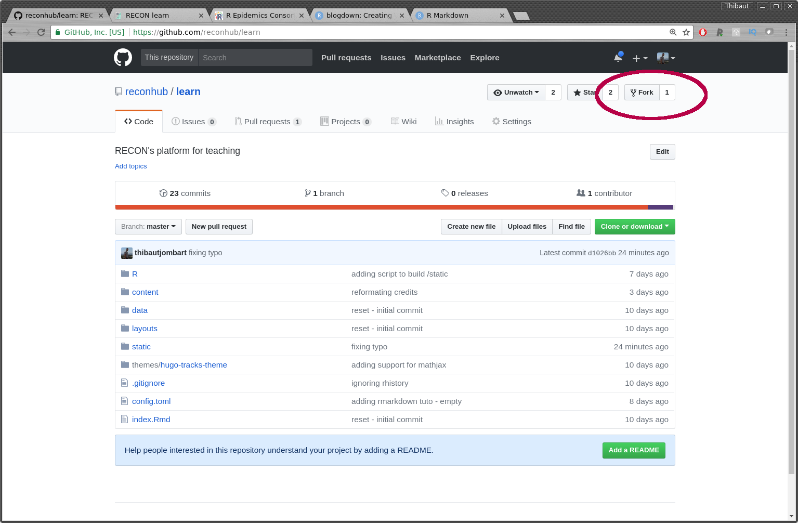
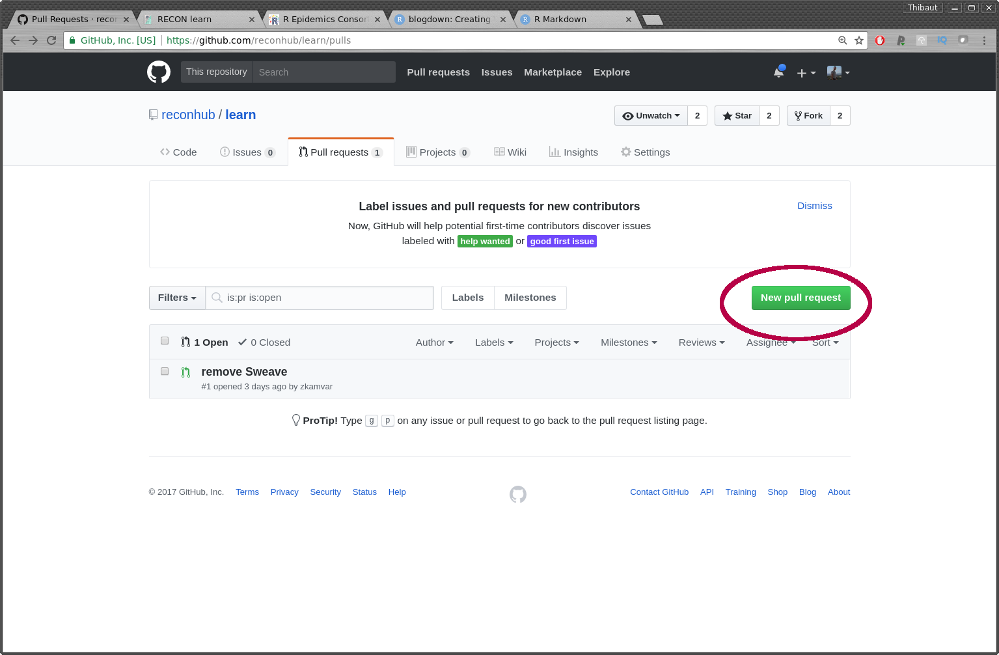
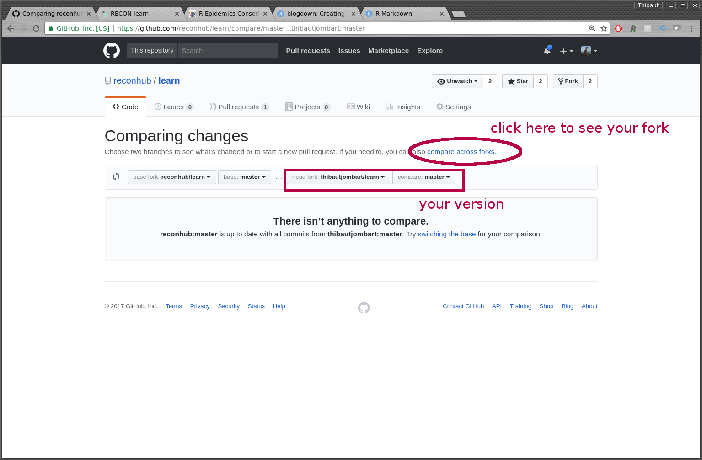

Welcome to the *RECON learn* project
====================================

This github project hosts the sources of the
[RECON](http://www.repidemicsconsortium.org/) learn platform, live at:
[https://reconlearn.netlify.com/](https://reconlearn.netlify.com/).


This *RECON learn* website uses
[blogdown](https://bookdown.org/yihui/blogdown/), which generates static content
for a website through the compilation of a series of
[Rmarkdown](http://rmarkdown.rstudio.com/) (`.Rmd`) documents.


## Running the website locally

You will need to install `blogdown` and its dependencies (especially Hugo):
```{r eval = FALSE}
install.packages("blogdown") # install blogdown
blogdown::install_hugo() # install hugo
```

See detailed [installation
guidelines](https://bookdown.org/yihui/blogdown/installation.html) for more
information.

<br>

You will also need to `git clone` this project, which using `git` command
lines would look like:

```{bash eval = FALSE}
git clone https://github.com/reconhub/learn
cd learn
```

Once this is done, you will need to make sure that all packages needed by all
practicals and lectures on the website are installed on your computer. If this
is not the case, you can install these dependencies using `checkpoint` by
typing:

```{r eval = FALSE}
if (!require("checkpoint")) {
    install.packages("checkpoint")
}

install.packages(
    checkpoint::scanForPackages(use.knitr = TRUE)$pkgs
)
```

You should usually only need this once, as further dependencies can be installed
at a later stage. Once this is done, you can preview the site by typing:

```{r eval = FALSE}
blogdown::serve_site()
```


This will open up the website at `127.0.0.1:4321`. This website is updated in
real time based on the content of `learn/`.


## Contributing to *RECON learn*

### General workflow

The general workflow would include the following steps:

1. **Fork the project** from the github *RECON learn* project:

<center>

</center>

This will create a copy of the project in your own github account. You will need
to clone this archive, and make the modifications there. You `git clone` would look like:

```{bash eval = FALSE}
git clone https://github.com/johnsnow/learn
```

If your github user name is `johnsnow`.  


2. **Add new content**, typically in the form of a new `.Rmd` file and
associated media (most often images). Regular posts such as practicals,
tutorials, and case studies are stored in `content/post/`. Other content which
is not rendered as typical html reports such as lecture slides can be stored in
`static`.

3. **Test new content** and revise until satisfying by visualising the local website
using `blogdown::serve_site()`, where the current working directory is set to
the project folder (`learn/` by default).

4. `git commit` and `git push` all changes; don't forget to add new images as
well (run `git status` to see which files haven't been added).

5. Make a **pull request** against the main project (`master` branch), from the github *RECON learn* project:

<center>

</center>

Make sure you use `reconhub/learn`, branch `master` as base fork:

<center>

</center>


### Contributing practicals and case studies

#### Create a new file

Practicals, tuorials, case studies are contributed as
[Rmarkdown](http://rmarkdown.rstudio.com/) (`.Rmd`) documents. They are stored
in `content/post`. The best way to create a new document is copy-paste an
existing one and rename it. Naming conventions are as follows:

- start with `practical` for practicals, `study` for case studies
- use lower case, no special characters
- be hypen-separated ("-")

For instance, for a practical using a SEIR model for influenza data:

- `practical-seir-influenza` is good
- `SEIR-flu` is bad as lacking 'practical' (it could be a lecture), and has
  capitalised letters
- `practical-new` is bad, as it is non-informative


#### Editing the YAML header

The YAML header is the beginning of the `Rmd` document, within the `---`. For instance:
```{r eval = FALSE}
---
title: Phylogenetic tree reconstruction
author: Thibaut Jombart
categories: ["practicals"]
tags: ["genetics"]
date: 2017-11-01
image: img/highres/trees.jpg
showonlyimage: true
bibliography: practical-phylogenetics.bib
---
```

Fields are mostly self-explanatory, and can be adapted to your needs. The date
should respect the format provided.


The **image** will be the image associated with the document on the website. We
try using natural, high-resolution, evocative images having a link, if only
figurative, with the topic covered. These images are stored in
`static/img/highres/`. Do not forget to add and push this file as well, as it
will be required for your post to be successfully integrated. The path to the
file provided in the header assumes `static/` as root folder (see example
above), so that the right path will look like: `img/highres/your-image.jpg`.


The **`bibliography`** is optional. If provided,
it should contain references cited in the document as a `bibtex` file
(`.bib`). Do not forget to add and push this file as well, as it will be
required for your post to be successfully integrated.


### Contributing slides

Slides cannot be rendered as usual `html` reports using `blogdown`. Instead,
material for slides is stored in `static/slides`. Currently, two files are needed for a lecture:

1. a `.Rmd` post in `content/post` (see above) to introduce the lecture and link
to the slides; for an example, look at
`content/post/lecture-reproducibility.Rmd`.

2. the slides themselves, stored in `static/slides`.

For the slides, we recommended using `.Rmd` there again, as such slides will be
automatically compiled and updated in real time when running
`blogdown::serve_site()`. If your slides use images, store them in
`static/img/slides`. You will be able to refer to them using
`../../img/slides/your-image.jpg`. For an example of `rmarkdown+ioslides`
slides, look at
`static/slides/intro_reproducibility_Rmd/intro_reproducibility.Rmd`.

