This practical is the second part of the response to a simulated Ebola Virus Disease (EVD) outbreak taking place in the city of Ankh, Republic of Morporkia. While the [first part](./simulated-evd-early.html) focussed on early assessments of transmissibility, this part explores more methodological options for estimating transmissibility, and provides an introduction to outbreak reconstruction using *outbreaker2*.

<br>

An update on the EVD outbreak in Ankh, Republic of Morporkia
============================================================

After some rather concerning [preliminary results](../simulated-evd-early) on the new EVD outbreak in the city of Ankh, Republic of Morporkia, Public Health Morporkia (PHM) has sent you updates of the linelists and contact data. This time, PHM has also obtained Whole Genome Sequences (WGS) of the Ebola virus isolated in patients. As before, you are asked to assess the situation and produce evidence-based recommendations for informing the response.

Required packages
-----------------

The following packages, available on CRAN, are needed for this practical:

-   [`readxl`](https://cran.r-project.org/web/packages/readxl/index.html) to read `.xlsx` files
-   [`ggplot2`](http://ggplot2.org/) for graphics
-   [`incidence`](http://www.repidemicsconsortium.org/incidence/) for epicurves
-   [`epicontacts`](http://www.repidemicsconsortium.org/epicontacts/) for contact data visualisation
-   [`EpiEstim`](https://cran.r-project.org/web/packages/EpiEstim/index.html) for time-varying reproduction number estimation
-   [`distcrete`](http://www.repidemicsconsortium.org/distcrete) to obtain discrete time delay distributions
-   [`epitrix`](http://www.repidemicsconsortium.org/epitrix) for some practical tricks for epidemics analysis
-   [`ape`](http://ape-package.ird.fr/) for DNA sequence analysis
-   [`outbreaker2`](http://www.repidemicsconsortium.org/outbreaker2) to reconstruct the outbreak

To install these packages, use `install.packages`, e.g.:

``` r
install.packages("readxl")
install.packages("ggplot2")
install.packages("incidence")
install.packages("epicontacts")
install.packages("EpiEstim")
install.packages("distcrete")
install.packages("epitrix")
install.packages("ape")
install.packages("outbreaker2")
```

The new data
------------

The data update includes new linelists and contact lists:

-   [PHM-EVD-linelist-2017-11-25.xlsx](../../data/PHM-EVD-linelist-2017-11-25.xlsx): a linelist containing case information up to the 25th November 2017

-   [PHM-EVD-contacts-2017-11-25.xlsx](../../data/PHM-EVD-contacts-2017-11-25.xlsx): a list of contacts reported between cases up to the 25th November, where `from` indicates a potential source of infection, and `to` the recipient of the contact.

To read into R, download these files and use the function `read_xlsx()` from the `readxl` package to import the data. Each import will create a data table stored as a `tibble` object. Call the first one `linelist`, and the second one `contacts`. For instance, your first command line could look like:

``` r
linelist <- readxl::read_xlsx("PHM-EVD-linelist-2017-11-25.xlsx")
```

Note that for further analyses, you will need to make sure all dates are stored as `Date` objects. This can be done using `as.Date`:

``` r
linelist$onset <- as.Date(linelist$onset)
```

Once imported, the data should look like:

``` r
## linelist: one line per case
linelist
## # A tibble: 50 x 4
##    case_id onset      sex      age
##    <chr>   <date>     <chr>  <dbl>
##  1 39e9dc  2017-10-10 female    62
##  2 664549  2017-10-16 male      28
##  3 b4d8aa  2017-10-17 male      54
##  4 51883d  2017-10-18 male      57
##  5 947e40  2017-10-20 female    23
##  6 9aa197  2017-10-20 female    66
##  7 e4b0a2  2017-10-21 female    13
##  8 af0ac0  2017-10-21 male      10
##  9 185911  2017-10-21 female    34
## 10 601d2e  2017-10-22 male      11
## # ... with 40 more rows

## contacts: pairs of cases with reported contacts
contacts
## # A tibble: 36 x 2
##    from   to    
##    <chr>  <chr> 
##  1 9aa197 426b6d
##  2 39e9dc a8e9d8
##  3 c2a389 95fc1d
##  4 51883d 778316
##  5 51883d e37897
##  6 933811 99abbe
##  7 51883d 185911
##  8 b4d8aa e4b0a2
##  9 605322 1875e2
## 10 b4d8aa b5ad13
## # ... with 26 more rows
```

Analysis of epidemiological data
================================

Visualising contact data
------------------------

After the initial stage of the outbreak, contact tracing has been maintained but started being sparser, and exposures haven't been reported for all cases. Despite these limitations, contacts are still a valuable source of information. Using the function `make_epicontacts` in the `epicontacts` package, create a new `epicontacts` object called `x`, specifying that contacts are directed. When plotting the data, use the arguments `node_shape` and `shapes` (see `?vis_epicontacts`) to distinguish males and females. For a list of available symbols and corresponding shape code, you can type `epicontacts::codeawesome`.

The results should look like:

    ## 
    ## /// Epidemiological Contacts //
    ## 
    ##   // class: epicontacts
    ##   // 50 cases in linelist; 36 contacts;  directed 
    ## 
    ##   // linelist
    ## 
    ## # A tibble: 50 x 4
    ##    id     onset      sex      age
    ##  * <chr>  <date>     <chr>  <dbl>
    ##  1 39e9dc 2017-10-10 female    62
    ##  2 664549 2017-10-16 male      28
    ##  3 b4d8aa 2017-10-17 male      54
    ##  4 51883d 2017-10-18 male      57
    ##  5 947e40 2017-10-20 female    23
    ##  6 9aa197 2017-10-20 female    66
    ##  7 e4b0a2 2017-10-21 female    13
    ##  8 af0ac0 2017-10-21 male      10
    ##  9 185911 2017-10-21 female    34
    ## 10 601d2e 2017-10-22 male      11
    ## # ... with 40 more rows
    ## 
    ##   // contacts
    ## 
    ## # A tibble: 36 x 2
    ##    from   to    
    ##    <chr>  <chr> 
    ##  1 9aa197 426b6d
    ##  2 39e9dc a8e9d8
    ##  3 c2a389 95fc1d
    ##  4 51883d 778316
    ##  5 51883d e37897
    ##  6 933811 99abbe
    ##  7 51883d 185911
    ##  8 b4d8aa e4b0a2
    ##  9 605322 1875e2
    ## 10 b4d8aa b5ad13
    ## # ... with 26 more rows

<!--html_preserve-->
<iframe src="widgets/ebola_recons_epicontacts_1.html" width="100%" height="500px">
</iframe>
<!--/html_preserve-->
<font class="question">What can you say about these contacts? How would you interpret the different clusters?</font>

Building epicurves
------------------

Using the same approach as in the [first part](../simulated-evd-early) of the practical, use `incidence` (from the `incidence` package) to compute and plot epicurves using dates of symptom onset. As the time series is now longer, compare daily incidence to weekly incidence.

You should obtain something like:

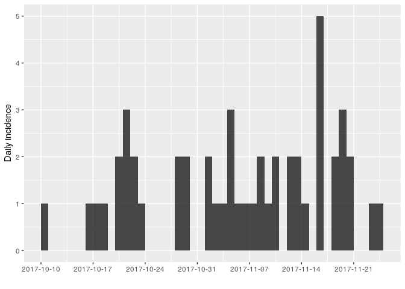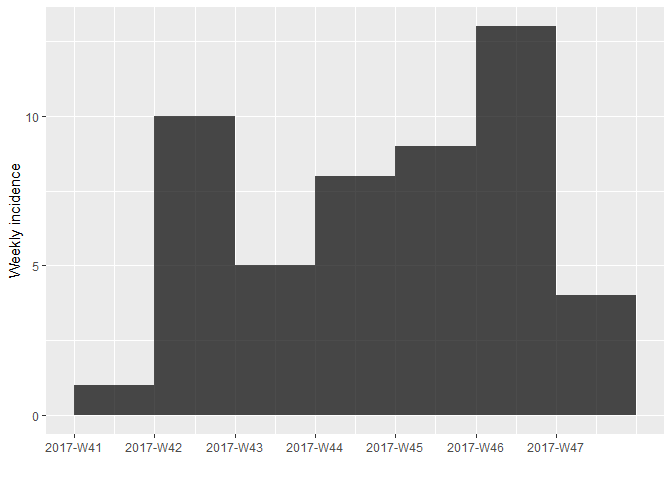

As there are no longer time intervals with 'zero' incidence on the weekly epicurve, which are problematic for log-linear regression, we can try fitting a model to these data; we do so here, with `i` being the weekly incidence:

``` r
f <- fit(i)
f
## <incidence_fit object>
## 
## $model: regression of log-incidence over time
## 
## $info: list containing the following items:
##   $r (daily growth rate):
## [1] 0.02689489
## 
##   $r.conf (confidence interval):
##            2.5 %     97.5 %
## [1,] -0.03115559 0.08494537
## 
##   $doubling (doubling time in days):
## [1] 25.77245
## 
##   $doubling.conf (confidence interval):
##         2.5 %    97.5 %
## [1,] 8.159917 -22.24792
## 
##   $pred: data.frame of incidence predictions (7 rows, 5 columns)
plot(i, color = "#c65353", fit = f)
```

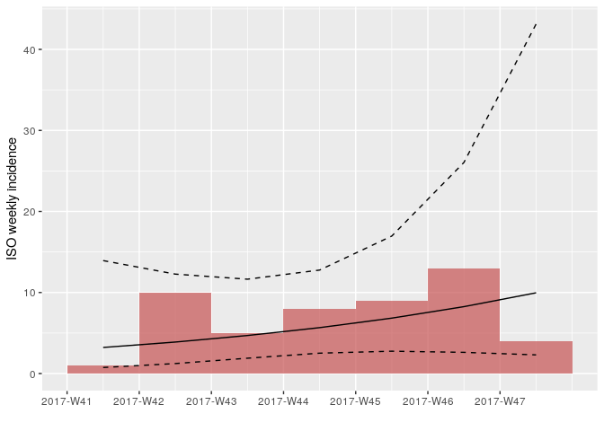

How would you interpret this result? What are the limitations of this analysis?

Estimating transmissibility
---------------------------

Repeating the same analysis as in the [early stage](../simulated-evd-early) of the outbreak, we can use `get_R` from the `earlyR` package to estimate the reproduction number:

``` r
library(earlyR)

## parameters of the serial interval from practical part1, on the dataset
## ebola_sim_clean (outbreaks package)

mu <- 11.48 # mean serial interval
sd <- 7.38 # standard deviation

daily_i <- incidence(linelist$onset)
simple_R <- get_R(daily_i, si_mean = mu, si_sd =  sd, max_R = 5)
simple_R
## 
## /// Early estimate of reproduction number (R) //
##  // class: earlyR, list
## 
##  // Maximum-Likelihood estimate of R ($R_ml):
## [1] 1.286286
## 
## 
##  // $lambda:
##   0.04089622 0.05345593 0.06190884 0.06671221 0.06852841 0.06803361...
## 
##  // $dates:
## [1] "2017-10-11" "2017-10-12" "2017-10-13" "2017-10-14" "2017-10-15"
## [6] "2017-10-16"
## ...
## 
##  // $si (serial interval):
## A discrete distribution
##   name: gamma
##   parameters:
##     shape: 2.41975308641975
##     scale: 4.74428571428571

## R: likelihood function
plot(simple_R)
```

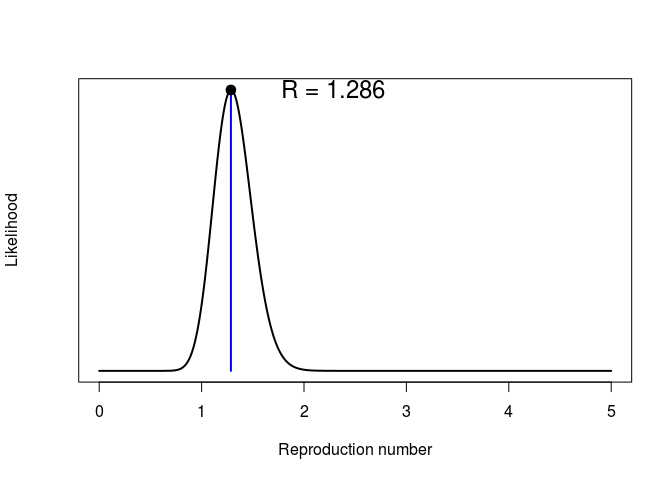

``` r

## force of infection
plot(simple_R, "lambdas")
abline(v = as.Date("2017-11-25"))
```

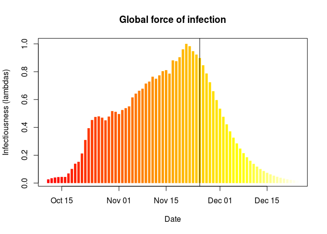

<font class="question">What do you make of these results?</font><font
class="question">What is the main limitation of the estimation of the reproduction number (\(R\)) in this analysis?</font><font class="question"> What assumption does it make about the outbreak?</font>

Estimating time-varying transmissibility
----------------------------------------

When the assumption that \(R\) is constant over time becomes untenable, an alternative is the estimationg of time-varying transmissibility using the instantaneous reproduction number \(R_t\). This approach, introduced by Cori et al. (2013), is implemented in the package `EpiEstim` (function `EstimateR`). It esimates \(R_t\) for a succession of sliding time windows, using the same Poisson likelihood described in the [first part](../simulated-evd-early). In the following, we use `EstimateR` to estimate transmissibility for 1-week sliding time windows:

``` r
library(EpiEstim)
library(ggplot2)

days <- seq_along(daily_i$dates)
Rt <- EstimateR(as.vector(daily_i$counts), days, days + 7, method = "ParametricSI",
                   Mean.SI = mu, Std.SI = sd)
## Warning in EstimateR(as.vector(daily_i$counts), days, days + 7, method =
## "ParametricSI", : You're estimating R too early in the epidemic to get the
## desired posterior CV.
Rt <- Rt$R[days,]
head(Rt, 10)
##    T.Start T.End  Mean(R)    Std(R) Quantile.0.025(R) Quantile.0.05(R)
## 1        1     8       NA        NA                NA               NA
## 2        2     9       NA        NA                NA               NA
## 3        3    10       NA        NA                NA               NA
## 4        4    11       NA        NA                NA               NA
## 5        5    12 7.760690 2.5868968          3.548682         4.048690
## 6        6    13 7.747323 2.3359057          3.867436         4.344845
## 7        7    14 6.674902 1.9268782          3.449019         3.851537
## 8        8    15 4.773032 1.4391233          2.382680         2.676806
## 9        9    16 3.437773 1.0871193          1.648546         1.865131
## 10      10    17 2.541335 0.8471116          1.162060         1.325794
##    Quantile.0.25(R) Median(R) Quantile.0.75(R) Quantile.0.95(R)
## 1                NA        NA               NA               NA
## 2                NA        NA               NA               NA
## 3                NA        NA               NA               NA
## 4                NA        NA               NA               NA
## 5          5.896094  7.475227         9.314937        12.446983
## 6          6.070950  7.513862         9.169754        11.946526
## 7          5.294658  6.490432         7.854455        10.127781
## 8          3.740239  4.629200         5.649375         7.360110
## 9          2.655985  3.323885         4.095710         5.399097
## 10         1.930749  2.447856         3.050292         4.075920
##    Quantile.0.975(R)
## 1                 NA
## 2                 NA
## 3                 NA
## 4                 NA
## 5          13.592581
## 6          12.952366
## 7          10.947973
## 8           7.979796
## 9           5.873368
## 10          4.451060
```

`EpiEstim` is not yet integrated with other RECON packages, so adding the results to existing `incidence` plots takes some customisation using `ggplot2`. Uses the following commands to add estimates of \(R_r\) to the daily incidence:

``` r

names(Rt) <- gsub("[(]R[)]", "", names(Rt))
Rt <- cbind.data.frame(as.data.frame(daily_i),
                       Rt)
plot(daily_i) +
    geom_ribbon(data = Rt, fill = "#c65353", alpha = .3,
                aes(x = dates, ymin = Quantile.0.025, ymax = Quantile.0.975)) +
    geom_line(data = Rt, aes(x = dates, y = Median), col = "#c65353", alpha = .8) +
    geom_hline(yintercept = 1, linetype = 2) +
    labs(title = "Weekly Rt: median, and 95% CI")
## Warning: Removed 11 rows containing missing values (geom_path).
```

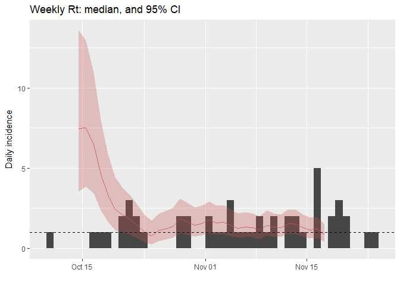

<font class="question">How would you interpret this result? What is the caveat of this representation?</font>

Finding who infected whom
=========================

To gain a better understanding of the transmission process, we can attempt to reconstruct plausible transmission trees using the dates of symptom onsets and limited contact data. This can be achieved using `outbreaker2`, which provides a modular platform for outbreak reconstruction. This package extends and replaces `outbreaker`, which in contrast was a static implementation of a specific transmission model (Jombart et al. 2014).

Looking at Whole Genome Sequences (WGS)
---------------------------------------

WGS have been obtained for all cases in this outbreak. They are stored as a `fasta` [PHM-EVD-WGS.fa](../../data/PHM-EVD-WGS.fa). Download this file, save it in your working directory, and then import these data using the function `read.FASTA` from the `ape` package.

``` r
library(ape)
## dna <- read.FASTA("PHM-EVD-WGS.fa")
dna
## 50 DNA sequences in binary format stored in a list.
## 
## All sequences of same length: 18958 
## 
## Labels:
## 39e9dc
## 664549
## b4d8aa
## 51883d
## 947e40
## 9aa197
## ...
## 
## Base composition:
##     a     c     g     t 
## 0.250 0.248 0.248 0.254
identical(labels(dna), linelist$case_id) # check sequences match linelist data
## [1] TRUE
```

As a first exploration of the data, we derive a Neighbour-Joining tree rooted at the first case of the outbreak:

``` r
nj <- nj(dist.dna(dna, model = "N")) # NJ on nucleotide distances (model = "N")
nj
## 
## Phylogenetic tree with 50 tips and 48 internal nodes.
## 
## Tip labels:
##  39e9dc, 664549, b4d8aa, 51883d, 947e40, 9aa197, ...
## 
## Unrooted; includes branch lengths.
nj <- root(nj, 1)
plot(nj, main = "Neighbour Joining tree")
axisPhylo()
```

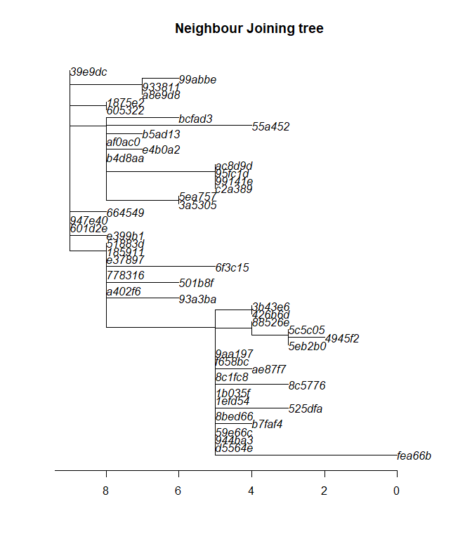

This phylogenetic tree shows the inferred evolution of the pathogen sequences. Branch length (x-axis) correspond to the number of mutations occuring between lineages (indicated by the axis at the bottom). The tree has been rooted to the index case, so that this sequence (top, left) is the "most ancient" part of the tree. Note that in such representations, distances on the y-axis are meaningless.

<font class="question">How would you interpret this phylogenetic tree? Many methods of outbreak reconstruction infer transmission events from phylogenies. What results would you expect here?</font>

Building delay distributions
----------------------------

`outbreaker2` can handle different types of dates. When dates of onset are provided, information on the *generation time* (delay between primary and secondary infections) and on the *incubation period* (delay between infection and symptom onset) can be included in the model. These delays are typically modelled as Gamma distributions, which need to be discretised in order to account for the fact that time is reported as days.

A possible approach here would be using estimates of the *mean* and *standard deviation* of the incubation period and the generation time published in the literature. From this, one would need to use `epitrix` to convert these parameters into *shape* and *scale* for a Gamma distribution, and then use `distcrete` to generate discretised distributions.

Alternatively, these parameters can be estimated from a previous, reasonably similar outbreak. PHM asks you to use the dataset `ebola_sim_clean` from the `outbreaks` package to this end. Start by extracting data on the inbucation period (i.e. delay from infection to onset) and store the output in an object called `incub`; results should look like:

``` r
incub <- with(ebola_sim_clean$linelist, date_of_onset - date_of_infection)
incub <- as.integer(na.omit(incub))
summary(incub)
##    Min. 1st Qu.  Median    Mean 3rd Qu.    Max. 
##    1.00    4.00    8.00   10.08   14.00   62.00

hist(incub, col = terrain.colors(10), border = "white",
     main = "Incubation period",
     xlab = "Days after exposure")
```

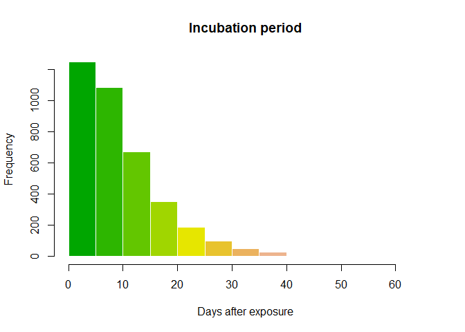

Then, use `epicontacts` to extract data on the generation time (i.e. delay between infections between infectors and infectees):

``` r
ebola_sim_contacts
## 
## /// Epidemiological Contacts //
## 
##   // class: epicontacts
##   // 5,829 cases in linelist; 3,800 contacts;  directed 
## 
##   // linelist
## 
## # A tibble: 5,829 x 11
##    id     generation date_of_infection date_of_onset date_of_hospitalisat…
##  * <chr>       <int> <date>            <date>        <date>               
##  1 d1fafd          0 NA                2014-04-07    2014-04-17           
##  2 53371b          1 2014-04-09        2014-04-15    2014-04-20           
##  3 f5c3d8          1 2014-04-18        2014-04-21    2014-04-25           
##  4 6c286a          2 NA                2014-04-27    2014-04-27           
##  5 0f58c4          2 2014-04-22        2014-04-26    2014-04-29           
##  6 49731d          0 2014-03-19        2014-04-25    2014-05-02           
##  7 f9149b          3 NA                2014-05-03    2014-05-04           
##  8 881bd4          3 2014-04-26        2014-05-01    2014-05-05           
##  9 e66fa4          2 NA                2014-04-21    2014-05-06           
## 10 20b688          3 NA                2014-05-05    2014-05-06           
## # ... with 5,819 more rows, and 6 more variables: date_of_outcome <date>,
## #   outcome <fct>, gender <fct>, hospital <fct>, lon <dbl>, lat <dbl>
## 
##   // contacts
## 
## # A tibble: 3,800 x 3
##    from   to     source 
##  * <chr>  <chr>  <fct>  
##  1 d1fafd 53371b other  
##  2 cac51e f5c3d8 funeral
##  3 f5c3d8 0f58c4 other  
##  4 0f58c4 881bd4 other  
##  5 8508df 40ae5f other  
##  6 127d83 f547d6 funeral
##  7 f5c3d8 d58402 other  
##  8 20b688 d8a13d other  
##  9 2ae019 a3c8b8 other  
## 10 20b688 974bc1 other  
## # ... with 3,790 more rows
gen_time <- get_pairwise(ebola_sim_contacts, "date_of_infection")
gen_time <- as.integer(na.omit(gen_time))
summary(gen_time)
##    Min. 1st Qu.  Median    Mean 3rd Qu.    Max. 
##    1.00    5.00    9.00   10.96   15.00   44.00

hist(gen_time, col = terrain.colors(10), border = "white",
     main = "Generation time",
     xlab = "Days after exposure")
```

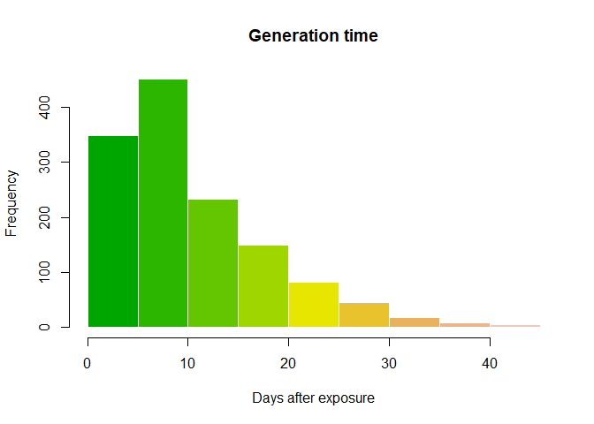

We can now fit a discretised Gamma distributions to both delays. The function `fit_dist_gamma` in the package `epitrix` makes this fairly simple. We illustrate the procedure for the incubation period:

``` r
library(epitrix)
incub_fit <- fit_disc_gamma(incub)
incub_fit
## $mu
## [1] 10.57505
## 
## $cv
## [1] 0.7022628
## 
## $sd
## [1] 7.426463
## 
## $ll
## [1] -12123.24
## 
## $converged
## [1] TRUE
## 
## $distribution
## A discrete distribution
##   name: gamma
##   parameters:
##     shape: 2.02768577832022
##     scale: 5.21532912601657
incub_dist <- incub_fit$distribution

plot(0:50, incub_dist$d(0:50), type = "h", col = terrain.colors(51),
     xlab = "Days after exposure", ylab = "Probability",
     main = "Incubation period distribution", lend = 1, lwd = 8)
```

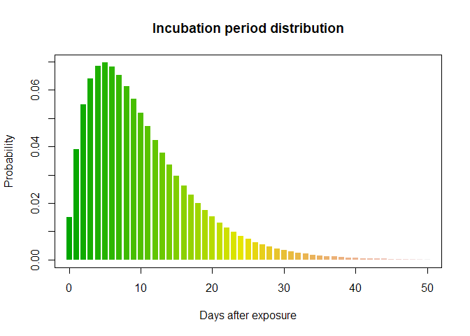

Using the same process, create a distribution for the generation time. Results should resemble:

    ## $mu
    ## [1] 11.46512
    ## 
    ## $cv
    ## [1] 0.6379854
    ## 
    ## $sd
    ## [1] 7.314581
    ## 
    ## $ll
    ## [1] -4364.861
    ## 
    ## $converged
    ## [1] TRUE
    ## 
    ## $distribution
    ## A discrete distribution
    ##   name: gamma
    ##   parameters:
    ##     shape: 2.45684936922917
    ##     scale: 4.66659611108255

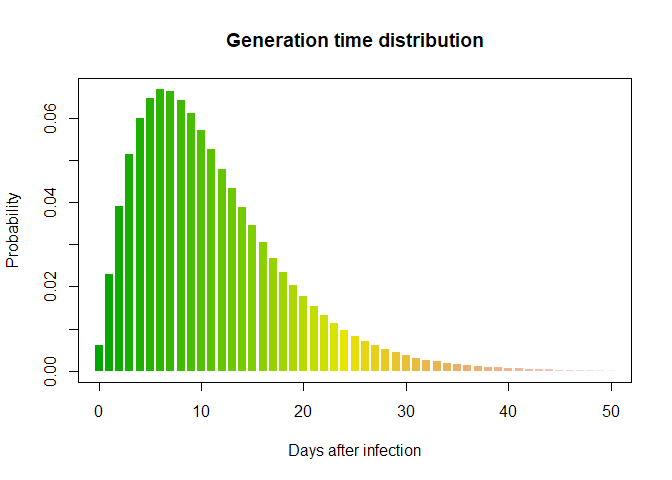

Using the original `outbreaker` model
-------------------------------------

The original `outbreaker` model combined temporal information (here, dates of onset) with sequence data to infer who infected whom. Here, we use `outbreaker2` to apply this model to the data.

All inputs to the new `outbreaker` function are prepared using dedicated functions, which make a number of checks on provided inputs and define defaults:

``` r
library(outbreaker2)

data <- outbreaker_data(dates = linelist$onset, # dates of onset
                        dna = unname(dna), # WGS; remove labels for compatibility
                        w_dens = gen_time_dist$d(1:100), # generation time distribution
                        f_dens = incub_dist$d(1:100) # incubation period distribution
                        )
```

We also create a configuration, which determines different aspects of the analysis, including which parameters need to be estimated, initial values of parameters, the length of the MCMC, etc.:

``` r
config <- create_config(move_kappa = FALSE, # don't look for missing cases
                        move_pi = FALSE, # don't estimate reporting
                        init_pi = 1, # set reporting to 1
                        find_import = FALSE, # don't look for additional imported cases
                        init_tree = "star" # star-like tree as starting point
                        )
```

We can now run the analysis. This should take a couple of minutes on modern laptops. Note the use of `set.seed(0)` to have identical results across different users and computers:

``` r
set.seed(0)
res_basic <- outbreaker(data = data, config = config)
res_basic
## 
## 
##  ///// outbreaker results ///
## 
## class:  outbreaker_chains data.frame
## dimensions 201 rows,  158 columns
## ancestries not shown: alpha_1 - alpha_50
## infection dates not shown: t_inf_1 - t_inf_50
## intermediate generations not shown: kappa_1 - kappa_50
## 
## /// head //
##   step       post       like    prior           mu pi eps lambda
## 1    1 -1979.3825 -1981.6850 2.302485 1.000000e-04  1 0.5   0.05
## 2   50  -812.2698  -814.5723 2.302543 4.244632e-05  1 0.5   0.05
## 3  100  -816.6804  -818.9829 2.302522 6.265153e-05  1 0.5   0.05
## 
## ...
## /// tail //
##      step      post      like    prior           mu pi eps lambda
## 199  9900 -807.7895 -810.0920 2.302535 5.039668e-05  1 0.5   0.05
## 200  9950 -810.8754 -813.1780 2.302551 3.377507e-05  1 0.5   0.05
## 201 10000 -811.5659 -813.8684 2.302522 6.311282e-05  1 0.5   0.05
plot(res_basic)
```

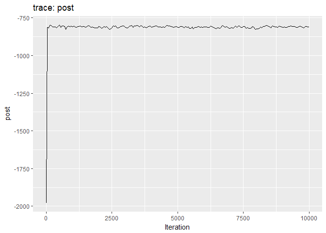

``` r
plot(res_basic, burn = 500)
```

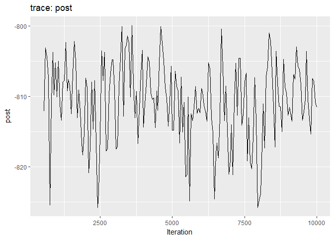

The first two plots show the trace of the log-posterior densities (with, and without burnin). See `?plot.outbreaker_chains` for details on available plots. Graphics worth looking at include:

``` r
plot(res_basic,  type = "alpha", burnin = 500) # ancestries
```


``` r
plot(res_basic,  type = "t_inf", burnin = 500) # infection dates
```


``` r
plot(res_basic, "mu", burn = 500, type = "density") # mutation rate
```


``` r
p <- plot(res_basic,  type = "network", burnin = 500, min_support = .05) # transmission trees
## p
```

<!--html_preserve-->
<iframe src="widgets/ebola_outbreaker_1.html" width="100%" height="500px">
</iframe>
<!--/html_preserve-->
As a further help for interpretation, you can derive a consensus tree from the posterior samples of trees using `summary`. Look in particular at the *support* column, and compare the results to the contact data.

``` r
smry_basic <- summary(res_basic)
head(smry_basic$tree)
##   from to time   support generations
## 1   NA  1   -8 0.2537313          NA
## 2    1  2    0 0.4427861           1
## 3    8  3    2 0.3283582           1
## 4    9  4    3 0.3432836           1
## 5   10  5    0 0.5124378          NA
## 6    4  6    5 0.3383085           1
tail(smry_basic$tree)
##    from to time   support generations
## 45   48 45   29 0.2636816           1
## 46   49 46   31 0.3830846           1
## 47   20 47   26 0.5174129           1
## 48   21 48   27 0.1741294           1
## 49   30 49   31 0.3880597           1
## 50   48 50   34 0.1641791           1
hist(smry_basic$tree$support, col = "grey", border = "white",
     main = "Consensus ancestry: support", xlim = c(0,1))
```

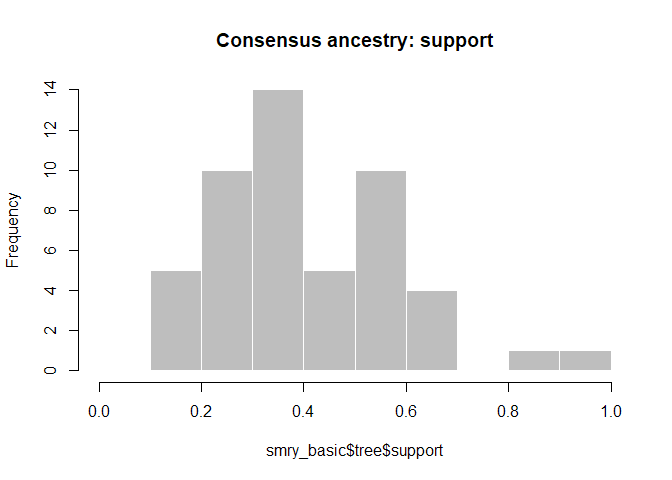

<font class="question">How would you interpret the results? Is this what you would have expected?</font>

As a point of comparison, repeat the same analysis using temporal data only, and plot a graph of ancestries (`type = "alpha"`); you should obtain something along the lines of:

``` r
set.seed(0)

data <- outbreaker_data(dates = linelist$onset, # dates of onset
                        w_dens = gen_time_dist$d(1:100), # generation time distribution
                        f_dens = incub_dist$d(1:100) # incubation period distribution
                        )
res_time <- outbreaker(data = data, config = config)
plot(res_time, type = "alpha", burn = 500)
```

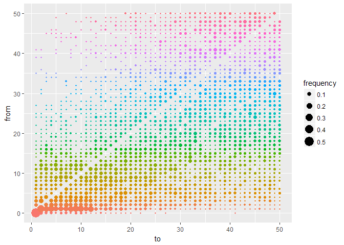

<font class="question">What is the usefulness of temporal and genetic data for outbreak reconstruction? What other data would you ideally include?</font>

Adding contact data to the reconstruction process
-------------------------------------------------

Contact data currently contains case labels. While `epicontacts` objects will soon be accepted as inputs in `outbreaker2`, for now we need to operate some minor transformations to define contacts using cases indices rather than labels:

``` r
ctd <- matrix(match(unlist(x$contacts), linelist$case_id), ncol = 2)
head(ctd)
##      [,1] [,2]
## [1,]    6   28
## [2,]    1   15
## [3,]   30   46
## [4,]    4   23
## [5,]    4   13
## [6,]   41   43
dim(ctd)
## [1] 36  2
```

All inputs to the `outbreaker` function are prepared using dedicated functions, which make a number of checks on provided inputs and define defaults:

``` r
data <- outbreaker_data(dates = linelist$onset, # dates of onset
                        dna = unname(dna), # dna sequences
                        ctd = ctd, # contact data
                        w_dens = gen_time_dist$d(1:100), # generation time distribution
                        f_dens = incub_dist$d(1:100) # incubation period distribution
                        )
```

We are now ready to run the analysis. This may take a couple of minutes, depending on your computer:

``` r
set.seed(0)
res_full <- outbreaker(data = data, config = config)
res_full
## 
## 
##  ///// outbreaker results ///
## 
## class:  outbreaker_chains data.frame
## dimensions 201 rows,  158 columns
## ancestries not shown: alpha_1 - alpha_50
## infection dates not shown: t_inf_1 - t_inf_50
## intermediate generations not shown: kappa_1 - kappa_50
## 
## /// head //
##   step       post       like    prior           mu pi       eps
## 1    1 -2153.0273 -2155.3298 2.302485 1.000000e-04  1 0.5000000
## 2   50  -897.6124  -899.9149 2.302517 6.776465e-05  1 0.5889257
## 3  100  -861.1298  -863.4323 2.302527 5.788386e-05  1 0.7036900
##        lambda
## 1 0.050000000
## 2 0.016343896
## 3 0.003869504
## 
## ...
## /// tail //
##      step      post      like    prior           mu pi       eps
## 199  9900 -838.7367 -841.0392 2.302540 4.526663e-05  1 0.6064171
## 200  9950 -833.8983 -836.2008 2.302538 4.745629e-05  1 0.7066745
## 201 10000 -835.0767 -837.3792 2.302537 4.802969e-05  1 0.7478403
##           lambda
## 199 0.0008513904
## 200 0.0008513904
## 201 0.0008513904
```

Produce graphics as in the previous model. Assess convergence, choose an appropriate burnin, visualise ancestries and the infection timelines:

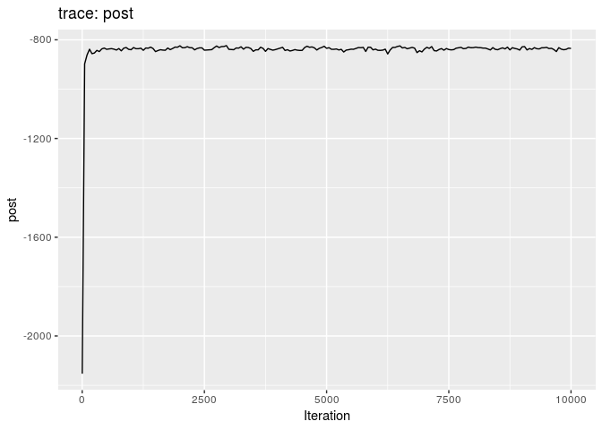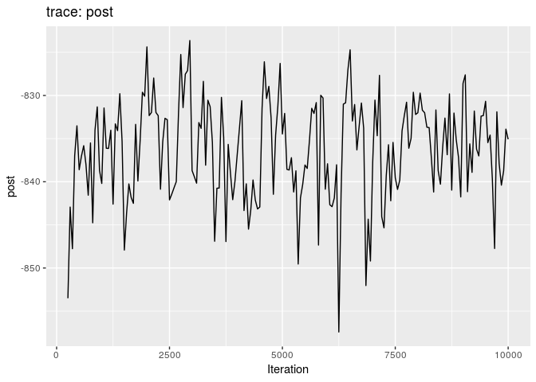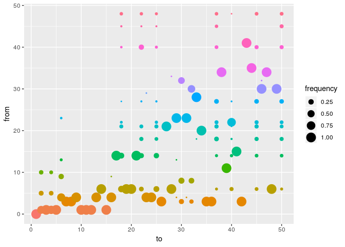<!--html_preserve-->

<script type="application/json" data-for="htmlwidget-425176f984510afb8814">{"x":{"nodes":{"id":[1,2,3,4,5,6,7,8,9,10,11,12,13,14,15,16,17,18,19,20,21,22,23,24,25,26,27,28,29,30,31,32,33,34,35,36,37,38,39,40,41,42,43,44,45,46,47,48,49,50],"label":[1,2,3,4,5,6,7,8,9,10,11,12,13,14,15,16,17,18,19,20,21,22,23,24,25,26,27,28,29,30,31,32,33,34,35,36,37,38,39,40,41,42,43,44,45,46,47,48,49,50],"value":[7.36224489795918,0,6.37244897959184,5.66836734693878,0.372448979591837,6.21428571428571,0,0.627551020408163,0.255102040816327,0.26530612244898,1,0,0.0561224489795918,3.10204081632653,1,0,0,0.704081632653061,0,1,1.73979591836735,1.22448979591837,2.01530612244898,0,0,0,0.571428571428571,0.994897959183674,0.00510204081632653,2.56122448979592,0,0.438775510204082,0.00510204081632653,2,1,0,0,0,0,0.683673469387755,1,0,0,0,0.255102040816327,0,0,0.505102040816326,0,0],"color":["#CCDDFF","#BCDAEE","#ADD8DE","#9ED6CD","#8FD4BD","#7FD2AD","#86CEA7","#9FC9A9","#B7C3AC","#D0BDAE","#E9B8B0","#FDB2B3","#ECAFB5","#DBADB8","#CBAABB","#BAA7BD","#A9A4C0","#AFA8A9","#BFB085","#D0B762","#E1BE3F","#F2C61B","#FFCA05","#FFC11C","#FFB934","#FFB14B","#FFA963","#FFA07A","#F7AC83","#EEBE88","#E4CF8C","#DBE191","#D2F395","#CDF99B","#D0E7A2","#D4D5A9","#D7C4B0","#DBB2B7","#DEA0BE","#E4A6B8","#EAAEB1","#EFB6AA","#F5BFA3","#FBC79C","#FACC9D","#F1CCA6","#E8CCB0","#DFCCB9","#D6CCC3","#CDCDCD"],"shape":["dot","dot","dot","dot","dot","dot","dot","dot","dot","dot","dot","dot","dot","dot","dot","dot","dot","dot","dot","dot","dot","dot","dot","dot","dot","dot","dot","dot","dot","dot","dot","dot","dot","dot","dot","dot","dot","dot","dot","dot","dot","dot","dot","dot","dot","dot","dot","dot","dot","dot"],"shaped":["star",null,null,null,null,null,null,null,null,null,null,null,null,null,null,null,null,null,null,null,null,null,null,null,null,null,null,null,null,null,null,null,null,null,null,null,null,null,null,null,null,null,null,null,null,null,null,null,null,null]},"edges":{"from":[1,1,1,1,1,1,1,1,3,3,3,3,3,3,3,3,4,4,4,4,4,4,5,5,6,6,6,6,6,6,6,6,6,6,6,6,8,8,9,10,10,11,13,14,14,14,14,14,14,14,14,14,15,18,18,18,18,18,20,21,21,21,21,21,21,21,22,22,22,22,22,23,23,27,27,27,28,30,30,30,32,34,34,35,40,40,40,40,40,41,45,45,48,48,48,48,48,48],"to":[2,3,4,5,10,11,12,15,7,8,26,30,32,35,36,42,6,9,13,16,23,24,2,4,14,18,19,20,22,25,28,37,40,45,48,50,30,32,6,2,4,39,6,17,18,21,22,25,37,40,45,50,41,22,25,37,45,50,34,18,22,25,27,37,45,50,25,37,40,45,50,29,31,37,45,50,33,32,46,49,30,38,47,44,22,25,37,45,50,43,37,50,18,22,25,37,45,50],"value":[0.642857142857143,1,0.719387755102041,1,1,1,1,1,1,1,1,0.224489795918367,0.147959183673469,1,1,1,0.668367346938776,1,1,0.994897959183674,0.994897959183674,1,0.198979591836735,0.173469387755102,1,0.392857142857143,1,1,0.183673469387755,0.306122448979592,0.994897959183674,0.0510204081632653,0.127551020408163,0.102040816326531,1,0.0561224489795918,0.341836734693878,0.285714285714286,0.25,0.158163265306122,0.107142857142857,1,0.0510204081632653,1,0.306122448979592,1,0.224489795918367,0.25,0.0612244897959184,0.0714285714285714,0.0969387755102041,0.0918367346938776,1,0.13265306122449,0.102040816326531,0.178571428571429,0.137755102040816,0.127551020408163,1,0.11734693877551,0.112244897959184,0.122448979591837,1,0.137755102040816,0.137755102040816,0.107142857142857,0.0714285714285714,0.11734693877551,0.760204081632653,0.127551020408163,0.102040816326531,0.989795918367347,0.994897959183674,0.183673469387755,0.173469387755102,0.163265306122449,0.994897959183674,0.566326530612245,0.994897959183674,1,0.433673469387755,1,1,1,0.239795918367347,0.0561224489795918,0.102040816326531,0.127551020408163,0.127551020408163,1,0.0816326530612245,0.122448979591837,0.0816326530612245,0.076530612244898,0.0561224489795918,0.086734693877551,0.0969387755102041,0.102040816326531],"arrows":["to","to","to","to","to","to","to","to","to","to","to","to","to","to","to","to","to","to","to","to","to","to","to","to","to","to","to","to","to","to","to","to","to","to","to","to","to","to","to","to","to","to","to","to","to","to","to","to","to","to","to","to","to","to","to","to","to","to","to","to","to","to","to","to","to","to","to","to","to","to","to","to","to","to","to","to","to","to","to","to","to","to","to","to","to","to","to","to","to","to","to","to","to","to","to","to","to","to"],"color":["#CCDDFF","#CCDDFF","#CCDDFF","#CCDDFF","#CCDDFF","#CCDDFF","#CCDDFF","#CCDDFF","#ADD8DE","#ADD8DE","#ADD8DE","#ADD8DE","#ADD8DE","#ADD8DE","#ADD8DE","#ADD8DE","#9ED6CD","#9ED6CD","#9ED6CD","#9ED6CD","#9ED6CD","#9ED6CD","#8FD4BD","#8FD4BD","#7FD2AD","#7FD2AD","#7FD2AD","#7FD2AD","#7FD2AD","#7FD2AD","#7FD2AD","#7FD2AD","#7FD2AD","#7FD2AD","#7FD2AD","#7FD2AD","#9FC9A9","#9FC9A9","#B7C3AC","#D0BDAE","#D0BDAE","#E9B8B0","#ECAFB5","#DBADB8","#DBADB8","#DBADB8","#DBADB8","#DBADB8","#DBADB8","#DBADB8","#DBADB8","#DBADB8","#CBAABB","#AFA8A9","#AFA8A9","#AFA8A9","#AFA8A9","#AFA8A9","#D0B762","#E1BE3F","#E1BE3F","#E1BE3F","#E1BE3F","#E1BE3F","#E1BE3F","#E1BE3F","#F2C61B","#F2C61B","#F2C61B","#F2C61B","#F2C61B","#FFCA05","#FFCA05","#FFA963","#FFA963","#FFA963","#FFA07A","#EEBE88","#EEBE88","#EEBE88","#DBE191","#CDF99B","#CDF99B","#D0E7A2","#E4A6B8","#E4A6B8","#E4A6B8","#E4A6B8","#E4A6B8","#EAAEB1","#FACC9D","#FACC9D","#DFCCB9","#DFCCB9","#DFCCB9","#DFCCB9","#DFCCB9","#DFCCB9"]},"nodesToDataframe":true,"edgesToDataframe":true,"options":{"width":"100%","height":"100%","nodes":{"shape":"dot","color":{"highlight":"red"},"shadow":{"enabled":true,"size":10}},"manipulation":{"enabled":false},"edges":{"arrows":{"to":{"enabled":true,"scaleFactor":0.2}},"color":{"highlight":"red"}}},"groups":null,"width":null,"height":null,"idselection":{"enabled":false},"byselection":{"enabled":false},"main":null,"submain":null,"footer":null,"background":"rgba(0, 0, 0, 0)"},"evals":[],"jsHooks":[]}</script>
<!--/html_preserve-->
<font class="question">How would you interpret the results?</font>

<br>

Derive a consensus tree using `summary`, and make a new `epicontacts` object, using the previous linelist, to visualise the consensus tree with meta-information:

``` r
smry_full <- summary(res_full)
head(smry_full$tree)
##   from to time   support generations
## 1   NA  1   -6        NA          NA
## 2    1  2    2 0.6517413           1
## 3    1  3    2 1.0000000           1
## 4    1  4    1 0.7164179           1
## 5    1  5    1 0.9950249           1
## 6    4  6    6 0.6666667           1

smry_full$tree$support <- round(smry_full$tree$support, 2)

linelist$id <- 1:nrow(linelist) # add case index to linelist
cons_tree <- make_epicontacts(linelist, smry_full$tree[-1, ], id = "id",
                              from = 1, to = 2, directed = TRUE)
```

In the following, we add age class information to the linelist of `cons_tree`, and create color palettes which will be used to display information on the final graph:

``` r
library(visNetwork)

support_pal <- colorRampPalette(
    c("#918D98", "#645877", "#423359", "#281449", "#1A0340")
)

age_pal <- colorRampPalette(
    c("#3288BD", "#ABDDA4", "#FDAE61", "#D53E4F")
)

cons_tree$linelist$age_class <- cut(cons_tree$linelist$age,
                                    breaks = c(0, 10, 20, 30, 40, 90),
                                    labels = c("0-10", "11-20", "21-30", "31-40", "41+" ))
```

Looking carefully at the documentation of `vis_epicontacts`, try to reproduce the final consensus tree below:

<!--html_preserve-->
<iframe src="widgets/ebola_outbreaker_2.html" width="100%" height="500px">
</iframe>
<!--/html_preserve-->
<font class="question">What are your conclusions? What are the main drivers of this outbreak? What recommendations would you make to further improve the response?</font>

About this document
===================

Contributors
------------

-   Thibaut Jombart: initial version

Contributions are welcome via [pull requests](https://github.com/reconhub/learn/pulls). The source file is hosted on [github](https://github.com/reconhub/learn/blob/master/content/post/2017-11-22-sim-ebola-reconstruction.Rmd).

Legal stuff
-----------

**License**: [CC-BY](https://creativecommons.org/licenses/by/3.0/) **Copyright**: Thibaut Jombart, 2017

References
==========

Cori, Anne, Neil M Ferguson, Christophe Fraser, and Simon Cauchemez. 2013. “A New Framework and Software to Estimate Time-Varying Reproduction Numbers During Epidemics.” *Am. J. Epidemiol.* 178 (9): 1505–12.

Jombart, Thibaut, Anne Cori, Xavier Didelot, Simon Cauchemez, Christophe Fraser, and Neil Ferguson. 2014. “Bayesian Reconstruction of Disease Outbreaks by Combining Epidemiologic and Genomic Data.” *PLoS Comput. Biol.* 10 (1): e1003457.
