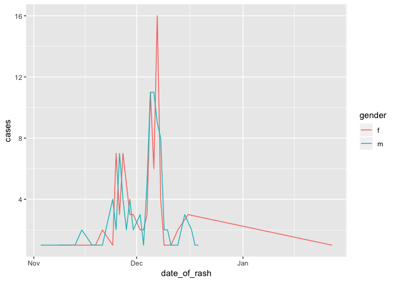
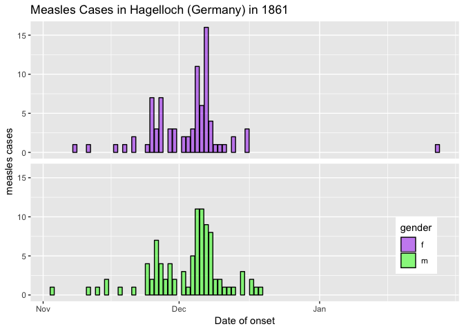
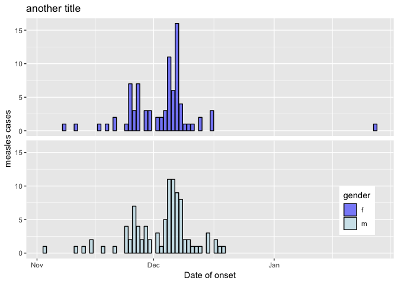

Introduction
============

This tutorial is part of the pre-course materials of a "Short Course on Outbreak Analysis and Modelling for Public Health". The aim is to introduce students to the very basic concepts of R and R Studio, in order to get some baseline knowledge in R and R programming.

Installing R and R Studio
=========================

*R* is a free software environment and *RStudio* is a free and open-source environment for to work on R. Both, R and Studio should be installed separately.

*R* can be installed from the R Project for Statistical computing website: <https://r-project.org/>

*RStudio* can be installed from its website. The *free* version is sufficient to conduct the routine epidemiological analyses
<https://www.rstudio.com/products/rstudio/download/>

Once both are installed, we work from *RStudio*.

For a very detailed explanation on how to install R and R Studio, please visit the video made by Thibaut Jombart from RECON <https://www.youtube.com/watch?v=LbezGA_Yle8>

Project setup
=============

One of the great advantages of using RStudio is the prossibility of using `R.proj` to organise the work space, history and source documents.

To create this, do the following steps:

1.  Open RStudio and on the top right corner find *New Project*

2.  Create a new RStudio project in a new directory that you can call “introR”

\[`static/img/screenshots/NewDirectory.png`\]

1.  Create the sub folders you need for organising your work (i.e. data, scripts, figs)

In the end, your project should look something like this image

\[`static/img/screenshots/Rproject.png`\]

Structures in R
===============

According to Hadley Wickham, in his Advanced R book \[<http://adv-r.had.co.nz/>\], there are two types of structures in R:

-   Homogeneous: atomic vectors (1d), matrices (2d) and arrays (nd)

-   Heterogeneous: data frames and lists

### Atomic vectors

These are the most basic structures in R and have only one dimension (1d):

-   Double (numeric)

-   Logic

-   Character

-   Integer

``` r

vector_double <- c(1, 2, 3, 4)  

vector_logic <- c(TRUE, FALSE, FALSE, TRUE)

vector_character <- c("A", "B", "C", "D")

vector_integer <- c(1L, 2L, 3L, 4L)
```

To evaluate which type of vector we have, we can use two commands `typeof`

``` r
typeof(vector_double)
## [1] "double"
typeof(vector_logic)
## [1] "logical"
typeof(vector_character)
## [1] "character"
typeof(vector_integer)
## [1] "integer"
```

### Matrices

Matrices are structures a bit more complex than vectors, with two main characteristics:

-   A matrix is composed of only one type of vector

-   A matrix has only one dimension

A command to build a `matrix` uses three arguments:

`data` corresponds to the list of vectors we want to use in the matrix

`nrow` the number of rows where the data is gonna be split (first dimension)

`ncol` the number of columns where the data is gonna be split (second dimension)

By default the matrix is filled by column, unless we specify otherwise using `byrow = TRUE`

``` r

matrix_of_doub <-  matrix(data = vector_double, nrow = 2, ncol = 2)
matrix_of_doub
##      [,1] [,2]
## [1,]    1    3
## [2,]    2    4
dim(matrix_of_doub)
## [1] 2 2
```

Make and test other types of matrices

``` r
matrix_of_log <-  matrix(data = vector_logic, nrow = 4, ncol = 3)
matrix_of_log

matrix_of_char <- matrix(data = vector_character, nrow = 4, ncol = 4)
matrix_of_char

matrix_of_int <-  matrix(data = vector_integer, nrow = 4, ncol = 5)
matrix_of_int
```

\#\#\# Arrays

Array is a special type of matrix, where there is more than two dimensions (n dimensions).

An array of two dimensions is a matrix
To create an array we need three arguments: `data` and `dim`.

In turn, the `dim` argument of an array is composed of three arguments being: 1) number of rows, 2) number of columns and 3) number of dimensions.

``` r

vector_example <-1:18
array_example <- array(data = vector_example, dim = c(2,3,3))

dim(array_example)
## [1] 2 3 3
array_example
## , , 1
## 
##      [,1] [,2] [,3]
## [1,]    1    3    5
## [2,]    2    4    6
## 
## , , 2
## 
##      [,1] [,2] [,3]
## [1,]    7    9   11
## [2,]    8   10   12
## 
## , , 3
## 
##      [,1] [,2] [,3]
## [1,]   13   15   17
## [2,]   14   16   18
```

\#\#\# Dataframes

A `data.frame` is a heterogeneous and bi dimensional structure, similar but not exactly equal to a matrix. Unlike a matrix, various types of vectors can be part of a single data frame.

The arguments for the `data.frame` command are simply the columns in the data frame. Each column should have the same number of rows to be able to fit into a data frame.

Data frames do not allow vectors with different lengths. When the length of the vector is smaller than the length of the data frame, the data frame coerces the vector to its length.

``` r


data_example <- data.frame( vector_character,vector_double, vector_logic, vector_integer)
```

To access the general structure of a data frame we use the command `str`

``` r

str(data_example)
## 'data.frame':    4 obs. of  4 variables:
##  $ vector_character: Factor w/ 4 levels "A","B","C","D": 1 2 3 4
##  $ vector_double   : num  1 2 3 4
##  $ vector_logic    : logi  TRUE FALSE FALSE TRUE
##  $ vector_integer  : int  1 2 3 4
```

To access the different components of the data frame we use this syntax `[,]` where the first dimension corresponds to rows and the second dimension to columns.

``` r

data_example[1,2]
## [1] 1
```

\#\#\# Lists

A `list` is the most complex structure in base R. A list cab be composed of any type of other structures of any dimension.

``` r

list_example <- list(vector_character,
                     matrix_of_doub,
                     data_example)
```

To access the different components of a list, we use the syntax `[]` where the argument is simply the order within the list.

``` r

list_example[1]
## [[1]]
## [1] "A" "B" "C" "D"
```

Functions
=========

A function is one of the structures that makes *R* a very powerful platform for programming.

There are various types of functions

*Primitive or base functions*: these are the default functions in *R* under the *base package*. For instance, for basic arithmetic operations, but also for more complex operations such as extraction of median values `median`, or even more complex like `summary` of a variable.

*Functions from packages* : these are functions created within a package. For example the function `glm` in the *stats* package.

*User-built functions*: these are the functions that any user creates for a customized routine. In turn, these functions could become part of a package.

The basic components of a function are:

*name*: this is the name that we give to our function (for example: `myfun`)

*formals or arguments*: these are the series of elements that control how to call the function.

*body*: this is the series of operations or modifications on my arguments.

*output*: this is the results after modifying the arguments. If this output corresponds to a series of data we can extract it using the command `return`.

*function internal environment*: means the specific rules and objects within a function. Those rules and objects will not work outside the function.

-   User-built function (example 1)

Let's build a function that calculates our Body Mass Index (BMI)

``` r

# The name (myfun)
myfun <- function(weight, 
                  height) # The arguments (weight and heighj)
{ 
  # The body
  
  BMI      <- weight/(height^2)
  
  return(BMI) # Retun specification for the output
}


formals(myfun)
## $weight
## 
## 
## $height
body(myfun)
## {
##     BMI <- weight/(height^2)
##     return(BMI)
## }
environment(myfun)
## <environment: 0x119af4660>

myfun(weight = 88, height = 1.78)
## [1] 27.77427
```

-   User-built function (example 2)

Let's build a function that has default values, in this case we don't need to specify always some of the arguments as they can be set as by default.

``` r

# The name (myfun2)
myfun2 <- function(weight, 
                   height,
                   units = 'kg/m2') # The arguments (weight and height)
{ 
  # The body
  BMI      <- weight/(height^2)
  output <- paste(round(BMI,1), units)
  
  return(output) # Retun specification for the output
}


myfun2(weight = 88, height = 1.78)
## [1] "27.8 kg/m2"


myfun2(weight = 8800, height = 178, units = 'g/cm2')
## [1] "0.3 g/cm2"
```

R packages
==========

As described by Hadley Wickham in his book *R packages*, a package is the fundamental unit of reproducible R code. A package should include at least:

-   Reusable R functions
-   Documentation
-   Sample data

Any R user could build a package that then can be used or modified by others as they are open-source.

The R packages are available on the Comprehensive R Archive Network (CRAN) <https://cran.r-project.org>

The basic commands to basic use of packages

1.  Install a package with the command `install.packages ("package-name")`
2.  Use them in R with `library ("package-name")`

Let's install one of the packages from RECON.

``` r
install.packages('incidence')
library(incidence)
```

Library is a directory containing installed packages. We can use `lapply(.libPaths(), dir)` to check which packages are active currently in our R session.

An important part of a package is the documentation. This is stored in the `vignettes`. To access the basic documentation on a package we can use `browseVignettes("incidence")`

Scoping and Environments
========================

Wen we create a function, a new environment is created. This is important because within a function R look for the elements within the function but if the element doesn't exist within the function then R looks for it in the global environment.

-   Example of a function which objects are only avalible in th eglobal environment

``` r
mynewfun <- function () {
  z = x + y 
  return(z)
  
}

x = 1
y = 3

mynewfun()
## [1] 4
```

-   Example of a function which objects are defined partically in the local environment and in the global envoronment

``` r
mynewfun <- function (xx) {
  zz = xx + yy 
  return(zz)
  
}

yy = 4
mynewfun(xx = 4)
## [1] 8
```

This characteristic of R is very important when running any analysis or routine. It is always recommended NOT to use elements within a function that are only available in the global environment.

\# Working with probability distributions

All distributions in R can be explored by the use of functions that allow us to get the different forms of a distribution. Fortunately, all distributions work in the same way, so if you learn to work with one, you will have the general idea of how to work with the others

For example for a normal distribution

To explore the arguments in a function we use `?dnorm`

`dnorm` = density function with default arguments `(x, mean = 0, sd = 1, log = FALSE)`

`pnorm` gives the distribution function

`qnorm` gives the quantile function

`rnorm` generates random deviates

Many distributions are part of the `stats` package that comes by default with R such as the *uniform*, *poisson* and *binomial*, among others. For other less used distributions sometimes you may need to intsall other packages. For a non exaustibe list of the most used distrubutions and their arguments, see the table below:

<table class="table table-striped" style="width: auto !important; margin-left: auto; margin-right: auto;">
<thead>
<tr>
<th style="text-align:left;">
name
</th>
<th style="text-align:left;">
probability
</th>
<th style="text-align:left;">
quantile
</th>
<th style="text-align:left;">
distribution
</th>
<th style="text-align:left;">
randomn
</th>
</tr>
</thead>
<tbody>
<tr>
<td style="text-align:left;">
Beta
</td>
<td style="text-align:left;">
`pbeta`
</td>
<td style="text-align:left;">
`qbeta`
</td>
<td style="text-align:left;">
`dbeta`
</td>
<td style="text-align:left;">
`rbeta`
</td>
</tr>
<tr>
<td style="text-align:left;">
Binomial
</td>
<td style="text-align:left;">
`pbinom`
</td>
<td style="text-align:left;">
`qbinom`
</td>
<td style="text-align:left;">
`dbinom`
</td>
<td style="text-align:left;">
`rbinom`
</td>
</tr>
<tr>
<td style="text-align:left;">
Cauchy
</td>
<td style="text-align:left;">
`pcauchy`
</td>
<td style="text-align:left;">
`qcauchy`
</td>
<td style="text-align:left;">
`dcauchy`
</td>
<td style="text-align:left;">
`rcauchy`
</td>
</tr>
<tr>
<td style="text-align:left;">
Chi-Square
</td>
<td style="text-align:left;">
`pchisq`
</td>
<td style="text-align:left;">
`qchisq`
</td>
<td style="text-align:left;">
`dchisq`
</td>
<td style="text-align:left;">
`rchisq`
</td>
</tr>
<tr>
<td style="text-align:left;">
Exponential
</td>
<td style="text-align:left;">
`pexp`
</td>
<td style="text-align:left;">
`qexp`
</td>
<td style="text-align:left;">
`dexp`
</td>
<td style="text-align:left;">
`rexp`
</td>
</tr>
<tr>
<td style="text-align:left;">
Gamma
</td>
<td style="text-align:left;">
`pgamma`
</td>
<td style="text-align:left;">
`qgamma`
</td>
<td style="text-align:left;">
`dgamma`
</td>
<td style="text-align:left;">
`rgamma`
</td>
</tr>
<tr>
<td style="text-align:left;">
Logistic
</td>
<td style="text-align:left;">
`plogis`
</td>
<td style="text-align:left;">
`qlogis`
</td>
<td style="text-align:left;">
`dlogis`
</td>
<td style="text-align:left;">
`rlogis`
</td>
</tr>
<tr>
<td style="text-align:left;">
Log Normal
</td>
<td style="text-align:left;">
`plnorm`
</td>
<td style="text-align:left;">
`qlnorm`
</td>
<td style="text-align:left;">
`dlnorm`
</td>
<td style="text-align:left;">
`rlnorm`
</td>
</tr>
<tr>
<td style="text-align:left;">
Negative Binomial
</td>
<td style="text-align:left;">
`pnbinom`
</td>
<td style="text-align:left;">
`qnbinom`
</td>
<td style="text-align:left;">
`dnbinom`
</td>
<td style="text-align:left;">
`rnbinom`
</td>
</tr>
<tr>
<td style="text-align:left;">
Normal
</td>
<td style="text-align:left;">
`pnorm`
</td>
<td style="text-align:left;">
`qnorm`
</td>
<td style="text-align:left;">
`dnorm`
</td>
<td style="text-align:left;">
`rnorm`
</td>
</tr>
<tr>
<td style="text-align:left;">
Poisson
</td>
<td style="text-align:left;">
`ppois`
</td>
<td style="text-align:left;">
`qpois`
</td>
<td style="text-align:left;">
`dpois`
</td>
<td style="text-align:left;">
`rpois`
</td>
</tr>
<tr>
<td style="text-align:left;">
Student t
</td>
<td style="text-align:left;">
`pt`
</td>
<td style="text-align:left;">
`qt`
</td>
<td style="text-align:left;">
`dt`
</td>
<td style="text-align:left;">
`rt`
</td>
</tr>
<tr>
<td style="text-align:left;">
Uniform
</td>
<td style="text-align:left;">
`punif`
</td>
<td style="text-align:left;">
`qunif`
</td>
<td style="text-align:left;">
`dunif`
</td>
<td style="text-align:left;">
`runif`
</td>
</tr>
<tr>
<td style="text-align:left;">
Weibull
</td>
<td style="text-align:left;">
`pweibull`
</td>
<td style="text-align:left;">
`qweibull`
</td>
<td style="text-align:left;">
`dweibull`
</td>
<td style="text-align:left;">
`rweibull`
</td>
</tr>
</tbody>
</table>

Create and open datasets
========================

R allows not only to open but also to create data sets. There are three sources of data sets:

-   Data-set imported as such (from `.xlsx`, `.csv`, `.stata`, or `.RDS` formats, among many others)

-   Data-set that is part of a R package

-   Data-set created in our R session

Tidyverse
=========

In order to better manage data-sets, we recommend install and use `tidyverse` package which automatically upload many other packages that (dplyr, tidyr, tibble, readr, purr, among others) that are very useful for data wrangling.

``` r
library(tidyverse)
```

Let's open and explore a data-set that is imported from excel

For example this data-set from our RECON practical on early outbreak analysis: - [PHM-EVD-linelist-2017-10-27.xlsx](static/data/PHM-EVD-contacts-2017-10-27.xlsx):

Then, lets save this data-set in the same directory we are currently working.

For importing data-sets from excel we can use the library `readxl` which is linked to tidyverse. However to will still need to load the `readxl` library as it is not a core tidyverse package.

``` r
library(readxl)
dat <- read_excel("data/PHM-EVD-linelist-2017-10-27.xlsx")
```

Here, we will take a look at some of the most used functions from `tidyverse`.

Here, we will be using a lot the pipe function `%>%` which is key to use tidyverse and makes programming easier. The pipe function allows emphasize a sequence of actions on an object.

From the package `dyplr`, the most common functions are:

`glimpse`: allows a rapid exploration of a data-set

`arrange`: arranges the data-set by the value of a particular variable if numeric, or by alphabetic order if it is a character.

`mutate`: allows generate a new variable

`rename`: allows change a variable's name

`summarise`: reduces the dimension of a data-set

``` r
glimpse(dat)
## Observations: 50
## Variables: 4
## $ case_id <chr> "39e9dc", "664549", "b4d8aa", "51883d", "947e40", "9aa19…
## $ onset   <dttm> 2017-10-10, 2017-10-16, 2017-10-17, 2017-10-18, 2017-10…
## $ sex     <chr> "female", "male", "male", "male", "female", "female", "f…
## $ age     <dbl> 62, 28, 54, 57, 23, 66, 13, 10, 34, 11, 23, 23, 9, 68, 3…

dat %>% arrange (age)
## # A tibble: 50 x 4
##    case_id onset               sex      age
##    <chr>   <dttm>              <chr>  <dbl>
##  1 ac8d9d  2017-11-23 00:00:00 female     5
##  2 8c5776  2017-11-02 00:00:00 female     7
##  3 426b6d  2017-11-08 00:00:00 female     7
##  4 93a3ba  2017-11-10 00:00:00 male       7
##  5 5eb2b0  2017-11-13 00:00:00 female     7
##  6 1efd54  2017-11-04 00:00:00 male       8
##  7 e37897  2017-10-28 00:00:00 female     9
##  8 59e66c  2017-11-16 00:00:00 male       9
##  9 af0ac0  2017-10-21 00:00:00 male      10
## 10 778316  2017-11-04 00:00:00 female    10
## # … with 40 more rows
dat %>% mutate (fecha_inicio_sintomas = onset)
## # A tibble: 50 x 5
##    case_id onset               sex      age fecha_inicio_sintomas
##    <chr>   <dttm>              <chr>  <dbl> <dttm>               
##  1 39e9dc  2017-10-10 00:00:00 female    62 2017-10-10 00:00:00  
##  2 664549  2017-10-16 00:00:00 male      28 2017-10-16 00:00:00  
##  3 b4d8aa  2017-10-17 00:00:00 male      54 2017-10-17 00:00:00  
##  4 51883d  2017-10-18 00:00:00 male      57 2017-10-18 00:00:00  
##  5 947e40  2017-10-20 00:00:00 female    23 2017-10-20 00:00:00  
##  6 9aa197  2017-10-20 00:00:00 female    66 2017-10-20 00:00:00  
##  7 e4b0a2  2017-10-21 00:00:00 female    13 2017-10-21 00:00:00  
##  8 af0ac0  2017-10-21 00:00:00 male      10 2017-10-21 00:00:00  
##  9 185911  2017-10-21 00:00:00 female    34 2017-10-21 00:00:00  
## 10 601d2e  2017-10-22 00:00:00 male      11 2017-10-22 00:00:00  
## # … with 40 more rows

dat %>% rename (edad = age)
## # A tibble: 50 x 4
##    case_id onset               sex     edad
##    <chr>   <dttm>              <chr>  <dbl>
##  1 39e9dc  2017-10-10 00:00:00 female    62
##  2 664549  2017-10-16 00:00:00 male      28
##  3 b4d8aa  2017-10-17 00:00:00 male      54
##  4 51883d  2017-10-18 00:00:00 male      57
##  5 947e40  2017-10-20 00:00:00 female    23
##  6 9aa197  2017-10-20 00:00:00 female    66
##  7 e4b0a2  2017-10-21 00:00:00 female    13
##  8 af0ac0  2017-10-21 00:00:00 male      10
##  9 185911  2017-10-21 00:00:00 female    34
## 10 601d2e  2017-10-22 00:00:00 male      11
## # … with 40 more rows
glimpse(dat)
## Observations: 50
## Variables: 4
## $ case_id <chr> "39e9dc", "664549", "b4d8aa", "51883d", "947e40", "9aa19…
## $ onset   <dttm> 2017-10-10, 2017-10-16, 2017-10-17, 2017-10-18, 2017-10…
## $ sex     <chr> "female", "male", "male", "male", "female", "female", "f…
## $ age     <dbl> 62, 28, 54, 57, 23, 66, 13, 10, 34, 11, 23, 23, 9, 68, 3…

dat %>% group_by(sex) %>% summarise(number = n())
## # A tibble: 2 x 2
##   sex    number
##   <chr>   <int>
## 1 female     26
## 2 male       24

dat %>% filter(age >14)
## # A tibble: 34 x 4
##    case_id onset               sex      age
##    <chr>   <dttm>              <chr>  <dbl>
##  1 39e9dc  2017-10-10 00:00:00 female    62
##  2 664549  2017-10-16 00:00:00 male      28
##  3 b4d8aa  2017-10-17 00:00:00 male      54
##  4 51883d  2017-10-18 00:00:00 male      57
##  5 947e40  2017-10-20 00:00:00 female    23
##  6 9aa197  2017-10-20 00:00:00 female    66
##  7 185911  2017-10-21 00:00:00 female    34
##  8 605322  2017-10-22 00:00:00 female    23
##  9 e399b1  2017-10-23 00:00:00 female    23
## 10 f658bc  2017-10-28 00:00:00 male      68
## # … with 24 more rows

select(dat, starts_with("date"))
## # A tibble: 50 x 0
select(dat, ends_with("loc"))
## # A tibble: 50 x 0

slice(dat, 10:15)
## # A tibble: 6 x 4
##   case_id onset               sex      age
##   <chr>   <dttm>              <chr>  <dbl>
## 1 601d2e  2017-10-22 00:00:00 male      11
## 2 605322  2017-10-22 00:00:00 female    23
## 3 e399b1  2017-10-23 00:00:00 female    23
## 4 e37897  2017-10-28 00:00:00 female     9
## 5 f658bc  2017-10-28 00:00:00 male      68
## 6 a8e9d8  2017-10-29 00:00:00 female    37
dat[10:15,]
## # A tibble: 6 x 4
##   case_id onset               sex      age
##   <chr>   <dttm>              <chr>  <dbl>
## 1 601d2e  2017-10-22 00:00:00 male      11
## 2 605322  2017-10-22 00:00:00 female    23
## 3 e399b1  2017-10-23 00:00:00 female    23
## 4 e37897  2017-10-28 00:00:00 female     9
## 5 f658bc  2017-10-28 00:00:00 male      68
## 6 a8e9d8  2017-10-29 00:00:00 female    37

filter(dat, sex == "female", age <= 30)
## # A tibble: 19 x 4
##    case_id onset               sex      age
##    <chr>   <dttm>              <chr>  <dbl>
##  1 947e40  2017-10-20 00:00:00 female    23
##  2 e4b0a2  2017-10-21 00:00:00 female    13
##  3 605322  2017-10-22 00:00:00 female    23
##  4 e399b1  2017-10-23 00:00:00 female    23
##  5 e37897  2017-10-28 00:00:00 female     9
##  6 8c5776  2017-11-02 00:00:00 female     7
##  7 88526e  2017-11-03 00:00:00 female    20
##  8 778316  2017-11-04 00:00:00 female    10
##  9 525dfa  2017-11-06 00:00:00 female    10
## 10 b5ad13  2017-11-07 00:00:00 female    21
## 11 8bed66  2017-11-08 00:00:00 female    29
## 12 426b6d  2017-11-08 00:00:00 female     7
## 13 c2a389  2017-11-10 00:00:00 female    26
## 14 5eb2b0  2017-11-13 00:00:00 female     7
## 15 b7faf4  2017-11-16 00:00:00 female    10
## 16 944ba3  2017-11-19 00:00:00 female    30
## 17 95fc1d  2017-11-19 00:00:00 female    15
## 18 5c5c05  2017-11-20 00:00:00 female    21
## 19 ac8d9d  2017-11-23 00:00:00 female     5
```

Let's open and explore a data-set that is part of a package

``` r
# install.packages("outbreaks")
library(outbreaks)
measles_dat <- outbreaks::measles_hagelloch_1861
class(measles_dat)
## [1] "data.frame"
head(measles_dat)
##   case_ID infector date_of_prodrome date_of_rash date_of_death age gender
## 1       1       45       1861-11-21   1861-11-25          <NA>   7      f
## 2       2       45       1861-11-23   1861-11-27          <NA>   6      f
## 3       3      172       1861-11-28   1861-12-02          <NA>   4      f
## 4       4      180       1861-11-27   1861-11-28          <NA>  13      m
## 5       5       45       1861-11-22   1861-11-27          <NA>   8      f
## 6       6      180       1861-11-26   1861-11-29          <NA>  12      m
##   family_ID class complications x_loc y_loc
## 1        41     1           yes 142.5 100.0
## 2        41     1           yes 142.5 100.0
## 3        41     0           yes 142.5 100.0
## 4        61     2           yes 165.0 102.5
## 5        42     1           yes 145.0 120.0
## 6        42     2           yes 145.0 120.0
tail(measles_dat)
##     case_ID infector date_of_prodrome date_of_rash date_of_death age
## 183     183      184       1861-11-11   1861-11-15          <NA>   4
## 184     184       NA       1861-10-30   1861-11-06          <NA>  13
## 185     185       82       1861-12-03   1861-12-07          <NA>   3
## 186     186       45       1861-11-22   1861-11-26          <NA>   6
## 187     187       82       1861-12-07   1861-12-11          <NA>   0
## 188     188      175       1861-11-23   1861-11-27          <NA>   1
##     gender family_ID class complications x_loc y_loc
## 183      m         4     0           yes 182.5 200.0
## 184   <NA>        51     2           yes 182.5 200.0
## 185      m        21     0           yes 205.0 182.5
## 186   <NA>        57     0           yes 212.5  90.0
## 187      m        21     0           yes 205.0 182.5
## 188   <NA>        57     0           yes 212.5  90.0
```

From the package `tidyr`, the most common functions are:

`gather`: makes wide data `spread`: makes long data

Example:

``` r

people <- tibble(
  birth_date = as.Date('2000-01-01') + 0:9,
  name = letters[1:10],
  Y = rnorm(10, 0, 2),
  Z = rnorm(10, 0, 4),
  gender = rep(c('f', 'm'), 5)
)  %>%
  mutate(age = as.Date('2019-06-01') -  birth_date)

glimpse(people)
## Observations: 10
## Variables: 6
## $ birth_date <date> 2000-01-01, 2000-01-02, 2000-01-03, 2000-01-04, 2000…
## $ name       <chr> "a", "b", "c", "d", "e", "f", "g", "h", "i", "j"
## $ Y          <dbl> 0.6370456, 1.8358036, -0.8761612, 0.7128543, 1.582006…
## $ Z          <dbl> -3.9181014, -2.4690262, 2.9559129, -4.7689641, -4.742…
## $ gender     <chr> "f", "m", "f", "m", "f", "m", "f", "m", "f", "m"
## $ age        <time> 7091 days, 7090 days, 7089 days, 7088 days, 7087 day…

people %>% spread(key = 'age', gender)
## # A tibble: 10 x 14
##    birth_date name       Y      Z `7082` `7083` `7084` `7085` `7086` `7087`
##    <date>     <chr>  <dbl>  <dbl> <chr>  <chr>  <chr>  <chr>  <chr>  <chr> 
##  1 2000-01-01 a      0.637 -3.92  <NA>   <NA>   <NA>   <NA>   <NA>   <NA>  
##  2 2000-01-02 b      1.84  -2.47  <NA>   <NA>   <NA>   <NA>   <NA>   <NA>  
##  3 2000-01-03 c     -0.876  2.96  <NA>   <NA>   <NA>   <NA>   <NA>   <NA>  
##  4 2000-01-04 d      0.713 -4.77  <NA>   <NA>   <NA>   <NA>   <NA>   <NA>  
##  5 2000-01-05 e      1.58  -4.74  <NA>   <NA>   <NA>   <NA>   <NA>   f     
##  6 2000-01-06 f     -1.67  -3.46  <NA>   <NA>   <NA>   <NA>   m      <NA>  
##  7 2000-01-07 g     -0.454  0.706 <NA>   <NA>   <NA>   f      <NA>   <NA>  
##  8 2000-01-08 h     -0.932 -1.26  <NA>   <NA>   m      <NA>   <NA>   <NA>  
##  9 2000-01-09 i     -3.47  -3.76  <NA>   f      <NA>   <NA>   <NA>   <NA>  
## 10 2000-01-10 j     -0.265 -1.38  m      <NA>   <NA>   <NA>   <NA>   <NA>  
## # … with 4 more variables: `7088` <chr>, `7089` <chr>, `7090` <chr>,
## #   `7091` <chr>
```

ggplot2
=======

`ggplot` is an implementation of the concept of *grammar of grapphics* that has been implemented in R by Hadley Wickham. He explains in his ggplot2 book that "the grammar is a mapping from data to aesthetic attributes (colour, shape, size) of geometric objects (points, lines, bars)".

The main components of a ggplot2 plot are: *data frame*

*aesthesic mappings* this refers to the indications on how the data should be mapped (x, y) to color, size, etc

*geoms* refers to geometric objects such as points, lines, shapes

*facets* for conditional plots

*coodinate system*

### Basic functions in ggplot

`ggplo()` is the core function in ggplot2. The basic argument of the function is the data frame we want to plot (data).

`ggplot(data)` then can be associated using the symbol `+` to other type of functions the *geoms* that will draw a particular type of shape. Some of the most commonly used are:

`_geom_points()` : for points

`geom_line()` : for lines

`geom_bar()` : for bar charts

`geom_histogram()`: for histograms

All these commands will use the same syntax for the aesthetics `(x, y, colour, fill, shape)`.

#### GGplot example with the measles dataset

Let's use the measles data-set from the `outbreaks` package that we had imported above. In this case we want to make a graph that display a the time-series of cases by week coloured by gender, so we have to define that:

`x` = time

`y` = aggregated number of cases by week and gender

`colour` = gender

An important thing to be aware is that for a single instruction in ggplot, it will only use variables that belong to the same data-set. So, we need to have the three variables (x, y and colour) in the same data frame (with the same length).

``` r
head(measles_dat, 5)
##   case_ID infector date_of_prodrome date_of_rash date_of_death age gender
## 1       1       45       1861-11-21   1861-11-25          <NA>   7      f
## 2       2       45       1861-11-23   1861-11-27          <NA>   6      f
## 3       3      172       1861-11-28   1861-12-02          <NA>   4      f
## 4       4      180       1861-11-27   1861-11-28          <NA>  13      m
## 5       5       45       1861-11-22   1861-11-27          <NA>   8      f
##   family_ID class complications x_loc y_loc
## 1        41     1           yes 142.5 100.0
## 2        41     1           yes 142.5 100.0
## 3        41     0           yes 142.5 100.0
## 4        61     2           yes 165.0 102.5
## 5        42     1           yes 145.0 120.0
```

In this case, we can notice that the measles data-set as it is now doesn't contain one of the three variables, the `y` variable (aggregated number of cases per week, by gender). This means we first need to reformat the data frame so that it actually contains the three variables we want to plot.

``` r
head(measles_dat, 5)
##   case_ID infector date_of_prodrome date_of_rash date_of_death age gender
## 1       1       45       1861-11-21   1861-11-25          <NA>   7      f
## 2       2       45       1861-11-23   1861-11-27          <NA>   6      f
## 3       3      172       1861-11-28   1861-12-02          <NA>   4      f
## 4       4      180       1861-11-27   1861-11-28          <NA>  13      m
## 5       5       45       1861-11-22   1861-11-27          <NA>   8      f
##   family_ID class complications x_loc y_loc
## 1        41     1           yes 142.5 100.0
## 2        41     1           yes 142.5 100.0
## 3        41     0           yes 142.5 100.0
## 4        61     2           yes 165.0 102.5
## 5        42     1           yes 145.0 120.0
```

To reformat the data frame we can use various functions explained above from the `dplyr` package.

``` r

measles_grouped <- measles_dat %>% 
  mutate(cases = 1) %>%
  filter(!(is.na(gender))) %>%
  group_by(date_of_rash, gender) %>% summarise(cases = n())

head(measles_grouped, 5)
## # A tibble: 5 x 3
## # Groups:   date_of_rash [4]
##   date_of_rash gender cases
##   <date>       <fct>  <int>
## 1 1861-11-03   m          1
## 2 1861-11-08   f          1
## 3 1861-11-11   f          1
## 4 1861-11-11   m          1
## 5 1861-11-13   m          1
```

Once the data frame is ready, plotting is very easy

``` r
ggplot(data = measles_grouped) +
  geom_line(aes(x = date_of_rash, y = cases, colour = gender))
```



-   Modifying the theme and defaults visualisation

By default ggplot makes many Decisions for us, such as the colours used, the size of the lines, the font size, etc. Sometimes we may want to change them to improve the visualisation.

Here there is an example of an alternative way to present the exact same data. You can try and modify some of the lines in order to understand which is the effect of each of the instructions.

``` r

p <- ggplot(data = measles_grouped, 
       aes(x = date_of_rash, y = cases, fill = gender)) +
  geom_bar(stat= 'identity', colour = 'black', alpha = 0.5) +
  facet_wrap (~ gender, nrow = 2) +
  xlab ('Date of onset')   + ylab ('measles cases') +
  theme(strip.background = element_blank(),
        strip.text.x = element_blank()) +
  ggtitle('Measles Cases in Hagelloch (Germany) in 1861') +
  theme(legend.position = c(0.9, 0.2))  +
    scale_fill_manual(values =c('purple', 'green')) 

p
```



Finally, ggplot has a very useful feature that allows you to simply add mortification on top of a ggplot object. For instance, we decided we want to change the title and the colour of the gender variable after we have finished the plot. In this case, we don't have to make the plot again. We simply need to add the instruction on top of the previous plot

``` r
p + ggtitle('another title') +
    scale_fill_manual(values =c('blue', 'lightblue')) 
## Scale for 'fill' is already present. Adding another scale for 'fill',
## which will replace the existing scale.
```



Further learning
================

In order to apply many of these basic concept to a particular case, I recommend to do the practical "An outbreak of gastroenteritis in Stegen, Germany" from the RECON learn website <https://www.reconlearn.org/post/stegen.html>

Recommended readings
====================

Many materials for this basic R tutorial have been taken from the very famous books by Hadley Wickham which are mostly available online.

-   R for Data Science <https://r4ds.had.co.nz/index.html>

-   Advanced R <http://adv-r.had.co.nz/>

-   R packages <http://r-pkgs.had.co.nz/>

Contributors
------------

-   Zulma M. Cucunuba: initial version

Contributions are welcome via [pull requests](https://github.com/reconhub/learn/pulls).

Legal stuff
-----------

**License**: [CC-BY](https://creativecommons.org/licenses/by/3.0/) **Copyright**: Zulma M. Cucunuba, 2019

Contributions are welcome via [pull requests](https://github.com/reconhub/learn/pulls). The source file of this document can be found [**here**](https://raw.githubusercontent.com/reconhub/learn/master/content/post/practical-introR.Rmd).

Legal stuff
-----------

**License**: [CC-BY](https://creativecommons.org/licenses/by/3.0/) **Copyright**: Zulma Cucunuba, 2019

**You are free:**

-   to Share - to copy, distribute and transmit the work
-   to Remix - to adapt the work Under the following conditions:
-   Attribution - You must attribute the work in the manner specified by the author or licensor (but not in any way that suggests that they endorse you or your use of the work). The best way to do this is to keep as it is the list of contributors: sources, authors and reviewers.
-   Share Alike - If you alter, transform, or build upon this work, you may distribute the resulting work only under the same or similar license to this one. Your changes must be documented. Under that condition, you are allowed to add your name to the list of contributors.
-   You cannot sell this work alone but you can use it as part of a teaching. With the understanding that:
-   Waiver - Any of the above conditions can be waived if you get permission from the copyright holder.
-   Public Domain - Where the work or any of its elements is in the public domain under applicable law, that status is in no way affected by the license.
-   Other Rights - In no way are any of the following rights affected by the license:
-   Your fair dealing or fair use rights, or other applicable copyright exceptions and limitations;
-   The author's moral rights;
-   Rights other persons may have either in the work itself or in how the work is used, such as publicity or privacy rights.
-   Notice - For any reuse or distribution, you must make clear to others the license terms of this work by keeping together this work and the current license. This licence is based on <http://creativecommons.org/licenses/by-sa/3.0/>
