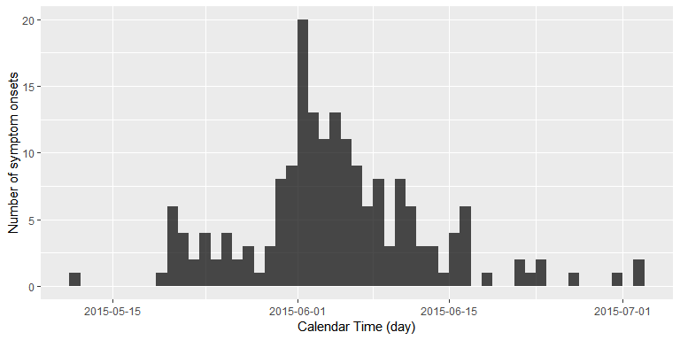
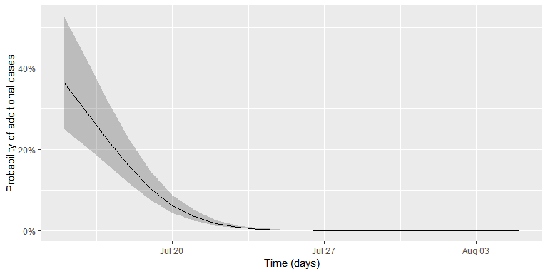

Motivation
==========

At which time point during an outbreak of a person-to-person transmitted
disease can one declare the outbreak as having ended? Answering this
question can be important in order to calm the population, re-attract
tourists, stop export bans or reduce alertness status. The current WHO
method for answering the above question is as follows: a period of two
times the longest possible incubation time needs to pass without
observing additional cases, before the outbreak can be declared as being
over. However, as stated in their paper, Nishiura, Miyamatsu, and
Mizumoto (2016) write that this criterion clearly lacks a statistical
motivation. As an improvement Nishiura and co-workers formulate a
statistical criterion for the decision making based on the serial
interval distribution and the offspring distribution of the pathogen
responsible for the outbreak.

In what follows we shall quickly describe their method and apply it to
their motivating example, which was the 2015 MERS-CoV outbreak in Korea.
R code is provided implementing and illustrating the method.
**Warning**: This practical assumes you have a certain knowledge of
statistical modelling and statistical inference, i.e. knowledge about
distributions, maximum likelihood inference and Monte Carlo simulation.

Statistical Method
==================

Describing the above problem in **mathematical notation**, let
*Y*<sub>*t*</sub> be a count variable representing the number of symptom
onset in cases we observe on a given day *t* during the outbreak. The
sequence of the *Y*<sub>*t*</sub> is also called the [**epidemic
cuve**](http://www.cdc.gov/foodsafety/outbreaks/investigating-outbreaks/epi-curves.html)
of the outbreak. Furthermore, let
*D* = {*Y*<sub>*i*</sub>, *i* = 1, …, *n*} be the currently available
outbreak data containing the time of symptom onset in in each of the *n*
days the outbreak has lasted so far. For simplicity we assume that at
the last observation at least some cases were observed, i.e.
*Y*<sub>*n*</sub> &gt; 0. In what follows we will be interested in what
happens with *Y*<sub>*t*</sub> for future time points, i.e. time points
after the last currently observed onset time. In particular out interest
is, whether we expect to observe either zero cases or more than zero
cases for *Y*<sub>*t*</sub>, *t* = *n* + 1, *n* + 2, ….

The important result of Nishiura, Miyamatsu, and Mizumoto (2016) is that
the probability *π*<sub>*t*</sub> = *P*(*Y*<sub>*t*</sub> &gt; 0 \| *D*)
for *t* = *n* + 1, *n* + 2, … can be computed as follows:
$$
\\begin{align\*}
\\pi\_t = 1 - \\prod\_{i=1}^n \\sum\_{o=0}^{\\infty} f\_{\\text{offspring}}(o; R\_0, k) \\cdot \\left\[ F\_{\\text{serial}}(t-t\_i) \\right\]^{o},
\\end{align\*}
$$
 where *f*<sub>offspring</sub> denotes the probability mass function
(PMF) for the number of secondary cases that one primary case induces.
It is assumed that this distribution is negative binomial with
expectation *R*<sub>0</sub> &gt; 0 and clumping parameter *k* &gt; 0. In
other words, E (*O*) = *R*<sub>0</sub> and
Var (*O*) = *R*<sub>0</sub> + *R*<sub>0</sub><sup>2</sup>/*k*.
Furthermore, *F*<sub>serial</sub> denotes the CDF of the serial interval
distribution of the disease of interest. The serial interval is the time
period between the onset of symptoms in the primary and onset of
symptoms in the secondary case, see Svensson (2007) for details and
definitions.

Once *π*<sub>*t*</sub> is below some pre-defined threshold *c*, say
*c* = 0.05, one would declare the outbreak to be over, if no new cases
have been observed by time *t*. In other words:
*T*<sub>end</sub> = min<sub>*t* &gt; *n*</sub>{*π*<sub>*t*</sub> &lt; *c*}.

Note that the formulated approach is conservative, because every
available case is treated as having the potential to generate new
secondary cases according to the entire offspring distribution. In
practice, however, observed cases towards the end will be secondary
cases of some of the earlier cases. Hence, these primary cases will be
attributed as having the ability to generate more secondary cases than
they actually have in practice. Another important assumption of the
method is that all cases are observed: no asymptomatic cases nor
under-reporting is taken into account.

Required packages
-----------------

The following packages, available on CRAN, are needed for this
practical:

-   [`tidyverse`](http://tidyverse.tidyverse.org) A set of packages
    (aka. the *hadleyverse*) to enhance the necessary data munging
-   [`openxlsx`](https://cran.r-project.org/web/packages/openxlsx/) to
    read `.xlsx` files without `rJava` dependence
-   [`pbapply`](https://cran.r-project.org/web/packages/pbapply/)
    Package to get a progress bar for lengthy computations done using
    `apply`, `sapply`, and `lapply`.

To install these packages, use `install.packages` and then load them
using

``` r
library(tidyverse)
library(openxlsx)
library(pbapply)
```

Data from the MERS-Cov Oubtreak in Korea, 2015
----------------------------------------------

We use the WHO MERS-CoV data available from
<http://www.who.int/csr/don/21-july-2015-mers-korea/en/> to illustrate
the statistical method. For convenience, these data were download and
are distributed as part of the RECON learn github account.

``` r
linelist <- openxlsx::read.xlsx("../../static/data/MERS-CoV-cases-rok-21Jul15.xlsx", startRow=4)
```

We skip the first 3 rows as they contain irrelevant header data. After
loading the data, additional data munging is needed in order to convert
the date-strings to the `Date` class and fill the missing values in the
`Date.of.symptoms.onset` column as described in the paper.

``` r
##Convert all columns containing the String "...Date..." to the Date class
##using the date/month/Year format (in which the data are available)
linelist <- linelist %>%
  mutate_if(grepl("Date", names(linelist)), as.Date, format="%d/%m/%Y")

## As written in the @nishiura_etal2016 paper, the missing onset times
## are handled as follows: Whenever the date of illness onset was missing,
## we substitute it with the date of laboratory confirmation.
linelist <- linelist %>%
  mutate(Date.of.symptoms.onset =
           if_else(is.na(Date.of.symptoms.onset),
                   Date.of.laboratory.confirmation,
                   Date.of.symptoms.onset))
```

At the end of the data munging the first three lines in the data look as
follows:

``` r
head(linelist, n=3)
##   Case.no. Date.of.notification.to.WHO Age Sex Health.care.worker
## 1        1                  2015-05-20  68   M                 No
## 2        2                  2015-05-22  63   F                 No
## 3        3                  2015-05-22  76   M                 No
##   Comorbidities Date.of.symptoms.onset Date.of.first.hospitalization
## 1          <NA>             2015-05-11                    2015-05-15
## 2          <NA>             2015-05-19                          <NA>
## 3          <NA>             2015-05-20                          <NA>
##   Date.of.laboratory.confirmation   Status Date.of.outcome
## 1                      2015-05-20    Alive            <NA>
## 2                      2015-05-20    Alive            <NA>
## 3                      2015-05-20 Deceased      2015-06-04
```

Analysis of the MERS-CoV data
=============================

The above data is the WHO dataset on the [MERS-Cov outbreak in
Korea](http://www.who.int/csr/don/21-july-2015-mers-korea/en/), which
occurred during May-July 2015. It contains the information about 185
cases of the MERS-CoV outbreak in Korea, 2015. Using the RECON
[`incidence`](http://www.repidemicsconsortium.org/incidence/) package it
is easy to plot the epicurve based on the date of symptoms onset in the
linelist.

``` r
inc <- incidence::incidence(linelist$Date.of.symptoms.onset, interval = 1)
plot(inc) + xlab("Calendar Time (day)") + ylab("Number of symptom onsets")
```



We are now interested in answering the following question: Standing at
2015-07-02, that is the day of the last reported new case with MERS
symptoms, how many days without newly reported symptom onsets would we
want to wait, before we would declare this outbreak as having **ended**?

Results
-------

We shall distinguish our results between

1.  estimating *R*<sub>0</sub> and *k* of the offspring distribution and
    the parameters of the serial interval distribution from data
2.  computating the probability *π*<sub>*t*</sub> given the parameters
    found in step 1.

Focus of this tutorial is on the later part. Details on the first part
is available in the R code from
[github](https://raw.githubusercontent.com/hoehleatsu/learn/outbreakend/content/post/practical-outbreakend.Rmd).

### Parameter Estimation of the Offspring and Serial Interval Distributions

The parameters to estimate are the following:

-   parameters of the parametric distributional family governing the
    serial interval distribution - in Nishiura, Miyamatsu, and
    Mizumoto (2016) this is assumed to be a gamma distribution with
    parameters *θ*<sub>serial</sub> = (*α*, *β*)′ with expectation
    *α*/*β* and variance *α*/*β*<sup>2</sup>
-   parameters of the offspring distribution, which here is assumed to
    be negative binomial with mean *R*<sub>0</sub> and clumping
    parameter *k*

The first set of parameters are estimated in Nishiura, Miyamatsu, and
Mizumoto (2016) by method-of-moment-matching the mean and standard
deviation of the serial interval distribution with observed in secondary
data - see the [technical
appendix](https://wwwnc.cdc.gov/eid/article/22/1/15-1383-techapp1.pdf)
of the paper for details. The solution for *α* and *β* of the gamma
distribution can then be found analytically from these values.

``` r
#Values for mean and std. deviation (=sqrt(Variance)) found in the paper
E <- 12.6
SD <- 2.8
##Convert to gamma distribution parameters
(theta_serial <- c(alpha=E^2/SD^2, beta=E/SD^2))
##     alpha      beta 
## 20.250000  1.607143
```

The second part of the estimation task is addressed in Nishiura et al.
(2015) by analysing final-size and generation data using a maximum
likelihood approach. We will here only implement the methods using the
data presented in Figure 1 and Table 1 of the paper. Unfortunately, one
cluster size is not immediately reconstructable from the data in the
paper, but guesstimating from the table on p.4 of the [ECDC Rapid Risk
Assessment](http://ecdc.europa.eu/en/publications/Publications/RRA-Middle-East-respiratory-syndrome-coronavirus-Korea.pdf)
it appears to be the outbreak in Jordan with a size of 19. The
likelihood is then maximized for
**θ** = (log (*R*<sub>0</sub>), log (*k*))′ using the `optim` function.

<!-- In the above `dfinalSize` and `dnGenerations` are two manually written R-functions, which contain the likelihood of observing a particular final size and a particular number of generations, respectively. -->
As usual in likelihood inference, a numeric approximation of the
variance-covariance matrix of $\\hat{\\mathbf{\\theta}}$ can be obtained
from the Hessian matrix for the loglikelihood evaluated at the MLE.
Altogether, we maximize the combined likelihood consisting of 36 as well
as the corresponding number of generations by:

``` r
theta_mle <- optim(c(log(1), log(1)), ll_combine, outbreaks=outbreaks, control=list(fnscale=-1), hessian=TRUE)
exp(theta_mle$par)
## [1] 0.8264387 0.1277683
```

Here, `ll_combine` denotes the log-likelihood function computed for the
data contained in `outbreaks`. For the exact code of these functions
please visit the [github source code]() of this practical.

These numbers deviate slightly from the values of *R̂*<sub>0</sub> = 0.75
and *k̂* = 0.14 reported by Nishiura et al. (2015). One explanation might
be the unclear cluster size of the Jordan outbreak, here it would have
been helpful to have had all data directly available in electronic form.

Determining the Outbreak End
----------------------------

The *π*<sub>*t*</sub> equation of Nishiura, Miyamatsu, and Mizumoto
(2016) stated above is implemented below as function `p_oneormore`. This
function requires the use of the PMF of the offspring distribution
(implemented as `doffspring`), which is the PMF of the negative binomial
offspring distribution.

``` r
###################################################################
## Offspring distribution, this is just the negative binomial PMF.
###################################################################
doffspring <- function(y, R_0, k, log=FALSE) {
  dnbinom(y, mu=R_0, size=k, log=log)
}

##########################################################################
## Probability for one or more cases at time t (vectorized for easier use).
##
## @param t             Vector of Time points to compute \pi_t for
## @param R_0           Estimated value of the basic reproduction number R_0
## @param k             Estimated value of the expected number of offspring k
## @param theta_serial  (alpha,beta) vector parametrising the serial interval
##                      gamma distribution
## @param oMax          Maximum value of o to sum in the summation formula
##                      (instead of infinity)
##########################################################################
p_oneormore <- Vectorize(function(t, R_0, k, theta_serial, oMax=1e4) {
  ##Init result variable
  res <- 1

  ##Loop over the linelist (this might take a while for long linelists)
  for (i in seq_len(nrow(linelist))) {
    serial_time <- as.numeric(t - linelist$Date.of.symptoms.onset[i])
    cdf <- pgamma(serial_time, theta_serial[1], theta_serial[2])
    o <- 0L:oMax
    osum <- sum( doffspring(y=o, R_0=R_0, k=k) * cdf^o)
    res <- res * osum
  }
  return(1-res)
},vectorize.args=c("t","R_0","k"))
```

The function allows us to re-calculate the results of Nishiura,
Miyamatsu, and Mizumoto (2016) for the MERS-CoV outbreak:

``` r
##Results from the Nishiura et al. (2015) paper
##R_0_hat <- 0.75 ; k_hat <- 0.14
##Use MLE found with the data we were able to extract.
R_0_hat <- exp(theta_mle$par[1])
k_hat   <- exp(theta_mle$par[2])

## Compute probility for one or more cases on a grid of dates
df <- data_frame(t=seq(as.Date("2015-07-15"), as.Date("2015-08-05"), by="1 day"))
df <- df %>%
  mutate(pi =  p_oneormore(t, R_0=R_0_hat, k=k_hat, theta_serial=theta_serial, oMax=250))
## Look at the result
head(df, n=3)
## # A tibble: 3 x 2
##   t             pi
##   <date>     <dbl>
## 1 2015-07-15 0.366
## 2 2015-07-16 0.297
## 3 2015-07-17 0.226
```

We can embed estimation uncertainty originating from the estimation of
*R*<sub>0</sub> and *k* by adding an additional bootstrap step with
values of (log *R*<sub>0</sub>, log *k*)′ sampled from the asymptotic
normal distribution of the MLE. This distribution has expectation equal
to the MLE and variance-covariance matrix equal to the observed Fisher
information. Pointwise percentile-based 95% confidence intervals are
then easily computed from the samples. The figure below shows this 95%
CI (shaded area) together with the *π*<sub>*t*</sub> curve. The github
code contains the details of generating the sample and drawing the curve
using `ggplot`.



Altogether, the date where we would declare the outbreak to be over,
given a threshold of *c* = 0.05, is found as:

``` r
(tEnd <- df2 %>% filter(`quantile.97.5%` < c_threshold) %>% slice(1L))
##            t         pi quantile.2.5% quantile.97.5%
## 1 2015-07-21 0.03452785    0.02581767     0.04570503
```

In other words, given the assumptions of the model and the chosen
threshold, we would declare the outbreak to be over, if no new cases are
observed by 2015-07-21. The adequate choice of *c* as cut-off in the
procedure depends on what is at stake. Hence, choosing *c* = 0.05
without additional thought is more than arbitrary, but a more careful
discussion is beyond the scope of this small practical tutorial.

Discussion
==========

The present practical introduced the statistical modelling based
approach by Nishiura, Miyamatsu, and Mizumoto (2016) for declaring the
end of a person-to-person transmitted disease outbreak such as MERS-Cov,
Ebola, etc. If the considered outbreak has a different mode of
transmission, e.g. foodborne or originates from a point-source, then
different formulas apply, see e.g. Brookmeyer and You (2006). The [blog
post](http://staff.math.su.se/hoehle/blog/2016/08/04/outbreakEnd.html),
on which this practical is based, contains an additional hierarchical
modelling approach with simulation based inference. Altoghether, we hope
that the avaibility of the method in R might be helpful in future
outbreak analyses.

About this document
===================

Contributors
------------

-   [Michael Höhle](http://www.math.su.se/~hoehle), Stockholm
    University: RECON modified version of the blog post [No Sleep During
    the Reproducibility
    Session](http://staff.math.su.se/hoehle/blog/2016/08/04/outbreakEnd.html)

Contributions are welcome via [pull
requests](https://github.com/reconhub/learn/pulls). The source file is
hosted on
[github](https://github.com/reconhub/learn/blob/master/content/post/2018-03-22-practical-outbreakend.Rmd).

Legal stuff
-----------

**License**: This work is licensed under a <a rel="license"
href="http://creativecommons.org/licenses/by-sa/4.0/">Creative Commons
Attribution-ShareAlike 4.0 International License</a>. The
markdown+Rknitr source code of this blog is available under a [GNU
General Public License (GPL
v3)](https://www.gnu.org/licenses/gpl-3.0.html) license from github.

**Copyright**: Michael Höhle, 2018

References
==========

Brookmeyer, R., and X. You. 2006. “A hypothesis test for the end of a
common source outbreak.” *Biometrics* 62 (1):61–65.
<https://doi.org/10.1111/j.1541-0420.2005.00421.x>.

Nishiura, H., Y. Miyamatsu, G. Chowell, and M. Saitoh. 2015. “Assessing
the risk of observing multiple generations of Middle East respiratory
syndrome (MERS) cases given an imported case.” *Euro Surveill.* 20 (27).
[https://doi.org/10.2807/1560-7917.ES2015.20.27.21181](https://doi.org/10.2807/1560-7917.ES2015.20.27.21181 ).

Nishiura, H., Y. Miyamatsu, and K. Mizumoto. 2016. “Objective
Determination of End of MERS Outbreak, South Korea, 2015.” *Emerging
Infect. Dis.* 22 (1):146–48. <https://doi.org/10.3201/eid2201.151383>.

Svensson, Å. 2007. “A note on generation times in epidemic models.”
*Math Biosci* 208 (1):300–311.
<https://doi.org/10.1016/j.mbs.2006.10.010>.
