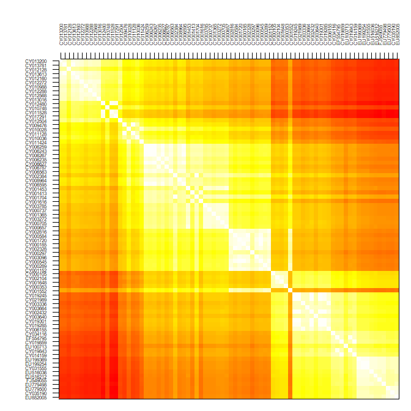
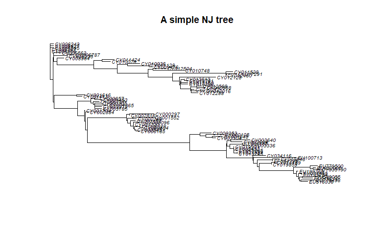
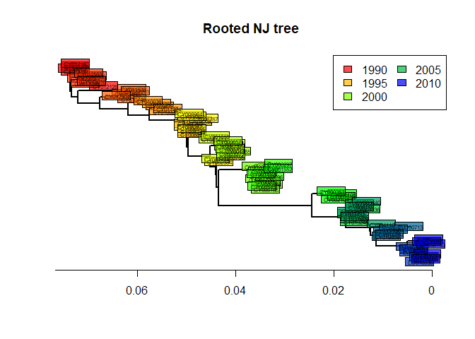
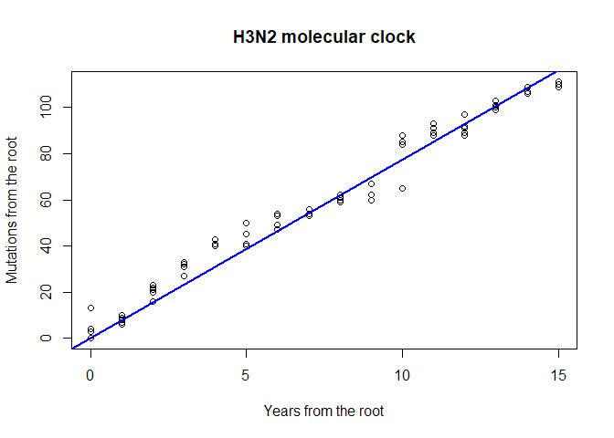
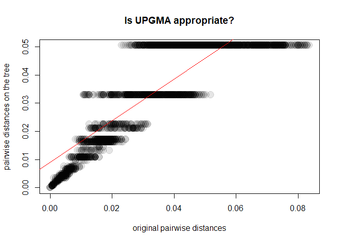
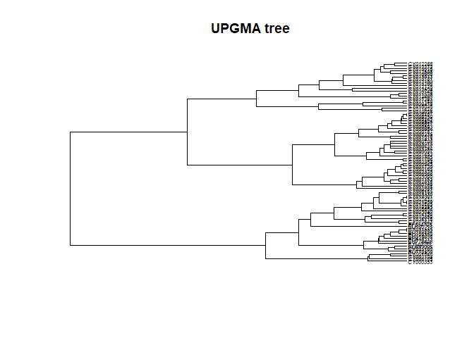
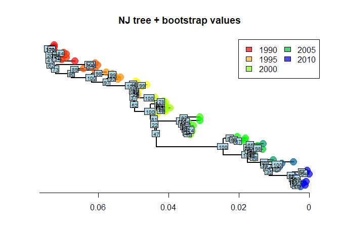

This practical aims to illustrate the basics of **phylogenetic
reconstruction** using R, with an emphasis on how the methods work, how
their results can be interpreted, and the relative advantages and
limitations of the methods. Three main classes of phylogenetic
approaches are introduced, namely **distance-based**, **maximum
parsimony**, and **maximum likelihood** methods. We also illustrate how
to assess the reliability of individual nodes using bootstrap, and show
how a simple linear model can be used to estimate a molecular clock in
rooted phylogenies. Methods are illustrated using a dataset of seasonal
influenza isolates sampled in the US from 1993 to 2008.

Introduction
============

Phylogenetics in a nutshell
---------------------------

The reconstruction of evolutionary relationships of a set of organisms
can be a tricky task, and has led to the development of a variety of
methods over the last decades, implemented in an even larger number of
software. However, these methods can be classified into three main
categories:

-   **distance-based methods**: compute a matrix of pairwise genetic
    distances between the studied taxa, and summarize it using a
    hierarchical clustering algorithm such as UPGMA or
    Neighbour-Joining. *Advantages*: fast (the fastest) and flexible
    (different genetic distances allow to account for different features
    of DNA sequence evolution). *Limitations*: no model comparison
    (can’t test for the ‘best’ tree, or the ‘best’ model of evolution);
    may be inaccurate and highly dependent on the distance and
    clustering algorithm chosen.

-   **maximum parsimony**: seeks the tree with the smallest number of
    overall genetic changes between the taxa. This is achieved by
    changing randomly the topology of the tree until parsimony is no
    longer improved. *Advantages*: intuitive interpretation (assumes
    that the simplest scenario is the most likely), usually accurate
    when the amount of genetic changes is small. *Limitations*:
    computer-intensive, simplistic model of evolution, no model
    comparison, inaccurate when substantial evolution takes place, and
    when heterogeneous mutation rates exist in different parts of the
    tree.

-   **likelihood-based method**: based on a model of sequence evolution
    which allows to compute a likelihood, that is, the probability of
    observing the data given the model and a set of parameters. There
    are two main branches of likelihood-based methods: maximum
    likelihood and Bayesian methods. The first seeks the ‘best’ tree and
    parameter values, i.e. the one maximizing the likelihood. The second
    derives samples of trees and model parameters which are the most
    consistent with the data and possible prior knowledge about the
    tree/parameters. *Advantages*: flexible (any model of evolution can
    be used), usually accurate, model selection possible, measure of
    uncertainty (in Bayesian approaches). *Limitations*:
    computer-intensive, model selection possibly cumbersome.

The R software implements one of the largest selections of phylogenetic
methods, including all of the above except for Bayesian reconstruction.

Required packages
-----------------

This practical requires a working version of ~ (R Core Team 2017)
greater than or equal to 2.15.2. It uses the following packages: *stats*
implements basic hierarchical clustering routines, *ade4* (Dray, Dufour,
and Chessel 2007) and *adegenet* (Jombart 2008; Jombart and Ahmed 2011)
are here used essentially for their graphics, *ape* \[Paradis, Claude,
and Strimmer (2004); Popescu2012-ct\] is the core package for
phylogenetics, and *phangorn* (Schliep 2011) implements parsimony and
likelihood-based methods. Make sure that the dependencies are installed
as well when installing the packages:

``` r
install.packages("adegenet", dep=TRUE)
install.packages("phangorn", dep=TRUE)
```

Then load the packages using:

``` r
library(stats)
library(ade4)
library(ape)
library(adegenet)
library(phangorn)
```

The data
--------

The data used in this practical are DNA sequences of seasonal influenza
(H3N2) downloaded from Genbank <http://www.ncbi.nlm.nih.gov/genbank/>.
Alignments have been realized beforehand using standard tools (Clustalw2
for basic alignment and Jalview for refining the results). We selected
80 isolates genotyped for the hemagglutinin (HA) segment sampled in the
US from 1993 to 2008. The dataset consists of two files: i)
[`usflu.fasta`](../../data/usflu.fasta), a file containing aligned DNA
sequences and ii) [`usflu.annot.csv`](../../data/usflu.annot.csv), a
comma-separated file containing useful annotations of the sequences.

First download these files (right-click → *Save Link As…*) and store
them in a folder `data/` in your working directory. To read the DNA
sequences into R, we use `fasta2DNAbin` from the *adegenet* package:

``` r
dna <- fasta2DNAbin(file = "data/usflu.fasta")
dna
class(dna)
```

    ## 
    ##  Converting FASTA alignment into a DNAbin object... 
    ## 
    ## 
    ##  Finding the size of a single genome... 
    ## 
    ## 
    ##  genome size is: 1,701 nucleotides 
    ## 
    ## ( 30  lines per genome )
    ## 
    ##  Importing sequences... 
    ## ........................................................................................................................................................................................................................................................................................................................................................................
    ##  Forming final object... 
    ## 
    ## ...done.
    ## 80 DNA sequences in binary format stored in a matrix.
    ## 
    ## All sequences of same length: 1701 
    ## 
    ## Labels:
    ##  CY013200
    ##  CY013781
    ##  CY012128
    ##  CY013613
    ##  CY012160
    ##  CY012272
    ## ...
    ## 
    ## Base composition:
    ##     a     c     g     t 
    ## 0.335 0.200 0.225 0.239
    ## [1] "DNAbin"

Sequences are stored as `DNAbin` objects, an efficient representation of
DNA/RNA sequences which use bytes (as opposed to character strings) to
code nucleotides, resulting in considerable savings in terms of memory
required to store the data. While the present dataset is very small,
such compression can become essential for larger genomes (bacterial
genomes are typically a few millions of nucleotides long). Note that for
even larger datasets, more efficient data reduction can be achieved
using the bit-level coding of polymorphic sites implemented in
*adegenet* (Jombart and Ahmed 2011).

The annotation file is read in R using the standard procedure:

``` r
annot <- read.csv("data/usflu.annot.csv",
                  header = TRUE, row.names = 1, stringsAsFactors = FALSE)
```

``` r
head(annot)
##   accession year                        misc
## 1  CY013200 1993 (A/New York/783/1993(H3N2))
## 2  CY013781 1993 (A/New York/802/1993(H3N2))
## 3  CY012128 1993 (A/New York/758/1993(H3N2))
## 4  CY013613 1993 (A/New York/766/1993(H3N2))
## 5  CY012160 1993 (A/New York/762/1993(H3N2))
## 6  CY012272 1994 (A/New York/729/1994(H3N2))
dim(annot)
## [1] 80  3
```

`accession` contains the Genbank accession numbers, which are unique
sequence identifiers; `year` is the year of collection of the isolates;
`misc` contains other possibly useful information. Before going further,
we check that isolates are identical in both files (accession numbers
are used as labels for the sequences):

``` r
dim(dna)
## [1]   80 1701
dim(annot)
## [1] 80  3
all(annot$accession == rownames(dna))
## [1] FALSE
table(annot$year)
## 
## 1993 1994 1995 1996 1997 1998 1999 2000 2001 2002 2003 2004 2005 2006 2007 
##    5    5    5    5    5    5    5    5    5    5    5    5    5    5    5 
## 2008 
##    5
```

Good! The data we will analyse are 80 isolates (5 per year) typed for
the same 1701 nucleotides.

Distance-based phylogenies
==========================

Distance-based phylogenetic reconstruction consists in i) computing
pairwise genetic distances between individuals (here, isolates), ii)
representing these distances using a tree, and iii) evaluating the
relevance of this representation.

Computing genetic distances
---------------------------

We first compute genetic distances using *ape*’s `dist.dna`, which
proposes no less than 15 different genetic distances (see `?dist.dna`
for details). Here, we use Tamura and Nei 1993’s model (Tamura and Nei
1993) which allows for different rates of transitions and transversions,
heterogeneous base frequencies, and between-site variation of the
substitution rate.

``` r
D <- dist.dna(dna, model = "TN93")
class(D)
## [1] "dist"
length(D)
## [1] 3160
```

`D` is an object of class `dist` which contains the distances between
every pairs of sequences.

Now that genetic distances between isolates have been computed, we need
to visualize this information. There are *n(n-1)/2* distances for *n*
sequences; here, *n=80* so that the genetic relationships between the
sampled isolates are described by *80 79 / 2 = 3160* pairwise distances.
Most of the time, summarising such information is not entirely trivial.
The simplest approach is plotting directly the matrix of pairwise
distances:

``` r
temp <- as.data.frame(as.matrix(D))
table.paint(temp, cleg = 0, clabel.row = .5, clabel.col = .5)
```


Darker shades of grey represent greater distances. Note that to use
`image` to produce similar plots, data need to be transformed first; for
instance:

``` r
temp <- t(as.matrix(D))
temp <- temp[,ncol(temp):1]
```

``` r
par(mar = c(1,5,5,1))
image(x = 1:80, y = 1:80, temp, col = rev(heat.colors(100)),
      xaxt = "n", yaxt = "n", xlab="",ylab="")
axis(side = 2, at = 1:80, lab = rev(rownames(dna)), las = 2, cex.axis = .5)
axis(side = 3, at = 1:80, lab = rownames(dna), las = 3, cex.axis = .5)
```



(see `image.plot` in the package *fields* for similar plots with a
legend).

Since the data are roughly ordered by year, we can already see some
genetic structure appearing, but this is admittedly not the most
satisfying or informative approach, and tells us little about the
evolutionary relationships between our isolates.

Building trees
--------------

We use trees to get a better representation of the genetic distances
between individuals. It is important, however, to bear in mind that the
obtained trees are not necessarily efficient representations of the
original distances, and information can (and likely will) be lost in the
process.

A wide array of algorithms for constructing trees from a distance matrix
are available in R, including:

-   `nj` (*ape* package): the classical Neighbor-Joining algorithm.

-   `bionj` (*ape*): an improved version of Neighbor-Joining.

-   `fastme.bal` and `fastme.ols` (*ape*): minimum evolution algorithms.
    `hclust` (*stats*): classical hierarchical clustering algorithms
    including single linkage, complete linkage, UPGMA, and others.

Here, we go for the standard:

``` r
tre <- nj(D)
class(tre)
## [1] "phylo"
tre <- ladderize(tre)
tre
## 
## Phylogenetic tree with 80 tips and 78 internal nodes.
## 
## Tip labels:
##   CY013200,  CY013781,  CY012128,  CY013613,  CY012160,  CY012272, ...
## 
## Unrooted; includes branch lengths.
plot(tre, cex = .6)
title("A simple NJ tree")
```



Trees created in the package *ape* are instances of the class `phylo`.
See `?read.tree` for a description of this class.

Plotting trees
--------------

The plotting method offers many possibilities for plotting trees; see
`?plot.phylo` for more details. Functions such as `tiplabels`,
`nodelabels`, `edgelabels` and `axisPhylo` can also be useful to
annotate trees. For instance, we may simply represent years using
different colors (red = ancient; blue = recent):

``` r
plot(tre, show.tip = FALSE)
title("Unrooted NJ tree")
myPal <- colorRampPalette(c("red","yellow","green","blue"))
tiplabels(annot$year, bg = num2col(annot$year, col.pal = myPal),
          cex=.5)
temp <- pretty(1993:2008, 5)
legend("bottomleft", fill = num2col(temp, col.pal = myPal),
       leg = temp, ncol = 2)
```


This illustrates a common mistake when interpreting phylogenetic trees.
In the above figures, we tend to assume that the left-side of the
phylogeny is \`ancestral’, while the right-side is ‘recent’. This is
wrong (as suggested by the colors) unless the phylogeny is actually
rooted, i.e. some external taxa has been used to define what is the most
‘ancient’ split in the tree. The present tree is not rooted, and should
be better represented as such:

``` r
plot(tre, type = "unrooted", show.tip = FALSE)
title("Unrooted NJ tree")
tiplabels(tre$tip.label, bg = num2col(annot$year, col.pal = myPal),
          cex = .5)
```


In the present case, a sensible rooting would be any of the most ancient
isolates (from 1993). We can take the first one:

``` r
head(annot)
##   accession year                        misc
## 1  CY013200 1993 (A/New York/783/1993(H3N2))
## 2  CY013781 1993 (A/New York/802/1993(H3N2))
## 3  CY012128 1993 (A/New York/758/1993(H3N2))
## 4  CY013613 1993 (A/New York/766/1993(H3N2))
## 5  CY012160 1993 (A/New York/762/1993(H3N2))
## 6  CY012272 1994 (A/New York/729/1994(H3N2))
tre2 <- root(tre, out = 1)
tre2 <- ladderize(tre2)
```

and plot the result:

``` r
plot(tre2, show.tip = FALSE, edge.width = 2)
title("Rooted NJ tree")
tiplabels(tre$tip.label,
          bg = transp(num2col(annot$year, col.pal = myPal),.7),
          cex = .5, fg = "transparent")
axisPhylo()
temp <- pretty(1993:2008, 5)
legend("topright",
       fill = transp(num2col(temp, col.pal = myPal),.7),
       leg = temp, ncol = 2)
```



The phylogeny is now rooted. The shape of this tree is typical of
influenza. What can you say about the evolution of influenza and the
fitness of different viral lineages, based on this tree? What does the
‘trunk’ of this tree represent? Would there be any interest in
predicting the genome of the trunk?

Estimating a molecular clock
----------------------------

Rooted trees are also useful for assessing the rate of evolution of a
given gene. We call **molecular clock** the accumulation of mutations
over time. Can you visually assess if there are signs of a molecular
clock in this tree? A quantitative analysis is very easy to perform, and
merely relies on regressing the number of mutations from the root to the
time of divergence from the root:

``` r
mutFromRoot <- as.matrix(dist.dna(dna, model = "N"))[1,]
yearFromRoot <- annot$year - annot$year[1]
plot(mutFromRoot ~ yearFromRoot, xlab = "Years from the root",
     ylab = "Mutations from the root", main = "H3N2 molecular clock")
lm.clock <- lm(mutFromRoot ~ -1 + yearFromRoot)
abline(lm.clock, col = "blue",lwd = 2)
```



``` r
summary(lm.clock)
## 
## Call:
## lm(formula = mutFromRoot ~ -1 + yearFromRoot)
## 
## Residuals:
##     Min      1Q  Median      3Q     Max 
## -12.327  -1.577   1.004   6.386  13.000 
## 
## Coefficients:
##              Estimate Std. Error t value Pr(>|t|)    
## yearFromRoot  7.73274    0.07443   103.9   <2e-16 ***
## ---
## Signif. codes:  0 '***' 0.001 '**' 0.01 '*' 0.05 '.' 0.1 ' ' 1
## 
## Residual standard error: 5.86 on 79 degrees of freedom
## Multiple R-squared:  0.9927, Adjusted R-squared:  0.9926 
## F-statistic: 1.079e+04 on 1 and 79 DF,  p-value: < 2.2e-16
lm.clock$coefficients
## yearFromRoot 
##     7.732742
lm.clock$coefficients/ncol(dna)
## yearFromRoot 
##  0.004545998
365/ lm.clock$coefficients
## yearFromRoot 
##     47.20189
```

What is the substitution rate per year for the HA segment? What is the
substitution rate per year and per site? On average, how many days would
you expect to wait before observing one mutation on a transmission
chain? Knowing that the generation time of influenza is roughly around
2-3 days, would you recommend using HA sequences for reconstructing
transmission trees of influenza epidemics? What alternative would you
suggest?

Assessing the quality of a phylogeny
------------------------------------

Many genetic distances and hierarchical clustering algorithms can be
used to build trees; not all of them are appropriate for a given
dataset. Genetic distances rely on hypotheses about the evolution of DNA
sequences which should be taken into account. For instance, the mere
proportion of differing nucleotides between sequences (`model = 'raw`}
in `dist.dna`) is easy to interprete, but only makes sense if all
substitutions are equally frequent. In practice, simple yet flexible
models such as that of Tamura and Nei (Tamura and Nei 1993) are probably
fair choices. At the very least, the genetic distance used should allow
different rates for transitions (*a &lt;-&gt; g*, *c &lt;-&gt; t*) and
transversions (other changes).

<br>

Once one has chosen an appropriate genetic distance and built a tree
using this distance, an essential yet most often overlooked question is
whether this tree actually is a good representation of the original
distance matrix. This is easily investigated using simple biplots and
correlation indices. The function `cophenetic` is used to compute
distances between the tips of the tree. Note that more distances are
available in the *adephylo* package (see `distTips` function).

``` r
x <- as.vector(D)
y <- as.vector(as.dist(cophenetic(tre2)))
plot(x, y, xlab = "original pairwise distances", ylab = "pairwise distances on the tree",
     main = "Is NJ appropriate?", pch = 20, col = transp("black",.1), cex = 3)
abline(lm(y~x), col = "red")
```


``` r
cor(x,y)^2
## [1] 0.9975154
```

As it turns out, our Neighbor-Joining tree (`tre2`) is a very good
representation of the chosen genetic distances. Things would have been
different had we chosen, for instance, UPGMA:

``` r
tre3 <- as.phylo(hclust(D,method = "average"))
y <- as.vector(as.dist(cophenetic(tre3)))
plot(x, y, xlab = "original pairwise distances", ylab = "pairwise distances on the tree",
     main = "Is UPGMA appropriate?", pch = 20, col = transp("black",.1), cex = 3)
abline(lm(y~x), col = "red")
```



``` r
cor(x,y)^2
## [1] 0.7393009
```

In this case, UPGMA is a poor choice. Why is this? A first explanation
is that UPGMA forces ultrametry (all the tips are equidistant to the
root):

``` r
plot(tre3, cex = .5)
title("UPGMA tree")
```



The underlying assumption is that all lineages have undergone the same
amount of evolution, which is obviously not the case in seasonal
influenza sampled over 16 years. <br>

Another validation of phylogenetic trees, much more commonly used, is
bootstrap. Bootstrapping a phylogeny consists in sampling the
nucleotides with replacement, rebuilding the phylogeny, and checking if
the original nodes are present in the bootstrapped trees. In practice,
this procedure is repeated a large number of times (e.g. 100, 1000),
depending on how computer-intensive the phylogenetic reconstruction is.
The underlying idea is to assess the variability in the obtained
topology which results from conducting the analyses on a random sample
the genome. Note that the assumption that the analysed sequences
represent a random sample of the genome is often dubious. For instance,
this is not the case in our toy dataset, since HA segment has a
different rate of evolution and experiences different selective
pressures from other segments of the influenza genome. We nonetheless
illustrate the procedure, implemented by `boot.phylo`:

``` r
myBoots <- boot.phylo(tre2, dna, function(e)
                      root(nj(dist.dna(e, model = "TN93")),1))
myBoots
```

The output gives the number of times each node was identified in
bootstrapped analyses (the order is the same as in the original object).
It is easily represented using `nodelabels`:

``` r
plot(tre2, show.tip = FALSE, edge.width = 2)
title("NJ tree + bootstrap values")
tiplabels(frame = "none", pch = 20,
          col = transp(num2col(annot$year, col.pal = myPal),.7),
          cex = 3, fg = "transparent")
axisPhylo()
temp <- pretty(1993:2008, 5)
legend("topright", fill = transp(num2col(temp, col.pal = myPal),.7),
       leg = temp, ncol = 2)
nodelabels(myBoots, cex = .6)
```



As we can see, some nodes are very poorly supported. One common practice
is to collapse these nodes into multifurcations. There is no dedicated
method for this in *ape*, but one simple workaround consists in setting
the corresponding edges to a length of zero (here, with bootstrap
&lt;70%), and then collapsing the small branches:

``` r
temp <- tre2
N <- length(tre2$tip.label)
toCollapse <- match(which(myBoots<70)+N, temp$edge[,2])
temp$edge.length[toCollapse] <- 0
tre3 <- di2multi(temp, tol = 0.00001)
```

The new tree might be slightly less informative, but more robust than
the previous one:

``` r
plot(tre3, show.tip = FALSE, edge.width = 2)
title("NJ tree after collapsing weak nodes")
tiplabels(tre3$tip.label, bg = transp(num2col(annot$year, col.pal = myPal), .7),
          cex = .5, fg = "transparent")
axisPhylo()
temp <- pretty(1993:2008, 5)
legend("topright", fill = transp(num2col(temp, col.pal = myPal), .7),
       leg = temp, ncol = 2)
```


Maximum parsimony phylogenies
=============================

Introduction
------------

Phylogenetic reconstruction based on parsimony seeks trees which
minimize the total number of changes (substitutions) from ancestors to
descendents. While a number of criticisms can be made to this approach,
it is a simple way to infer phylogenies for data which display low
divergence (i.e. most taxa differ from each other by only a few
nucleotides, and the overall substitution rate is low). <br>

In practice, there is often no way to perform an exhaustive search
amongst all possible trees to find the most parsimonious one, and
heuristic algorithms are used to browse the space of possible trees. The
strategy is fairly simple: i) initialize the algorithm using a tree and
ii) make small changes to the tree and retain those leading to better
parsimony, until the parsimony score stops improving.

Implementation
--------------

Parsimony-based phylogenetic reconstruction is implemented in the
package *phangorn*. It requires a tree (in *ape*’s format, i.e. a
`phylo` object) and the original DNA sequences in *phangorn*’s own
format, `phyDat`. We convert the data and generate a tree to initialize
the method:

``` r
dna2 <- as.phyDat(dna)
class(dna2)
## [1] "phyDat"
dna2
## 80 sequences with 1701 character and 269 different site patterns.
## The states are a c g t
tre.ini <- nj(dist.dna(dna,model = "raw"))
tre.ini
## 
## Phylogenetic tree with 80 tips and 78 internal nodes.
## 
## Tip labels:
##   CY013200,  CY013781,  CY012128,  CY013613,  CY012160,  CY012272, ...
## 
## Unrooted; includes branch lengths.
```

The parsimony of a given tree is given by:

``` r
parsimony(tre.ini, dna2)
## [1] 422
```

Then, optimization of the parsimony is achieved by:

``` r
tre.pars <- optim.parsimony(tre.ini, dna2)
## Final p-score 420 after  2 nni operations
tre.pars
## 
## Phylogenetic tree with 80 tips and 78 internal nodes.
## 
## Tip labels:
##   CY013200,  CY013781,  CY012128,  CY013613,  CY012160,  CY012272, ...
## 
## Unrooted; no branch lengths.
```

Here, the final result is very close to the original tree. The obtained
tree is unrooted and does not have branch lengths, but it can be plotted
as previously:

``` r
plot(tre.pars, type = "unr", show.tip = FALSE, edge.width = 2)
title("Maximum-parsimony tree")
tiplabels(tre.pars$tip.label, bg = transp(num2col(annot$year, col.pal = myPal),.7),
          cex = .5, fg = "transparent")
temp <- pretty(1993:2008, 5)
legend("bottomright", fill = transp(num2col(temp, col.pal = myPal),.7),
       leg = temp, ncol = 2, bg = transp("white"))
```


In this case, parsimony gives fairly consistent results with other
approaches, which is only to be expected whenever the amount of
divergence between the sequences is fairly low, as is the case in our
data.

Maximum likelihood phylogenies
==============================

Introduction
------------

Maximum likelihood phylogenetic reconstruction is somehow similar to
parsimony methods in that it browses a space of possible tree topologies
looking for the ‘best’ tree. However, it offers far more flexibility in
that any model of sequence evolution can be taken into account. Given
one model of evolution, one can compute the likelihood of a given tree,
and therefore optimization procedures can be used to infer both the most
likely tree topology and model parameters. <br>

As in distance-based methods, model-based phylogenetic reconstruction
requires thinking about which parameters should be included in a model.
Usually, all possible substitutions are allowed to have different rates,
and the substitution rate is allowed to vary across sites according to a
gamma distribution. We refer to this model as GTR + *Γ*(4) (GTR: global
time reversible). More information about phylogenetic models can be
found in (Kelchner and Thomas 2007).

Getting a ML tree
-----------------

Likelihood-based phylogenetic reconstruction is implemented in the
package *phangorn*. As in the previous section, we use the data `dna2`,
converted into *phangorn*’s format. We choose a Neighbor-Joining tree of
Tamura and Nei’s 1993 distance to get an initial tree.

``` r
class(dna2)
## [1] "phyDat"
dna2
## 80 sequences with 1701 character and 269 different site patterns.
## The states are a c g t
tre.ini <- nj(dist.dna(dna,model = "TN93"))
tre.ini
## 
## Phylogenetic tree with 80 tips and 78 internal nodes.
## 
## Tip labels:
##   CY013200,  CY013781,  CY012128,  CY013613,  CY012160,  CY012272, ...
## 
## Unrooted; includes branch lengths.
```

This tree is most likely not the ML tree, but we need it as a
‘reasonable’ starting point to initialize the optimization procedure.
The likelihood of this initial tree is computed using `pml`:

``` r
fit.ini <- pml(tre.ini, dna2, k = 4)
## negative edges length changed to 0!
fit.ini
## 
##  loglikelihood: -5641.785 
## 
## unconstrained loglikelihood: -4736.539 
## Discrete gamma model
## Number of rate categories: 4 
## Shape parameter: 1 
## 
## Rate matrix:
##   a c g t
## a 0 1 1 1
## c 1 0 1 1
## g 1 1 0 1
## t 1 1 1 0
## 
## Base frequencies:  
## 0.25 0.25 0.25 0.25
```

We now have all the information needed for seeking a maximum likelihood
solution using `optim.pml`; we specify that we want to optimize tree
topology (`optNni = TRUE`), base frequencies (`optBf = TRUE`), the rates
of all possible subtitutions (`optQ = TRUE`), and use a gamma
distribution to model variation in the substitution rates across sites
(`optGamma = TRUE`):

``` r
fit <- optim.pml(fit.ini, optNni = TRUE, optBf = TRUE,
                 optQ = TRUE, optGamma = TRUE)
```

``` r
fit
## 
##  loglikelihood: -5325.723 
## 
## unconstrained loglikelihood: -4736.539 
## Discrete gamma model
## Number of rate categories: 4 
## Shape parameter: 0.2676999 
## 
## Rate matrix:
##           a         c         g         t
## a 0.0000000 1.9788788 6.6454555 0.6487415
## c 1.9788788 0.0000000 0.1715952 8.2484828
## g 6.6454555 0.1715952 0.0000000 1.0000000
## t 0.6487415 8.2484828 1.0000000 0.0000000
## 
## Base frequencies:  
## 0.3368452 0.1978542 0.2244658 0.2408349
class(fit)
## [1] "pml"
names(fit)
##  [1] "logLik"  "inv"     "k"       "shape"   "Q"       "bf"      "rate"   
##  [8] "siteLik" "weight"  "g"       "w"       "eig"     "data"    "model"  
## [15] "INV"     "ll.0"    "tree"    "lv"      "call"    "df"      "wMix"   
## [22] "llMix"
```

`fit` is a list with class `pml` storing various useful information
about the model parameters and the optimal tree (stored in `fit$tree`).
In this example, we can see from the output that transitions (*a
&lt;-&gt; g* and *c &lt;-&gt; t*) are much more frequent than
transversions (other changes), which is consistent with biological
expectations (transversions induce more drastic changes of chemical
properties of the DNA and are more prone to purifying selection). One
advantage of using probabilistic models of evolution is that different
models can be compared formally. For instance, here, we can verify that
the optimized tree is indeed better than the original one using standard
likelihood ratio tests and AIC:

``` r
anova(fit.ini, fit)
## Likelihood Ratio Test Table
##   Log lik.  Df Df change Diff log lik. Pr(>|Chi|)    
## 1  -5641.8 158                                       
## 2  -5325.7 166         8        632.13  < 2.2e-16 ***
## ---
## Signif. codes:  0 '***' 0.001 '**' 0.01 '*' 0.05 '.' 0.1 ' ' 1
AIC(fit.ini)
## [1] 11599.57
AIC(fit)
## [1] 10983.45
```

Both the likelihood ratio test (highly significant, function `anova`)
and the AIC (lower = better) indicate that the new tree is a better
model of the data than the initial one.

We can extract and plot the tree as we did before with other methods:

``` r
tre4 <- root(fit$tree,1)
tre4 <- ladderize(tre4)
plot(tre4, show.tip = FALSE, edge.width = 2)
title("Maximum-likelihood tree")
tiplabels(annot$year,
          bg = transp(num2col(annot$year, col.pal = myPal), .7),
          cex = .5, fg = "transparent")
axisPhylo()
temp <- pretty(1993:2008, 5)
legend("topright", fill = transp(num2col(temp, col.pal = myPal), .7),
       leg = temp, ncol = 2)
```


This tree is statistically better than the original NJ tree based on
Tamura and Nei’s distance (Tamura and Nei 1993). However, we can note
that it is remarkably similar to the ‘robust’ version of this
distance-based tree (after collapsing weakly supported nodes). The
structure of this dataset is fairly simple, and all methods give fairly
consistent results. In practice, different methods can lead to different
interpretations, and it is often worth exploring different approaches
before drawing conclusions on the data.

About this document
===================

Contributors
------------

-   Thibaut Jombart: initial version

Contributions are welcome via [pull
requests](https://github.com/reconhub/learn/pulls). The source file if
this document can be found
[**here**](https://raw.githubusercontent.com/reconhub/learn/master/content/post/2017-11-01-practical-phylogenetics.Rmd).

Legal stuff
-----------

**License**: [CC-BY](https://creativecommons.org/licenses/by/3.0/)
**Copyright**: Thibaut Jombart, 2017

References
==========

Dray, Stéphane, Anne B Dufour, and Daniel Chessel. 2007. “The Ade4
package-II: Two-Table and K-Table Methods.” *R News* 7 (2):47–52.

Jombart, Thibaut. 2008. “Adegenet: A R Package for the Multivariate
Analysis of Genetic Markers.” *Bioinformatics* 24 (11):1403–5.

Jombart, Thibaut, and Ismaïl Ahmed. 2011. “Adegenet 1.3-1: New Tools for
the Analysis of Genome-Wide SNP Data.” *Bioinformatics* 27 (21):3070–1.

Kelchner, Scot A, and Michael A Thomas. 2007. “Model Use in
Phylogenetics: Nine Key Questions.” *Trends Ecol. Evol.* 22 (2):87–94.

Paradis, Emmanuel, Julien Claude, and Korbinian Strimmer. 2004. “APE:
Analyses of Phylogenetics and Evolution in R Language.” *Bioinformatics*
20 (2):289–90.

R Core Team. 2017. “R: A Language and Environment for Statistical
Computing.” Vienna, Austria: R Foundation for Statistical Computing.

Schliep, Klaus Peter. 2011. “Phangorn: Phylogenetic Analysis in R.”
*Bioinformatics* 27 (4):592–93.

Tamura, K, and M Nei. 1993. “Estimation of the Number of Nucleotide
Substitutions in the Control Region of Mitochondrial DNA in Humans and
Chimpanzees.” *Mol. Biol. Evol.* 10 (3):512–26.
