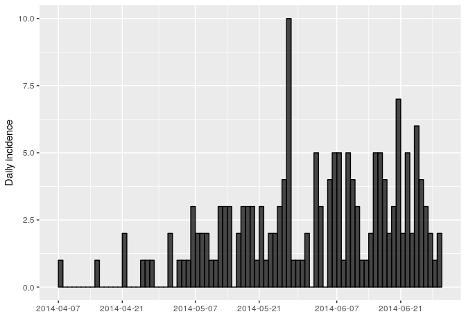

## Introduction

This practical (in three parts) simulates the early assessment and
reconstruction of an Ebola Virus Disease (EVD) outbreak. It introduces
various aspects of analysis of the early stage of an outbreak, including
case fatality ratio (CFR), epicurves ([part
1](./real-time-response-1.html)), growth rate estimation, contact
tracing data, delays, and estimates of transmissibility ([part
2](./real-time-response-2.html)), as well as transmission chain
reconstruction using outbreaker2 ([part
3](./real-time-response-3.html)).

> Note: This practical is derived from earlier practicals called [Ebola
> simulation part 1: early outbreak
> assessment](./simulated-evd-early.html) and [Ebola simulation part 2:
> outbreak reconstruction](./practical-ebola-reconstruction.html)

## Learning outcomes

By the end of this practical, you should be able to:

  - Load and clean outbreak data in R ([part
    1](./real-time-response-1.html))

  - Estimate the case fatality ratio (CFR) ([part
    1](./real-time-response-1.html))

  - Compute and plot incidence from linelist ([part
    1](./real-time-response-1.html))

  - Estimate & interpret the growth rate & doubling time of the epidemic
    ([part 2](./real-time-response-2.html))

  - Estimate the serial interval from data on pairs infector / infected
    individuals ([part 2](./real-time-response-2.html))

  - Estimate & interpret the reproduction number of the epidemic ([part
    2](./real-time-response-2.html))

  - Forecast short-term future incidence ([part
    2](./real-time-response-2.html))

  - Reconstruct who infected whom using epidemiological and genetic data
    ([part 3](./real-time-response-3.html))

## A novel EVD outbreak in a fictional country in West Africa

A new EVD outbreak has been notified in a fictional country in West
Africa. The Ministry of Health is in charge of coordinating the outbreak
response, and have contracted you as a consultant in epidemic analysis
to inform the response in real time.

## Required packages

The following packages, available on CRAN or github, are needed for this
analysis. Install necessary packages as follows:

``` r
# install.packages("remotes")
# install.packages("readxl")
# install.packages("outbreaks")
# install.packages("incidence")
# remotes::install_github("reconhub/epicontacts@ttree")
# install.packages("distcrete")
# install.packages("epitrix")
# remotes::install_github("annecori/EpiEstim")
# install.packages("projections")
# install.packages("ggplot2")
# install.packages("magrittr")
# install.packages("binom")
# install.packages("ape")
# remotes::install_github("finlaycampbell/outbreaker2") # [on CRAN soon]
# install.packages("here")
```

Once the packages are installed, you may need to open a new R session.
Then load the libraries as follows:

``` r
library(readxl)
library(outbreaks)
library(incidence)
library(epicontacts)
library(distcrete)
library(epitrix)
library(EpiEstim)
library(projections)
library(ggplot2)
library(magrittr)
library(binom)
library(ape)
library(outbreaker2)
library(here)
```

## Early data (reading data into R)

You have been given the following linelist and contact
data:

[linelist\_20140701.xlsx](https://github.com/reconhub/learn/raw/master/static/data/linelist_20140701.xlsx):
a linelist containing case information up to the 1st July 2014;
and

[contact\_20140701.xlsx](https://github.com/reconhub/learn/raw/master/static/data/contacts/20140701.xlsx):
a list of contacts reported between cases up to the 1st July 2014.
“infector” indicates a potential source of infection, and “case\_id”
the recipient of the contact.

To read into R, download these files and use the function `read_xlsx()`
from the `readxl` package to import the data. Each import will create a
data table stored as a `tibble` object.

  - Call the first one `linelist`, and  
  - the second one `contacts`.

For instance, you first command line could look like:

<!--
ZNK: These two chunks are needed because of the way the documents are structured
in blogdown. The source that we edit is not the same as the site that is
rendered. Everything in this directory will end up in the same directory as the
"static" when the website is displayed, but the current directory structure is
present when the practicals are built, so we have to do this silly 
song-and-dance to appease the directory gods.
-->

``` r
linelist <- read_excel(here("data/linelist_20140701.xlsx"), na = c("", "NA"))
```

``` r
contacts <- read_excel(here("data/contacts_20140701.xlsx"), na = c("", "NA"))
```

Take some time to look at the data and structure here.

  - Are the data and format similar to linelists that you have seen in
    the past?
  - If you were part of the outbreak investigation team, what other
    information might you want to collect?

<!-- end list -->

``` r
dim(linelist)
```

    ## [1] 169  11

``` r
head(linelist)
```

    ## # A tibble: 6 x 11
    ##   case_id generation date_of_infecti… date_of_onset date_of_hospita…
    ##   <chr>        <dbl> <chr>            <chr>         <chr>           
    ## 1 d1fafd           0 <NA>             2014-04-07    2014-04-17      
    ## 2 53371b           1 2014-04-09       2014-04-15    2014-04-20      
    ## 3 f5c3d8           1 2014-04-18       2014-04-21    2014-04-25      
    ## 4 6c286a           2 <NA>             2014-04-27    2014-04-27      
    ## 5 0f58c4           2 2014-04-22       2014-04-26    2014-04-29      
    ## 6 49731d           0 2014-03-19       2014-04-25    2014-05-02      
    ## # … with 6 more variables: date_of_outcome <chr>, outcome <chr>,
    ## #   gender <chr>, hospital <chr>, lon <dbl>, lat <dbl>

  - You may want to also collect data on date of report, age, household
    identifier, occupation, etc.

Note that for further analyses, you will need to make sure that all
dates as stored correctly as `Date` objects. You can do this by using
the function `as.Date`, for
example:

``` r
linelist$date_of_onset <- as.Date(linelist$date_of_onset, format = "%Y-%m-%d")
```

``` r
linelist$date_of_infection <- as.Date(linelist$date_of_infection, format = "%Y-%m-%d")
linelist$date_of_hospitalisation <- as.Date(linelist$date_of_hospitalisation, format = "%Y-%m-%d")
linelist$date_of_outcome <- as.Date(linelist$date_of_outcome, format = "%Y-%m-%d")
```

The formatted data should then look like:

    ## # A tibble: 6 x 11
    ##   case_id generation date_of_infecti… date_of_onset date_of_hospita…
    ##   <chr>        <dbl> <date>           <date>        <date>          
    ## 1 d1fafd           0 NA               2014-04-07    2014-04-17      
    ## 2 53371b           1 2014-04-09       2014-04-15    2014-04-20      
    ## 3 f5c3d8           1 2014-04-18       2014-04-21    2014-04-25      
    ## 4 6c286a           2 NA               2014-04-27    2014-04-27      
    ## 5 0f58c4           2 2014-04-22       2014-04-26    2014-04-29      
    ## 6 49731d           0 2014-03-19       2014-04-25    2014-05-02      
    ## # … with 6 more variables: date_of_outcome <date>, outcome <chr>,
    ## #   gender <chr>, hospital <chr>, lon <dbl>, lat <dbl>

    ## # A tibble: 6 x 3
    ##   infector case_id source 
    ##   <chr>    <chr>   <chr>  
    ## 1 d1fafd   53371b  other  
    ## 2 f5c3d8   0f58c4  other  
    ## 3 0f58c4   881bd4  other  
    ## 4 f5c3d8   d58402  other  
    ## 5 20b688   d8a13d  funeral
    ## 6 2ae019   a3c8b8  other

## Data cleaning and descriptive analysis

Look more closely at the data contained in this `linelist`.

  - What do you notice?

<!-- end list -->

``` r
head(linelist)
```

    ## # A tibble: 6 x 11
    ##   case_id generation date_of_infecti… date_of_onset date_of_hospita…
    ##   <chr>        <dbl> <date>           <date>        <date>          
    ## 1 d1fafd           0 NA               2014-04-07    2014-04-17      
    ## 2 53371b           1 2014-04-09       2014-04-15    2014-04-20      
    ## 3 f5c3d8           1 2014-04-18       2014-04-21    2014-04-25      
    ## 4 6c286a           2 NA               2014-04-27    2014-04-27      
    ## 5 0f58c4           2 2014-04-22       2014-04-26    2014-04-29      
    ## 6 49731d           0 2014-03-19       2014-04-25    2014-05-02      
    ## # … with 6 more variables: date_of_outcome <date>, outcome <chr>,
    ## #   gender <chr>, hospital <chr>, lon <dbl>, lat <dbl>

``` r
names(linelist)
```

    ##  [1] "case_id"                 "generation"             
    ##  [3] "date_of_infection"       "date_of_onset"          
    ##  [5] "date_of_hospitalisation" "date_of_outcome"        
    ##  [7] "outcome"                 "gender"                 
    ##  [9] "hospital"                "lon"                    
    ## [11] "lat"

You may notice that there are missing entries.  
An important step in analysis is to identify any mistakes in data entry.
Although it can be difficult to assess errors in hospital names, we
would expect the date of infection to always be before the date of
symptom onset.

Clean this dataset to remove any entries with negative or 0 day
incubation periods.

``` r
## identify mistakes in data entry (negative incubation period)
mistakes <- 
mistakes
linelist[mistakes, ]
```

``` r
## identify mistakes in data entry (negative incubation period)
mistakes <- which(linelist$date_of_onset <= linelist$date_of_infection)
mistakes
```

    ## [1]  46  63 110

``` r
linelist[mistakes, ] # show just the first few entries where there is negative or 0 incubation times.
```

    ## # A tibble: 3 x 11
    ##   case_id generation date_of_infecti… date_of_onset date_of_hospita…
    ##   <chr>        <dbl> <date>           <date>        <date>          
    ## 1 3f1aaf           4 2014-05-18       2014-05-18    2014-05-25      
    ## 2 ce9c02           5 2014-05-27       2014-05-27    2014-05-29      
    ## 3 7.0000…          6 2014-06-10       2014-06-10    2014-06-16      
    ## # … with 6 more variables: date_of_outcome <date>, outcome <chr>,
    ## #   gender <chr>, hospital <chr>, lon <dbl>, lat <dbl>

Save your “cleaned” linelist as a new object: `linelist_clean`

``` r
linelist_clean <- linelist[-mistakes, ]
```

What other negative dates or mistakes might you want to check if you had
the full dataset?

  - You may want to see if there are mistakes including but not
    restricted to: i) negative symptom onset to hospitalisation or
    outcome delays and ii) spelling errors such as hospital and names

## Calculating the case fatality ratio (CFR)

Here are the number of cases by outcome status. How would you calculate
the CFR from this?

``` r
table(linelist_clean$outcome, useNA = "ifany")
```

    ## 
    ##   Death Recover    <NA> 
    ##      60      43      63

Think about what to do with cases whose outcome is NA?

``` r
n_dead <- sum(linelist_clean$outcome %in% "Death")
n_known_outcome <- sum(linelist_clean$outcome %in% c("Death", "Recover"))
n_all <- nrow(linelist_clean)
cfr <- n_dead / n_known_outcome
cfr_wrong <- n_dead / n_all

cfr_with_CI <- binom.confint(n_dead, n_known_outcome, method = "exact")
cfr_wrong_with_CI <- binom.confint(n_dead, n_all, method = "exact")
```

  - Not properly accounting for the cases with unknown outcome status
    typically leads to underestimation of the CFR. This is particularly
    problematic early on in an outbreak where the final status of a
    large proportion of cases has not yet been observed.

## Looking at incidence curves

The first question we want to know is simply: how bad is it?. The first
step of the analysis is descriptive - we want to draw an epidemic curve
or epicurve. This visualises the incidence over time by date of symptom
onset.

Using the package `incidence`, compute the daily incidence from the
`linelist_clean` based on the dates of symptom onset. Store the result
in an object called i\_daily; the result should look like:

``` r
i_daily <- incidence(linelist_clean$date_of_onset) # daily incidence
```

``` r
i_daily
```

    ## <incidence object>
    ## [166 cases from days 2014-04-07 to 2014-06-29]
    ## 
    ## $counts: matrix with 84 rows and 1 columns
    ## $n: 166 cases in total
    ## $dates: 84 dates marking the left-side of bins
    ## $interval: 1 day
    ## $timespan: 84 days
    ## $cumulative: FALSE

``` r
plot(i_daily, border = "black")
```

<!-- -->

You might notice that the incidence dates `i_daily$dates` stops on the
last date where we have data on date of symptom onset (29th June 2014).
However close inspection of the linelist shows that the last date in the
linelist (of any entry) is in fact a bit later (1st July 2014). You can
use the argument `last_date` in the `incidence` function to change this.

``` r
#extend last date:
i_daily <- incidence(linelist_clean$date_of_onset, 
                     last_date = as.Date(max(linelist_clean$date_of_hospitalisation, na.rm = TRUE)))
i_daily
```

    ## <incidence object>
    ## [166 cases from days 2014-04-07 to 2014-07-01]
    ## 
    ## $counts: matrix with 86 rows and 1 columns
    ## $n: 166 cases in total
    ## $dates: 86 dates marking the left-side of bins
    ## $interval: 1 day
    ## $timespan: 86 days
    ## $cumulative: FALSE

``` r
plot(i_daily, border = "black")
```

<!-- -->

Another issue is that it may be hard to interpret trends when looking at
daily incidence, so also compute and plot the weekly incidence
`i_weekly`, as follows:

``` r
i_weekly <- incidence(linelist_clean$date_of_onset, interval = 7, 
                      last_date = as.Date(max(linelist_clean$date_of_hospitalisation, na.rm = TRUE)))
i_weekly
```

    ## <incidence object>
    ## [166 cases from days 2014-04-07 to 2014-06-30]
    ## [166 cases from ISO weeks 2014-W15 to 2014-W27]
    ## 
    ## $counts: matrix with 13 rows and 1 columns
    ## $n: 166 cases in total
    ## $dates: 13 dates marking the left-side of bins
    ## $interval: 7 days
    ## $timespan: 85 days
    ## $cumulative: FALSE

``` r
plot(i_weekly, border = "black")
```

<!-- -->

## Save data and outputs

This is the end of [part 1](./real-time-response-1.html) of the
practical. Before going on to [part 2](./real-time-response-2.html),
you’ll need to save the following
objects:

``` r
dir.create(here("data/clean")) # create clean data directory if it doesn't exist
saveRDS(i_daily, here("data/clean/i_daily.rds"))
saveRDS(i_weekly, here("data/clean/i_weekly.rds"))
saveRDS(linelist, here("data/clean/linelist.rds"))
saveRDS(linelist_clean, here("data/clean/linelist_clean.rds"))
saveRDS(contacts, here("data/clean/contacts.rds"))
```
