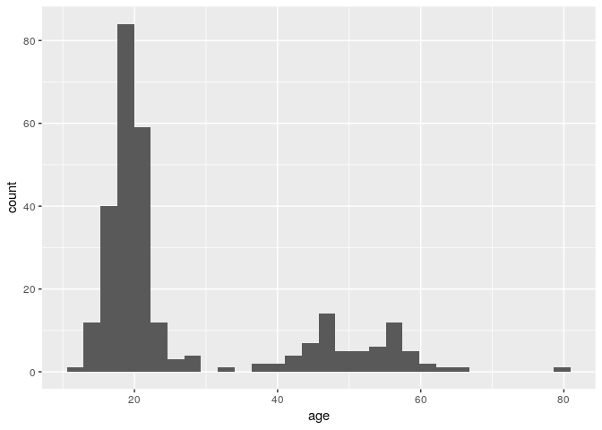
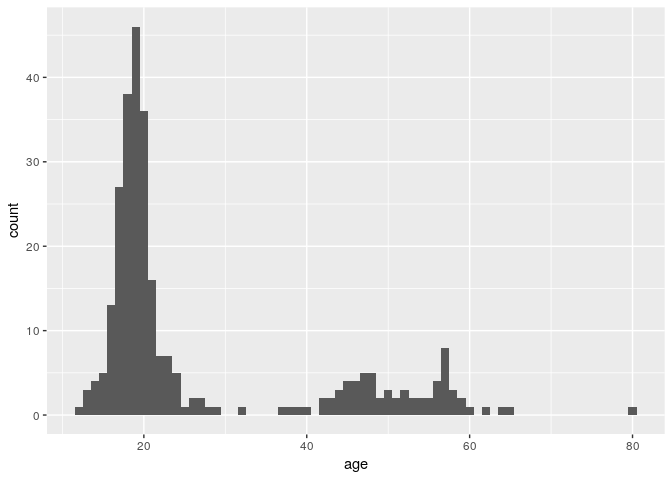
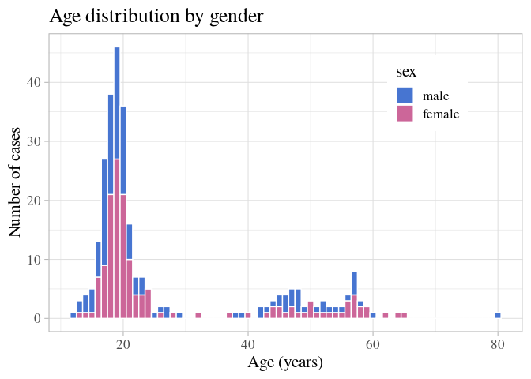
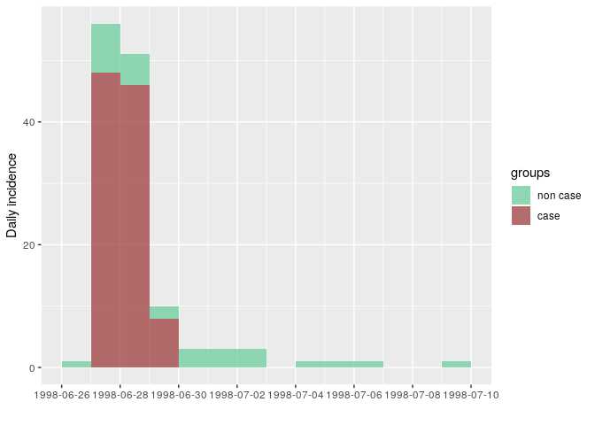
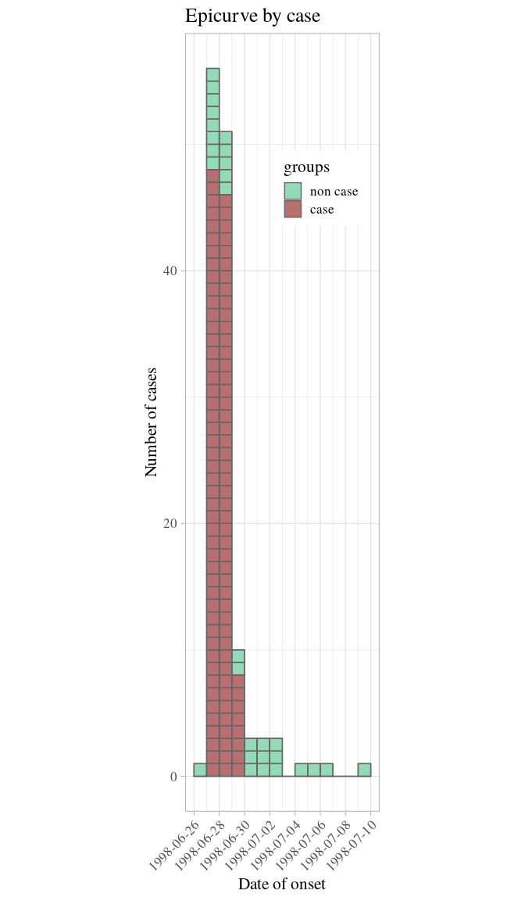
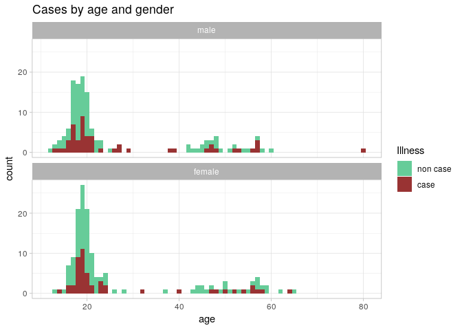
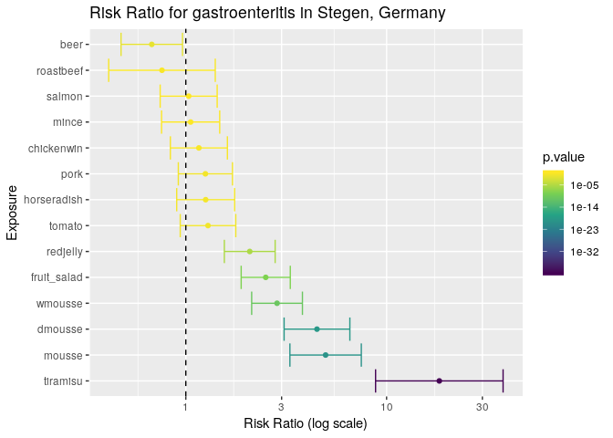
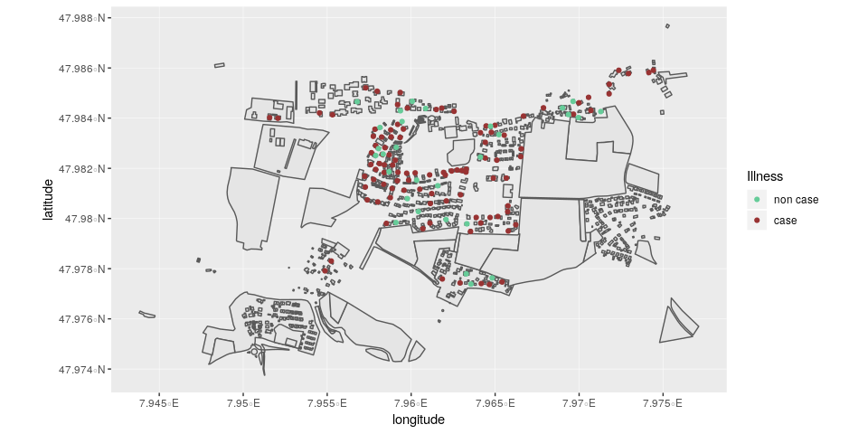

<!--[if IE]>
<p class="chromeframe"> You are using an <strong>outdated</strong> browser. Please <a href="http://browsehappy.com/">upgrade your browser</a> or <a href="http://www.google.com/chromeframe/?redirect=true">activate Google Chrome Frame</a> to improve your experience.</p>
<![endif]-->

# Context

On 26 June 1998, the St Sebastian High School in Stegen (school A),
Germany, celebrated a graduation party, where 250 to 350 participants
were expected. Attendants included graduates from that school, their
families and friends, teachers, 12th grade students, and some graduates
from a nearby school (school B).

A self-service party buffet was supplied by a commercial caterer from a
the nearby city of Freiburg. Food was prepared on the day of the party
and transported in a refrigerated van to the school. Relative locations
of the two schools and Freiburg can be seen
below:

<!--html_preserve-->

<iframe src="https://www.google.com/maps/d/u/0/embed?mid=1xYZh1AyB3h_mG4QihrO9LhFT3g5tjOv_" width="100%" height="500">

</iframe>

<!--html_preserve-->

Festivities at school A started with a dinner buffet open from 8.30 pm
onwards and were followed by a dessert buffet offered from 10 pm. The
party and the buffet extended late into the night and alcoholic
beverages were quite popular. All agreed it was a party to be
remembered.

## The alert

On 2nd July 1998, the Freiburg local health office reported to the
Robert Koch Institute (RKI) in Berlin a significant increase of cases of
gastroenteritis in the municipality of Stegen following the graduation
party described above. More than 100 cases were suspected among
participants and some of them were so ill that they were admitted to
nearby hospitals. Sick people showed symptoms like; *fever, nausea,
diarrhoea and vomiting* lasting for several days. Stool samples were
collected from several ill cases and sent to the laboratory in Freiburg
for microbiological identification. *Salmonella enteritidis* was
identified in 19 stool samples.

In response to the large number of cases associated with the dinner the
Freiburg health office sent an outbreak control team to investigate the
kitchen of the caterer in Freiburg. Food preparation procedures were
reviewed. Samples were taken of remaining food items after the
graduation ceremony and were sent to the laboratory of Freiburg
University. Microbiological analyses were performed on samples of the
following food items: brown chocolate mousse, caramel cream, remoulade
sauce, yoghurt dill sauce, and 10 raw eggs. Unfortunately no tiramisu
was left over after the dinner so no samples were tested of this
specific food item.

The Freiburg health office requested help from the RKI to assess the
magnitude of the outbreak and identify potential vehicle(s) and risk
factors for transmission in order to better control the outbreak.

## The epidemiological study

**Case definition**: cases were defined as any person who had attended
the party at St Sebastian High School and who suffered from *diarrhoea*
(min. 3 loose stool for 24 hours) with the onset between 27 June and 29
June 1998, or from at least three of the following symptoms: *vomiting*,
*fever over 38.5° C*, *nausea*, *abdominal pain*, *headache*.

Students from both schools attending the party were asked through phone
interviews to provide names of persons who attended the party.

Overall, 291 responded to enquiries and 103 cases were identified. The
linelist analysed in this case study was built from these 291 responses.

## This case study

In this case study, we will take you through the analysis of this
epidemic using R. This will be the occasion to illustrate more generally
useful practices for data analysis using **R**, including how to:

  - read and import data from Excel
  - explore data using tables and summaries
  - clean data
  - make graphics to describe the data
  - test which food items were associated with disease
  - plot a very basic spatial overview of cases

# Initial data processing

## Project setup

When using R, it’s a very good idea to keep your data and scripts
organised together. One way of doing this is to keep them in a single
folder that hosts and RStudio project file. For this project, your
folder structure will start out looking like this:

    .
    ├── 01-stegen-analysis.R
    ├── data/
    │   ├── stegen-map/
    │   │   ├── stegen_households.cpg
    │   │   ├── stegen_households.prj
    │   │   ├── stegen_households.qpj
    │   │   ├── stegen_households.shp
    │   │   └── stegen_households.shx
    │   └── stegen_raw.xlsx
    ├── LICENSE
    ├── README.md
    └── stegen.Rproj

To create this, do the following steps:

1)  Open RStudio and [create a new RStudio project in a new directory
    called
    “stegen”](https://support.rstudio.com/hc/en-us/articles/200526207-Using-Projects)

After you create your RStudio project, look at the top right corner of
the RStudio window and make sure that the project is set to “stegen” and
not “Project: (None)”:


2)  Once you have your Project set up, make a new folder called “data/”
    and [download `stegen_raw.xlsx` and save it to that
    folder](../../data/stegen_raw.xlsx)

3)  [Download `stegen-map.zip`](../../data/stegen-map.zip) and extract
    it to the “data/” folder

4)  In RStudio, click on the following menu path: <kbd>File \> New File
    \> R Script</kbd> and save it as `01-stegen-analysis.R`. This will
    be the R script where you will save the code of the analysis. Your
    RStudio window should look like this when you are done:


<details>

<summary><b>Going Further:</b> What are the `LICENSE` and `README.md`
files?</summary>

Both of these files are plain text files (edited via programs such as
notepad or textedit) that tell people how they can use the data and
code.

The `README.md` file is a text file that describes in plain language
what this project is about and what the components are. It’s called
README with the idea that anyone who comes across this project should be
able to read this file first and understand how to work with the
project.

The `LICENSE` file describes how the data and code are to be used. For
example, this case study is licensed under the [Creative Commons
Attribution 4.0 International
license](https://creativecommons.org/licenses/by/4.0/) which gives
people the freedom to reuse this in any way as long as they attribute
the original authors.

</details>

## Loading required packages

The following packages will be used in the case study. You can use the
`install.packages()` command to install them; this will save and install
them to your computer’s R library, so you only have to do this once.:

  - [*here*](https://github.com/jennybc/here_here): to find the path to
    data or script files
  - [*readxl*](https://readxl.tidyverse.org/): to read Excel
    spreadsheets into R
  - [*readr*](https://readr.tidyverse.org/): to write (and read)
    spreadsheets as text files
  - [*incidence*](https://www.repidemicsconsortium.org/incidence/): to
    build epicurves
  - [*epitrix*](https://www.repidemicsconsortium.org/epitrix/): to clean
    labels from our spreadsheet
  - [*dplyr*](https://dplyr.tidyverse.org/): to help with factors
  - [*ggplot2*](https://ggplot2.tidyverse.org/): to create custom
    visualisations
  - [*epitools*](https://cran.r-project.org/web/packages/epitools/index.html):
    to calculate risk ratios
  - [*sf*](https://github.com/r-spatial/sf/): To read in shape files
  - [*leaflet*](https://rstudio.github.io/leaflet/): to demonstrate
    interactive maps

Once we have these packages installed, we can tell R to load these
packages from our R library. This needs to be done once at the top of
every R script:

``` r
library("here")      # find data/script files
library("readxl")    # read xlsx files
library("readr")     # read and write text spreadsheets
library("incidence") # make epicurves
library("epitrix")   # clean labels and variables
library("dplyr")     # general data handling
library("ggplot2")   # advanced graphics
library("epitools")  # statistics for epi data
library("sf")        # shapefile handling
library("leaflet")   # interactive maps
```

<details>

<summary> <b> Package not installed? Did you get an error? </b>
</summary>

Note that you will get an error if the packages have not been installed
on your system. To install them (you only need to do this once\!), type:

``` r
install.packages("here")
install.packages("readxl")
install.packages("readr")
install.packages("incidence")
install.packages("epitrix")
install.packages("dplyr")
install.packages("ggplot2")
install.packages("epitools")
install.packages("sf")
install.packages("leaflet")
```

</details>

Loading these packages makes all functions implemented by the packages
available, so that `function_name()` can be used directly (without the
`package_name::` prefix). This is not a problem here as these packages
do not implement functions with identical names.

## Importing data from Excel

Linelist data can be read from various formats, including flat text
files (e.g. `.txt`, `.csv`), other statistical software (e.g. STATA) or
Excel spreadsheets. We illustrate the latter, which is probably the most
common format. We assume that [the data file
`stegen_raw.xlsx`](../../data/stegen_raw.xlsx) has been saved in a
`data/` folder of your project, and that your current R session is at
the root of the project.

Here we decompose the steps to read data in:

1.  defining the path to the data (`path_to_data`) with the *here*
    package
2.  using the function `read_excel()` from the *readxl* package to read
    data in, and save the data within R as a new object called `stegen`.

<!-- end list -->

``` r
path_to_data <- here("data", "stegen_raw.xlsx")
```

The `here()` function combines the path to the current R project on your
computer and the path to your data. If you look at what is in the
`path_to_data` object, you will notice that it will end with
`data/stegen_raw.xlsx`, but *it will look different than what I have
here*:

``` r
path_to_data
## [1] "/home/zkamvar/Documents/Projects/stegen/data/stegen_raw.xlsx"
```

This is because my project is stored in the folder on my computer called
“/home/zkamvar/Documents/Projects/stegen-analysis”. On your computer, it
will be in a different place, but the important part is that *this code
will work on any computer that has this R project*.

Now that we have the address of the data saved in the `path_to_data`
variable, we can read it in with the `read_excel()` function:

``` r
stegen <- read_excel(path_to_data)
```

To look at the content of the dataset, we can use either of these
commands:

``` r
stegen
## # A tibble: 291 x 23
##    `Unique key`   ill `Date-onset`   SEX   Age tiramisu tportion wmousse
##           <dbl> <dbl> <chr>        <dbl> <dbl>    <dbl>    <dbl>   <dbl>
##  1          210     1 1998-06-27       1    18        1        3       0
##  2           12     1 1998-06-27       0    57        1        1       0
##  3          288     1 1998-06-27       1    56        0        0       0
##  4          186     1 1998-06-27       0    17        1        1       1
##  5           20     1 1998-06-27       1    19        1        2       0
##  6          148     1 1998-06-27       0    16        1        2       1
##  7          201     1 1998-06-27       0    19        1        3       0
##  8          106     1 1998-06-27       0    19        1        2       1
##  9          272     1 1998-06-27       1    40        1        2       1
## 10           50     1 1998-06-27       0    53        1        1       1
## # ... with 281 more rows, and 15 more variables: dmousse <dbl>,
## #   mousse <dbl>, mportion <dbl>, Beer <dbl>, redjelly <dbl>, `Fruit
## #   salad` <dbl>, tomato <dbl>, mince <dbl>, salmon <dbl>,
## #   horseradish <dbl>, chickenwin <dbl>, roastbeef <dbl>, PORK <dbl>,
## #   latitude <dbl>, longitude <dbl>
```

``` r
View(stegen)
```

<details>

<summary><b>Problems?</b> In case of trouble, click here to toggle
additional help:</summary>

If the above fails, you should check:

  - that your data file has been saved in the right folder, with the
    right name (lower case and upper case do matter)
  - that your R session was started from the right project - if unsure,
    close R and re-open Rstudio by double-clicking on the `.Rproj` file
  - that all packages are installed and loaded (see installation
    guidelines above)

</details>

## Overview and summaries

We first have a quick look at the content of the data set. The
information we are looking for is:

  - the numbers of cases (rows) and variables (columns) in the data
  - the *name* of the variables: do they use consistent capitalisation
    and separators?
  - the *type* of the variables: are dates, numeric or categorical
    variables used when they should?
  - the *coding* of the variables: are explicit labels (e.g.
    `"male"`/`"female"`) used where relevant?

We first check the dimensions of the `stegen` object, and the name of
the variables:

``` r
dim(stegen) # rows x columns
## [1] 291  23
names(stegen) # column labels
##  [1] "Unique key"  "ill"         "Date-onset"  "SEX"         "Age"        
##  [6] "tiramisu"    "tportion"    "wmousse"     "dmousse"     "mousse"     
## [11] "mportion"    "Beer"        "redjelly"    "Fruit salad" "tomato"     
## [16] "mince"       "salmon"      "horseradish" "chickenwin"  "roastbeef"  
## [21] "PORK"        "latitude"    "longitude"
```

We can now try and summarise the dataset using:

``` r
summary(stegen)
##    Unique key         ill         Date-onset             SEX        
##  Min.   :  1.0   Min.   :0.000   Length:291         Min.   :0.0000  
##  1st Qu.: 73.5   1st Qu.:0.000   Class :character   1st Qu.:0.0000  
##  Median :146.0   Median :0.000   Mode  :character   Median :1.0000  
##  Mean   :146.0   Mean   :0.354                      Mean   :0.5223  
##  3rd Qu.:218.5   3rd Qu.:1.000                      3rd Qu.:1.0000  
##  Max.   :291.0   Max.   :1.000                      Max.   :1.0000  
##                                                                     
##       Age           tiramisu         tportion         wmousse      
##  Min.   :12.00   Min.   :0.0000   Min.   :0.0000   Min.   :0.0000  
##  1st Qu.:18.00   1st Qu.:0.0000   1st Qu.:0.0000   1st Qu.:0.0000  
##  Median :20.00   Median :0.0000   Median :0.0000   Median :0.0000  
##  Mean   :26.66   Mean   :0.4231   Mean   :0.6678   Mean   :0.2599  
##  3rd Qu.:27.00   3rd Qu.:1.0000   3rd Qu.:1.0000   3rd Qu.:1.0000  
##  Max.   :80.00   Max.   :1.0000   Max.   :3.0000   Max.   :1.0000  
##  NA's   :8       NA's   :5        NA's   :5        NA's   :14      
##     dmousse           mousse          mportion           Beer       
##  Min.   :0.0000   Min.   :0.0000   Min.   :0.0000   Min.   :0.0000  
##  1st Qu.:0.0000   1st Qu.:0.0000   1st Qu.:0.0000   1st Qu.:0.0000  
##  Median :0.0000   Median :0.0000   Median :0.0000   Median :0.0000  
##  Mean   :0.3937   Mean   :0.4256   Mean   :0.6523   Mean   :0.3911  
##  3rd Qu.:1.0000   3rd Qu.:1.0000   3rd Qu.:1.0000   3rd Qu.:1.0000  
##  Max.   :1.0000   Max.   :1.0000   Max.   :3.0000   Max.   :1.0000  
##  NA's   :4        NA's   :2        NA's   :12       NA's   :20      
##     redjelly       Fruit salad        tomato           mince      
##  Min.   :0.0000   Min.   :0.000   Min.   :0.0000   Min.   :0.000  
##  1st Qu.:0.0000   1st Qu.:0.000   1st Qu.:0.0000   1st Qu.:0.000  
##  Median :0.0000   Median :0.000   Median :0.0000   Median :0.000  
##  Mean   :0.2715   Mean   :0.244   Mean   :0.2852   Mean   :0.299  
##  3rd Qu.:1.0000   3rd Qu.:0.000   3rd Qu.:1.0000   3rd Qu.:1.000  
##  Max.   :1.0000   Max.   :1.000   Max.   :1.0000   Max.   :1.000  
##                                                                   
##      salmon        horseradish       chickenwin       roastbeef      
##  Min.   :0.0000   Min.   :0.0000   Min.   :0.0000   Min.   :0.00000  
##  1st Qu.:0.0000   1st Qu.:0.0000   1st Qu.:0.0000   1st Qu.:0.00000  
##  Median :0.0000   Median :0.0000   Median :0.0000   Median :0.00000  
##  Mean   :0.4811   Mean   :0.3093   Mean   :0.2887   Mean   :0.09966  
##  3rd Qu.:1.0000   3rd Qu.:1.0000   3rd Qu.:1.0000   3rd Qu.:0.00000  
##  Max.   :9.0000   Max.   :9.0000   Max.   :1.0000   Max.   :1.00000  
##                                                                      
##       PORK           latitude       longitude    
##  Min.   :0.0000   Min.   :47.98   Min.   :7.952  
##  1st Qu.:0.0000   1st Qu.:47.98   1st Qu.:7.959  
##  Median :0.0000   Median :47.98   Median :7.961  
##  Mean   :0.4742   Mean   :47.98   Mean   :7.962  
##  3rd Qu.:1.0000   3rd Qu.:47.98   3rd Qu.:7.965  
##  Max.   :9.0000   Max.   :47.99   Max.   :7.974  
##                   NA's   :160     NA's   :160
```

Note that binary variables, when treated as numeric values (0/1), are
summarised as such, which may not always be useful. As an alternative,
`table()` can be used to list all possible values of a variable, and
count how many time each value appears in the data. For instance, we can
compare the `summary()` and `table()` for consumption of `tiramisu`:

``` r
stegen$tiramisu # all values
##   [1]  1  1  0  1  1  1  1  1  1  1  1  1  1  1  1  1  1  1  1  1  1  1  1
##  [24]  1  1  1  1  1  1  1  1  1  1  1  1  1  1  1  1  1  1  1  1  1  1  1
##  [47]  1  1  1  1  1  1  1  1  1  1  1  1  1  1  1  1  1  0  1  1  1 NA  1
##  [70]  0  1  1 NA  1  1  1  1  1  1  1  1  1  1  1  0  1  1  0  1  1  1  1
##  [93]  1  0  1  1  1  1  0  0  0  0  0  0  0  0  1  0  1  0  0  1  0  0  0
## [116]  0  0  0 NA  1  0  0  1  0  0  0  0  0  1  0  0  0  0  1  0  0  0  0
## [139]  0  0  0  0  0  0  0  0  0  0  0  0  0  0  1  0  0  0  0  0  0  0  1
## [162]  0  0  1  0  0  0  0  0  0  0  0  0  0  1  1  0  0  0  0  0  0  0  0
## [185]  0  0  0 NA  0  0  0  0  0  1  0  0  1  0  1  1  0  0  0  0  1  0  0
## [208]  0  0  0  0  0  1  0  0  1  0  0  0  0  1  0  0  1  0  0  0  1  1  0
## [231]  0  0  0  0  0  1  0  0  0  0  0  0  0  1  0  1  0  0  0  0  0  0  0
## [254]  0  0  1  0  0  0  1  0  0  0  1  0  0  0  0  0  0 NA  0  1  0  0  0
## [277]  0  0  0  0  0  0  0  0  0  0  0  0  0  0  1
summary(stegen$tiramisu) # summary
##    Min. 1st Qu.  Median    Mean 3rd Qu.    Max.    NA's 
##  0.0000  0.0000  0.0000  0.4231  1.0000  1.0000       5
table(stegen$tiramisu) # table
## 
##   0   1 
## 165 121
```

<details>

<summary><b>Going Further:</b> Showing missing values in
<code>table()</code></summary>

You may notice that the `tiramisu` column has missing data, but
`table()` does not show how many missing values there are. By studying
the documentation for `table()` (type `?table` in your R console), we
find that there is an option called `useNA` with three options: “no”,
“ifany”, and “always”. Let’s take a look at what happens when we use
these three options:

``` r
table(stegen$tiramisu, useNA = "no")
## 
##   0   1 
## 165 121
table(stegen$tiramisu, useNA = "ifany")
## 
##    0    1 <NA> 
##  165  121    5
table(stegen$tiramisu, useNA = "always")
## 
##    0    1 <NA> 
##  165  121    5
```

We can see that both “ifany” and “always” show us that there are 5
missing values in our data set. What, then is the difference between the
two options? What happens if we have no missing values? We can try it
with a dummy data set:

``` r
table(c(1, 1, 0), useNA = "ifany")
## 
## 0 1 
## 1 2
table(c(1, 1, 0), useNA = "always")
## 
##    0    1 <NA> 
##    1    2    0
```

</details>

**Good news**: the dataset has the expected dimensions, and all the
relevant variables seem to be present. There are, however, **a few often
observed issues**:

1.  variable names are a bit messy, and include different separators,
    spaces, and irregular capitalisation
2.  variable types are partly wrong:
      - *unique keys* should be `character` (i.e. character strings)
      - *dates of onset* should be `Date` (**R** is good at handling
        actual dates)
      - *illness* and *sex* should be `factor` (i.e. a categorical
        variables)
3.  labels used in some variables are ambiguous:
      - *sex* should be coded explicitely, not as 0 (here, male) and 1
        (here, female)
      - *illness* should be coded explicitely, not as 0 (here, non-case)
        and 1 (case)
4.  some binary variables have maximum values of 9 (see
    `summary(stegen)`)

## Data cleaning

While it is tempting to go back to the Excel spreadsheet to fix issues
with data, it is almost always quicker and more reliable to clean data
in **R** directly. Here, we make a copy of the old data set, and clean
`stegen` before further analysis.

``` r
stegen_old <- stegen # save 'dirty data'
```

We use *epitrix*’s function `clean_labels()` to standardise the variable
names:

``` r
new_labels <- clean_labels(names(stegen)) # generate standardised labels
new_labels # check the result
##  [1] "unique_key"  "ill"         "date_onset"  "sex"         "age"        
##  [6] "tiramisu"    "tportion"    "wmousse"     "dmousse"     "mousse"     
## [11] "mportion"    "beer"        "redjelly"    "fruit_salad" "tomato"     
## [16] "mince"       "salmon"      "horseradish" "chickenwin"  "roastbeef"  
## [21] "pork"        "latitude"    "longitude"
names(stegen) <- new_labels
```

We convert the unique identifiers to character strings (`character`),
dates of onset to actual `Date` objects, and sex and illness are set to
categorical variables (`factor`), which allows us to represent the
variables as numbers so that we can do modelling, but allows us to add
meaningful labels to them:

``` r
stegen$unique_key <- as.character(stegen$unique_key)
stegen$sex <- factor(stegen$sex)
stegen$ill <- factor(stegen$ill)
stegen$date_onset <- as.Date(stegen$date_onset)
```

We use the function `recode()` from the *dplyr* package to recode `sex`
and `ill` more explicitely.

``` r
stegen$sex <- recode_factor(stegen$sex, "0" = "male", "1" = "female")
stegen$ill <- recode_factor(stegen$ill, "0" = "non case", "1" = "case")
```

if we look at the structure of the data, they are still represented as
numbers:

``` r
str(stegen$sex)
##  Factor w/ 2 levels "male","female": 2 1 2 1 2 1 1 1 2 1 ...
str(stegen$ill)
##  Factor w/ 2 levels "non case","case": 2 2 2 2 2 2 2 2 2 2 ...
```

Finally we look in more depth into these variables having maximum values
of 9, where we expect 0/1; `table()` is useful to list all values taken
by a variable, and listing their frequencies:

``` r

table(stegen$pork, useNA = "always")
## 
##    0    1    9 <NA> 
##  169  120    2    0
table(stegen$salmon, useNA = "always")
## 
##    0    1    9 <NA> 
##  183  104    4    0
table(stegen$horseradish, useNA = "always")
## 
##    0    1    9 <NA> 
##  217   72    2    0
```

The only rogue values are `9`; they are likely either data entry issues,
or missing data, which in **R** should be coded as `NA` (“not
available”). We can replace these values using:

``` r
stegen$pork[stegen$pork == 9] <- NA
stegen$salmon[stegen$salmon == 9] <- NA
stegen$horseradish[stegen$horseradish == 9] <- NA
```

Now we can confirm that the `9`’s have been replaced by `NA`.

``` r

table(stegen$pork, useNA = "always")
## 
##    0    1 <NA> 
##  169  120    2
table(stegen$salmon, useNA = "always")
## 
##    0    1 <NA> 
##  183  104    4
table(stegen$horseradish, useNA = "always")
## 
##    0    1 <NA> 
##  217   72    2
```

<details>

<summary> <b> Going further </b> Why does this work? Click here for more
details. </summary>

There are several things going on in a command like:

``` r
stegen$pork[stegen$pork == 9] <- NA
```

let us break them down from the inside out.

1.  `stegen$pork` means “get the variable called `pork` in the dataset
    `stegen`”
2.  The `==` is a logical check for equality. `stegen$pork == 9` checks
    each element in `stegen$pork` if it’s equal to `9`, returning `TRUE`
    if an element of `stegen$pork` is equal to `9` and `FALSE` if it
    doesn’t.
3.  The square brackets (`[ ]`) subset the vector `stegen$pork`
    according to whatever is between them; In this case, it’s checking
    `stegen$pork == 9`, which evaluates to FALSE, FALSE, FALSE, TRUE,
    FALSE, FALSE… This will return only the cases in `stegen$pork` that
    have `9`s recorded.
4.  The replacement: `... <- NA` replace `...` with `NA` (missing value)

in other words: "isolate the entries of `stegen$pork` which equal `9`,
and replace them with `NA`; here is another example to illustrate the
procedure:

``` r
## make example input vector
example_vector <- 1:5
example_vector
## [1] 1 2 3 4 5

## make example logical vector for subsetting
example_logical <- c(FALSE, TRUE, TRUE, FALSE, TRUE)
example_logical
## [1] FALSE  TRUE  TRUE FALSE  TRUE
example_vector[example_logical]      # subset values
## [1] 2 3 5
example_vector[example_logical] <- 0 # replace subset values
example_vector # check outcome
## [1] 1 0 0 4 0
```

</details>

## Saving clean data

Now that we’ve cleaned our data, we will probably want to re-use it in
further analyses, but we probably don’t want to go through the steps of
cleaning it again. Here, we will save our cleaned data into a new folder
under `data/` called `cleaned/`. We will use **R**’s function
`dir.create()` to create this folder under our data folder:

``` r
clean_dir <- here("data", "cleaned")
dir.create(clean_dir)
```

> STOP: open your file browser and confirm that file called
> “data/cleaned” has been created

We will store two different files in this directory that represent the
same data:

1.  a flat text file (spreadsheet) that can be read by any program
2.  a binary file that can only be accessed from R

### Saving as a flat file

A flat file is a text file that can be read by any program. The most
common type of flat file is a called a **csv** (comma separated values)
file. This is a text version of a spreadsheet with commas denoting the
columns. We can use the `write_csv()` function from the *readr* package
to do this:

``` r
stegen_clean_file <- here("data", "cleaned", "stegen_clean.csv")
write_csv(stegen, path = stegen_clean_file)
```

When you want to read in the file later, you can use the `read_csv()`
function.

### Saving as a binary file

When you save as a flat file, you will have to re-define which varaibles
are dates and which are factors when you re-read in the clean data. One
way to avoid doing this is to save your data into a file called an
**RDS** file, which is a data file that only R can read. This will
preserve your column definitions.

``` r
stegen_clean_rds <- here("data", "cleaned", "stegen_clean.rds")
saveRDS(stegen, file = stegen_clean_rds)
```

To read in the clean data for later use, we would use the `readRDS()`
function.

# Data exploration

## Summaries of age and sex distribution

It is good practice to first start to explore and familiarise yourself
with a dataset before heading into the analyses of your data. We can
have a brief look at age and sex distributions using some basic
summaries; for instance:

``` r
summary(stegen$age) # age stats
##    Min. 1st Qu.  Median    Mean 3rd Qu.    Max.    NA's 
##   12.00   18.00   20.00   26.66   27.00   80.00       8
summary(stegen$sex) # gender distribution
##   male female 
##    139    152
tapply(stegen$age, INDEX = stegen$sex, FUN = summary) # age stats by gender      
## $male
##    Min. 1st Qu.  Median    Mean 3rd Qu.    Max.    NA's 
##   12.00   17.50   19.00   26.38   28.00   80.00       4 
## 
## $female
##    Min. 1st Qu.  Median    Mean 3rd Qu.    Max.    NA's 
##   13.00   18.00   20.00   26.93   24.50   65.00       4
```

<details>

<summary> <b>Going further</b> click here to learn about
<code>tapply()</code>: </summary>

`tapply()` is a very handy function to stratify any kind of analyses.
You will find more details by reading the documentation of the function
`?tapply()`, but briefly, the syntax to be used is `tapply(input_data,
INDEX = stratification, FUN = function_to_use, further_arguments)`. In
the command used above:

``` r
tapply(stegen$age, INDEX = stegen$sex, FUN = summary)
```

<!-- 
L499 [TEXT]: maybe specify that FUN is just where you choose your function (and that this can be any function), couple people were confused about what FUN is...
-->

this literally means: select the age variable in the dataset `stegen`
(`stegen$age`), stratify it by sex (`INDEX = stegen$sex`), and apply the
`summary()` function `FUN = summary` to summarise each stratum. So for
instance, to get the average age by sex (function `mean()`), one could
use:

``` r
tapply(stegen$age, INDEX = stegen$sex, FUN = mean, na.rm = TRUE)
##     male   female 
## 26.37778 26.92568
```

Here we illustrate that further arguments to the function `mean()` can
be passed on; here, `na.rm = TRUE` means “ignore missing data”.

</details>

## Graphical exploration

The summaries above may be useful for reporting purposes, but graphics
are usually better for getting a feel for the data. Here, we illustrate
how the package *ggplot2* can be used to derive informative graphics of
age/sex distribution. It implements an alternative graphics system to
the basic **R** plots, in which the plot is built by adding (literally
using `+`) different layers of information, using:

  - `ggplot()` to specify the dataset to use
  - `geom_...()` functions which define a type of graphics to use
    (e.g. barplot, histogram)
  - `aes()` to map elements of the data into aesthetic properties
    (e.g. x/y axes, color, shape)

For instance, to get an histogram of age:

``` r
ggplot(stegen) + geom_histogram(aes(x = age))
## `stat_bin()` using `bins = 30`. Pick better value with `binwidth`.
```

<!-- -->

<details>

<summary>What does “`stat_bin()` using `bins = 30`. Pick better value
with `binwidth`” mean?</summary>

This is a message that came from `geom_histogram()`. If we look at the
help documentation for `geom_histogram()`, we can see this paragraph in
the **Details** section:

> By default, the underlying computation (‘stat\_bin()’) uses 30 bins;
> this is not a good default, but the idea is to get you experimenting
> with different bin widths. You may need to look at a few to uncover
> the full story behind your data.

Each bar in a histogram is considered a “bin”. The height of each bar is
the number of observations that fall within the bounds of that bar.
Because we are looking at age, it may be better for us to define a
binwidth of 1 so that each bar represents a single
year.

``` r
ggplot(stegen) + geom_histogram(aes(x = age), binwidth = 1)
```

<!-- -->

</details>

We can differentiate between genders by filling the bars with color
(n.b. we are also setting the binwidth to be 1
year):

``` r
ggplot(stegen) + geom_histogram(aes(x = age, fill = sex), binwidth = 1)
```

<!-- -->

Here, the age distribution is pretty much identical between male and
female.

<details>

<summary> <b> Going further:</b> click here to learn about customising
<i>ggplot2</i> graphics:</summary>

*ggplot2* graphics are highly customisable, and a lot of help and
examples can be found online. The [official
website](https://ggplot2.tidyverse.org/) is a good place to start.

For instance, here we:

  - define the width of each bin to be 1 year (`binwidth = 1` to avoid
    the warning from above)
  - add white borders to the plot (`color = "white"`)
  - specify colors manually for male / female, using specified color
    codes (see [html color
    picker](https://www.w3schools.com/colors/colors_picker.asp) to
    define your own colors) (`scale_fill_manual(...)`)
  - add labels for title, *x* and *y* axes (`labs()`)
  - specify a lighter general color theme, using Times font of a larger
    size by default (`theme_light(...)`)
  - move the legend inside the plot (`theme(...)`)

Note, it’s best practice to include only one *ggplot2* command per line
if you are using more than two.

``` r
ggplot(stegen) + 
  geom_histogram(aes(x = age, fill = sex), binwidth = 1, color = "white") +
  scale_fill_manual(values = c(male = "#4775d1", female = "#cc6699")) +
  labs(title = "Age distribution by gender", x = "Age (years)", y = "Number of cases") +
  theme_light(base_family = "Times", base_size = 16) +
  theme(legend.position = c(0.8, 0.8))
```

<!-- -->

</details>

## Epidemic curve

Epicurves (counts of incident cases) can be built using the package
*incidence*, which will compute the number of new cases given a vector
of dates (here, onset) and a time interval (1 day by default). We use
the function `incidence()` to achieve this, and then visualise the
results:

``` r
i <- incidence(stegen$date_onset)
## 160 missing observations were removed.
i
## <incidence object>
## [131 cases from days 1998-06-26 to 1998-07-09]
## 
## $counts: matrix with 14 rows and 1 columns
## $n: 131 cases in total
## $dates: 14 dates marking the left-side of bins
## $interval: 1 day
## $timespan: 14 days
## $cumulative: FALSE
plot(i)
```

<!-- -->

Details of the case counts can be obtained using:

``` r
as.data.frame(i)
##         dates counts
## 1  1998-06-26      1
## 2  1998-06-27     56
## 3  1998-06-28     51
## 4  1998-06-29     10
## 5  1998-06-30      3
## 6  1998-07-01      3
## 7  1998-07-02      3
## 8  1998-07-03      0
## 9  1998-07-04      1
## 10 1998-07-05      1
## 11 1998-07-06      1
## 12 1998-07-07      0
## 13 1998-07-08      0
## 14 1998-07-09      1
```

How long is this outbreak? It looks like most cases occurred over the
course of 3 days, but that cases kept showing up 10 days after the peak.
Is this true? Not really. Stratifying the epidemic curve by case
definition will clarify the situation:

``` r
i_ill <- incidence(stegen$date_onset, group = stegen$ill)
## 160 missing observations were removed.
i_ill
## <incidence object>
## [131 cases from days 1998-06-26 to 1998-07-09]
## [2 groups: non case, case]
## 
## $counts: matrix with 14 rows and 2 columns
## $n: 131 cases in total
## $dates: 14 dates marking the left-side of bins
## $interval: 1 day
## $timespan: 14 days
## $cumulative: FALSE
as.data.frame(i_ill)
##         dates non case case
## 1  1998-06-26        1    0
## 2  1998-06-27        8   48
## 3  1998-06-28        5   46
## 4  1998-06-29        2    8
## 5  1998-06-30        3    0
## 6  1998-07-01        3    0
## 7  1998-07-02        3    0
## 8  1998-07-03        0    0
## 9  1998-07-04        1    0
## 10 1998-07-05        1    0
## 11 1998-07-06        1    0
## 12 1998-07-07        0    0
## 13 1998-07-08        0    0
## 14 1998-07-09        1    0
plot(i_ill, color = c("non case" = "#66cc99", "case" = "#993333"))
```

<!-- -->

> n.b. Above, we defined the colors of the groups by specifying `color =
> c("non case" = "#66cc99", "case" = "#993333")` in our plot command.
> Here we are saying “The non case group should have the color \#66cc99
> and the case group should have the color \#993333”. These six digit
> codes are hexadecimal color codes widely used in web design. It’s not
> expected that anyone should be able to memorize what hex codes
> represent what colors, so there are websites that can help you pick a
> pleasing color palette such as <https://www.color-hex.com>. For
> example, this page shows information about how the color \#66cc99
> looks and what its complements are:
> <https://www.color-hex.com/color/66cc99>

The outbreak really only happened over 3 days: onsets reported after did
not match the epi case definition. This is compatible with a food-borne
outbreak with limited or no person-to-person transmission.

Note that the plots produced by *incidence* are *ggplot2* objects, so
that the options seen before can be used for further customisation (see
below).

<details>

<summary> <b> Going further</b> click here to learn about the
<i>incidence</i> package: </summary>

More information on the *incidence* package can be found from the
[dedicated website](https://www.repidemicsconsortium.org/incidence/).
Here, we illustrate how incidence can be stratified e.g. by case
definition:

We can also customise this graphic like other *ggplot2* plots (see [this
tutorial](https://www.repidemicsconsortium.org/incidence/articles/customize_plot.html)
for
more):

``` r
plot(i_ill, border = "grey40", show_cases = TRUE, color = c("non case" = "#66cc99", "case" = "#993333")) + 
  labs(title = "Epicurve by case", x = "Date of onset", y = "Number of cases") +
  theme_light(base_family = "Times", base_size = 16) + # changes the overal theme
  theme(legend.position = c(x = 0.7, y = 0.8)) + # places the legend inside the plot
  theme(axis.text.x = element_text(angle = 45, hjust = 1, vjust = 1)) + # sets the dates along the x axis at a 45 degree angle
  coord_equal() # makes each case appear as a box
```

<!-- -->

</details>

## Age and gender distribution of the cases

We use the same principles as before to visualise the distribution of
illness by age and gender. To split the plot into different panels
according to `sex`, we use `facet_wrap()` (see previous extra info on
*ggplot2* customisation for further details otions):

``` r
ggplot(stegen) + 
  geom_histogram(aes(x = age, fill = ill), binwidth = 1) +
  scale_fill_manual("Illness", values = c("non case" = "#66cc99", "case" = "#993333")) +
  facet_wrap(~sex, ncol = 1) + # stratify the sex into a single column of panels
  labs(title = "Cases by age and gender") + 
  theme_light()
```

<!-- -->

From these graphics, we can see that illness does not appear to depend
on age or gender, which suggests that the illness was caused by one or
more of the foods consumed. We will explore this with a risk ratio
analysis in the next section.

-----

# Looking for the culprits

In order to figure out which food item was most strongly associated with
the illness, we need to test the [Risk
Ratio](https://en.wikipedia.org/wiki/Risk_ratio) for all of the food
items recorded. Risk ratios are normally computed on *contingency*
tables (commonly known as 2x2 tables). In this part, we will compute
contingency tables for each exposure (food item) against the defined
cases, calculate their risk ratio with confidence intervals and
p-values, and plot them as points and errorbars using *ggplot2*.

## Reading in clean data

In the section on saving clean data, we saved a binary file with our
stegen data set. If you are starting here, you will want to read this
file in with `readRDS()`.

``` r
stegen_clean_rds <- here("data", "cleaned", "stegen_clean.rds")
stegen <- readRDS(stegen_clean_rds)
head(stegen)
```

    ## # A tibble: 6 x 23
    ##   unique_key ill   date_onset sex     age tiramisu tportion wmousse dmousse
    ##   <chr>      <fct> <date>     <fct> <dbl>    <dbl>    <dbl>   <dbl>   <dbl>
    ## 1 210        case  1998-06-27 fema…    18        1        3       0       1
    ## 2 12         case  1998-06-27 male     57        1        1       0       1
    ## 3 288        case  1998-06-27 fema…    56        0        0       0       0
    ## 4 186        case  1998-06-27 male     17        1        1       1       0
    ## 5 20         case  1998-06-27 fema…    19        1        2       0       0
    ## 6 148        case  1998-06-27 male     16        1        2       1       1
    ## # ... with 14 more variables: mousse <dbl>, mportion <dbl>, beer <dbl>,
    ## #   redjelly <dbl>, fruit_salad <dbl>, tomato <dbl>, mince <dbl>,
    ## #   salmon <dbl>, horseradish <dbl>, chickenwin <dbl>, roastbeef <dbl>,
    ## #   pork <dbl>, latitude <dbl>, longitude <dbl>

### Isolating the variables to test

<!--
You need to update the two paragraphs describing the exposure variables here
(sorry came back to this after reading the code updates lower down - code fine,
description wrong). So this whole only keeping the variables (unless theres a
good data practice and/or a rational for using it within apply) - I dont think
is necessary. From an epi standpoint you generally would always keep the data
that you have collected (because if its not useful you shouldnt collect it).
Furthermore when transitioning to multivariable analysis, we would want to
include all variables of interest not just food. So, I would suggest: keep the
food vector with the names of variables of interest, but dont subset the
dataset - just use the food names vector in the functions below?
-->

Because not all of the columns in our data set are food items (i.e.
“age”, and “tportion”), we only want to test the columns that are
food items for our analysis.

``` r
names(stegen)
##  [1] "unique_key"  "ill"         "date_onset"  "sex"         "age"        
##  [6] "tiramisu"    "tportion"    "wmousse"     "dmousse"     "mousse"     
## [11] "mportion"    "beer"        "redjelly"    "fruit_salad" "tomato"     
## [16] "mince"       "salmon"      "horseradish" "chickenwin"  "roastbeef"  
## [21] "pork"        "latitude"    "longitude"
```

In this case, we need to test columns 6 to 21, excluding `tportion` and
`mportion`, which are not binary; this can be done using the subsetting
brackets `[ ]`, where we will place character vector indicating the
columns we want to
test.

``` r
food <- c('tiramisu', 'wmousse', 'dmousse', 'mousse', 'beer', 'redjelly',
          'fruit_salad', 'tomato', 'mince', 'salmon', 'horseradish',
          'chickenwin', 'roastbeef', 'pork') 
food
##  [1] "tiramisu"    "wmousse"     "dmousse"     "mousse"      "beer"       
##  [6] "redjelly"    "fruit_salad" "tomato"      "mince"       "salmon"     
## [11] "horseradish" "chickenwin"  "roastbeef"   "pork"
stegen[food]
## # A tibble: 291 x 14
##    tiramisu wmousse dmousse mousse  beer redjelly fruit_salad tomato mince
##       <dbl>   <dbl>   <dbl>  <dbl> <dbl>    <dbl>       <dbl>  <dbl> <dbl>
##  1        1       0       1      1     0        0           0      0     0
##  2        1       0       1      1     0        0           1      0     1
##  3        0       0       0      0     0        0           0      1     1
##  4        1       1       0      1     0        1           0      0     0
##  5        1       0       0      0     1        0           0      0     0
##  6        1       1       1      1     0        0           1      0     1
##  7        1       0       1      1     0        0           1      0     0
##  8        1       1       1      1     0        1           1      0     0
##  9        1       1       1      1     1        0           0      1     0
## 10        1       1       1      1     0        1           0      0     0
## # ... with 281 more rows, and 5 more variables: salmon <dbl>,
## #   horseradish <dbl>, chickenwin <dbl>, roastbeef <dbl>, pork <dbl>
```

## Risk ratios

### For one variable

The [risk ratio](https://en.wikipedia.org/wiki/Risk_ratio) is defined as
the ratio between the proportion of illness in one group (typically
‘exposed’) vs another (‘non-exposed’). For instance, let us consider
the contingency table of pork consumption and illness. One way to
calcuate a contingency table is using the `epitable()` function from the
*epitools* package:

``` r
pork_table <- epitable(stegen$pork, stegen$ill)
pork_table
##          Outcome
## Predictor non case case
##         0      115   54
##         1       72   48
```

We can get the risk ratio by using the `riskratio()` function from the
*epitools* package. Here, we want to use Yates’ continuity correction
and calculate Wald confidence intervals (more information about this can
be found on the help page for `riskratio()` by typing `?riskratio` in
your R console).

``` r
pork_rr <- riskratio(pork_table, correct = TRUE, method = "wald")
pork_rr
## $data
##          Outcome
## Predictor non case case Total
##     0          115   54   169
##     1           72   48   120
##     Total      187  102   289
## 
## $measure
##          risk ratio with 95% C.I.
## Predictor estimate     lower    upper
##         0 1.000000        NA       NA
##         1 1.251852 0.9176849 1.707703
## 
## $p.value
##          two-sided
## Predictor midp.exact fisher.exact chi.square
##         0         NA           NA         NA
##         1  0.1620037    0.1708777   0.198536
## 
## $correction
## [1] TRUE
## 
## attr(,"method")
## [1] "Unconditional MLE & normal approximation (Wald) CI"
```

The documentation of `riskratio()` shows that it returns quite a few
things as a list. However, we only want three things from this list:

1.  risk ratio estimate
2.  95% confidence interval
3.  P-value

<details>

<summary> <b>Going further:</b> What is a list? </summary>

`pork_rr` is an R object called a “list”:

``` r
class(pork_rr)
## [1] "list"
```

A list is an R vector that can hold other vectors. While this may look
strange and unfamiliar, we’ve actually seen lists before. If you look
close, you can see that each element of a list starts with a `$`. This
is the exact same syntax as data frames. If we inspect our `stegen` data
frame, we can see that it is actually a list:

``` r
is.list(stegen)
## [1] TRUE
is.list(pork_rr)
## [1] TRUE
```

Each column of a data frame is just a different element of a list. In
fact, we can use the `$` operator to access different elements of the
list just as we would the columns of a data frame:

``` r
stegen_list <- as.list(stegen)
head(stegen_list)
## $unique_key
##   [1] "210" "12"  "288" "186" "20"  "148" "201" "106" "272" "50"  "216"
##  [12] "141" "91"  "98"  "200" "109" "117" "281" "269" "77"  "196" "16" 
##  [23] "168" "102" "204" "205" "271" "48"  "287" "25"  "15"  "45"  "125"
##  [34] "113" "284" "121" "52"  "207" "63"  "43"  "175" "214" "251" "213"
##  [45] "65"  "159" "29"  "14"  "165" "145" "202" "255" "169" "274" "254"
##  [56] "61"  "2"   "86"  "59"  "74"  "133" "115" "103" "138" "70"  "173"
##  [67] "144" "212" "234" "156" "146" "152" "31"  "279" "36"  "75"  "286"
##  [78] "215" "56"  "199" "154" "27"  "42"  "49"  "96"  "66"  "104" "13" 
##  [89] "221" "51"  "177" "111" "242" "143" "278" "62"  "176" "134" "256"
## [100] "55"  "235" "58"  "194" "282" "137" "118" "220" "24"  "187" "190"
## [111] "189" "195" "231" "239" "289" "184" "126" "209" "290" "67"  "170"
## [122] "230" "151" "283" "211" "69"  "35"  "233" "208" "155" "198" "40" 
## [133] "119" "139" "180" "188" "157" "80"  "203" "280" "37"  "193" "53" 
## [144] "22"  "85"  "232" "258" "265" "54"  "237" "266" "236" "88"  "10" 
## [155] "11"  "174" "185" "161" "226" "273" "227" "260" "223" "107" "183"
## [166] "250" "253" "44"  "182" "228" "285" "83"  "248" "136" "172" "46" 
## [177] "114" "166" "164" "101" "21"  "158" "108" "34"  "276" "222" "130"
## [188] "275" "72"  "218" "267" "76"  "241" "171" "142" "89"  "105" "39" 
## [199] "167" "140" "124" "131" "17"  "73"  "97"  "5"   "123" "9"   "99" 
## [210] "84"  "229" "116" "238" "217" "122" "240" "95"  "110" "41"  "206"
## [221] "23"  "257" "163" "64"  "100" "120" "160" "224" "94"  "60"  "263"
## [232] "191" "147" "179" "93"  "57"  "112" "268" "243" "219" "247" "38" 
## [243] "33"  "68"  "4"   "150" "79"  "178" "127" "153" "261" "92"  "90" 
## [254] "264" "277" "181" "197" "225" "18"  "1"   "252" "47"  "245" "78" 
## [265] "162" "81"  "3"   "82"  "32"  "71"  "30"  "28"  "135" "246" "149"
## [276] "7"   "19"  "249" "128" "6"   "192" "270" "262" "259" "87"  "8"  
## [287] "129" "26"  "132" "244" "291"
## 
## $ill
##   [1] case     case     case     case     case     case     case    
##   [8] case     case     case     case     case     case     case    
##  [15] case     case     case     case     case     case     case    
##  [22] case     case     case     case     case     case     case    
##  [29] case     case     case     case     case     case     case    
##  [36] case     case     case     case     case     case     case    
##  [43] case     case     case     case     case     case     case    
##  [50] case     case     case     case     case     case     case    
##  [57] case     case     case     case     case     case     case    
##  [64] case     case     case     case     case     case     case    
##  [71] case     case     case     case     case     case     case    
##  [78] case     case     case     case     case     case     case    
##  [85] case     case     case     case     case     case     case    
##  [92] case     case     case     case     case     case     case    
##  [99] non case non case non case non case case     non case non case
## [106] non case non case non case non case non case non case non case
## [113] non case non case non case non case non case non case non case
## [120] non case non case non case case     non case non case non case
## [127] non case non case non case non case non case non case non case
## [134] non case non case non case non case non case non case non case
## [141] non case non case non case non case non case non case non case
## [148] non case non case non case non case non case non case non case
## [155] non case non case non case non case non case non case non case
## [162] non case non case non case non case non case non case non case
## [169] non case non case non case non case non case non case non case
## [176] non case non case non case non case non case non case non case
## [183] non case non case non case non case non case non case non case
## [190] non case non case non case non case non case non case non case
## [197] non case non case non case non case non case non case non case
## [204] non case non case non case non case non case non case non case
## [211] non case non case case     non case non case non case non case
## [218] non case non case non case non case non case non case non case
## [225] non case non case non case non case non case non case non case
## [232] non case non case non case non case non case non case non case
## [239] non case non case non case non case non case case     non case
## [246] case     non case non case non case non case non case non case
## [253] non case non case non case non case non case non case non case
## [260] non case non case non case non case non case non case non case
## [267] non case non case non case non case non case non case non case
## [274] non case non case non case non case non case non case non case
## [281] non case non case non case non case non case non case non case
## [288] non case non case non case non case
## Levels: non case case
## 
## $date_onset
##   [1] "1998-06-27" "1998-06-27" "1998-06-27" "1998-06-27" "1998-06-27"
##   [6] "1998-06-27" "1998-06-27" "1998-06-27" "1998-06-27" "1998-06-27"
##  [11] "1998-06-27" "1998-06-27" "1998-06-27" "1998-06-27" "1998-06-27"
##  [16] "1998-06-27" "1998-06-27" "1998-06-27" "1998-06-27" "1998-06-27"
##  [21] "1998-06-27" "1998-06-27" "1998-06-27" "1998-06-27" "1998-06-27"
##  [26] "1998-06-27" "1998-06-27" "1998-06-27" "1998-06-27" "1998-06-27"
##  [31] "1998-06-27" "1998-06-27" "1998-06-27" "1998-06-27" "1998-06-27"
##  [36] "1998-06-27" "1998-06-27" "1998-06-27" "1998-06-27" "1998-06-27"
##  [41] "1998-06-27" "1998-06-27" "1998-06-27" "1998-06-27" "1998-06-27"
##  [46] "1998-06-27" "1998-06-27" "1998-06-28" "1998-06-28" "1998-06-28"
##  [51] "1998-06-28" "1998-06-28" "1998-06-28" "1998-06-28" "1998-06-28"
##  [56] "1998-06-28" "1998-06-28" "1998-06-28" "1998-06-28" "1998-06-28"
##  [61] "1998-06-28" "1998-06-28" "1998-06-28" "1998-06-28" "1998-06-28"
##  [66] "1998-06-28" "1998-06-28" "1998-06-28" "1998-06-28" "1998-06-28"
##  [71] "1998-06-28" "1998-06-28" "1998-06-28" "1998-06-28" "1998-06-28"
##  [76] "1998-06-28" "1998-06-28" "1998-06-28" "1998-06-28" "1998-06-28"
##  [81] "1998-06-28" "1998-06-28" "1998-06-28" "1998-06-28" "1998-06-28"
##  [86] "1998-06-28" "1998-06-28" "1998-06-28" "1998-06-28" "1998-06-28"
##  [91] "1998-06-29" "1998-06-29" "1998-06-29" "1998-06-29" "1998-06-29"
##  [96] "1998-06-29" "1998-06-29" "1998-06-29" NA           NA          
## [101] "1998-07-05" NA           "1998-06-27" NA           NA          
## [106] NA           NA           "1998-07-02" NA           NA          
## [111] NA           "1998-06-28" NA           NA           NA          
## [116] NA           NA           NA           NA           "1998-07-01"
## [121] NA           NA           "1998-06-28" NA           NA          
## [126] NA           NA           NA           "1998-06-30" NA          
## [131] NA           NA           NA           "1998-06-28" NA          
## [136] NA           NA           NA           NA           NA          
## [141] NA           NA           NA           NA           NA          
## [146] NA           NA           NA           NA           "1998-07-09"
## [151] NA           NA           "1998-06-29" NA           "1998-07-02"
## [156] NA           NA           NA           NA           NA          
## [161] "1998-07-06" NA           NA           NA           NA          
## [166] NA           NA           NA           NA           NA          
## [171] NA           NA           "1998-06-27" NA           NA          
## [176] NA           NA           NA           "1998-06-27" NA          
## [181] NA           NA           NA           "1998-06-28" NA          
## [186] NA           NA           NA           NA           "1998-06-30"
## [191] NA           NA           NA           NA           NA          
## [196] "1998-06-27" NA           NA           "1998-06-28" NA          
## [201] NA           NA           NA           NA           NA          
## [206] NA           NA           NA           NA           NA          
## [211] "1998-06-26" NA           "1998-06-28" "1998-06-27" NA          
## [216] NA           NA           NA           "1998-06-27" NA          
## [221] NA           NA           "1998-06-27" "1998-07-01" NA          
## [226] NA           NA           NA           NA           NA          
## [231] NA           NA           NA           NA           NA          
## [236] NA           NA           NA           NA           NA          
## [241] NA           NA           NA           NA           NA          
## [246] "1998-06-28" "1998-07-02" NA           NA           NA          
## [251] NA           "1998-06-27" NA           NA           NA          
## [256] NA           NA           NA           NA           NA          
## [261] NA           NA           NA           "1998-06-29" "1998-07-01"
## [266] "1998-06-27" NA           "1998-06-28" NA           NA          
## [271] NA           "1998-07-04" NA           NA           NA          
## [276] NA           NA           NA           NA           NA          
## [281] NA           NA           NA           NA           NA          
## [286] NA           NA           "1998-06-30" NA           NA          
## [291] NA          
## 
## $sex
##   [1] female male   female male   female male   male   male   female male  
##  [11] female male   male   female male   male   male   male   female female
##  [21] male   female male   male   male   female male   female male   male  
##  [31] female female female male   female female male   male   female male  
##  [41] male   female male   male   female female male   female female female
##  [51] male   male   male   female female female male   male   female male  
##  [61] male   male   male   female female female female male   female female
##  [71] female female male   female male   male   male   female male   female
##  [81] female female male   male   female male   female male   female male  
##  [91] female female male   female male   male   female male   female male  
## [101] male   female male   male   male   female male   female female female
## [111] female male   female male   male   male   male   male   female male  
## [121] male   female female female female male   female female male   female
## [131] male   female male   male   female female female female male   male  
## [141] female male   female male   male   female male   female female female
## [151] female female female female female female female male   male   male  
## [161] male   female female male   female female female male   male   male  
## [171] female male   male   male   female male   male   female male   female
## [181] male   male   male   male   female female male   male   female male  
## [191] male   female female male   female female male   female female female
## [201] male   male   male   female female male   female female female male  
## [211] male   female male   female male   female male   male   male   male  
## [221] male   male   female male   male   male   female female male   female
## [231] female female male   male   male   male   female male   female female
## [241] female female female female female female male   female female female
## [251] female female male   female female female female male   female male  
## [261] female male   female male   male   female male   female female female
## [271] female male   female female male   male   female male   male   female
## [281] female female female male   female female female female male   female
## [291] male  
## Levels: male female
## 
## $age
##   [1] 18 57 56 17 19 16 19 19 40 53 20 23 17 19 15 19 57 17 47 16 17 19 17
##  [24] 17 18 18 29 14 13 21 19 20 57 38 18 64 57 27 23 21 21 20 20 18 24 24
##  [47] 19 58 19 18 27 20 19 54 23 18 16 26 16 14 20 56 46 18 19 21 18 80 23
##  [70] 20 50 18 48 21 47 18 47 17 NA 52 20 32 17 16 17 20 19 19 NA 19 19 19
##  [93] 19 48 19 52 19 NA 21 18 20 19 39 17 22 13 20 18 17 17 62 17 21 54 20
## [116] 16 17 18 22 18 18 NA 19 17 20 57 20 20 48 19 44 19 46 51 17 16 22 18
## [139] 19 20 47 15 19 20 13 20 21 20 18 20 45 20 44 18 22 58 17 14 NA 20 20
## [162] NA 19 19 16 26 20 19 17 19 57 18 19 17 18 18 23 19 45 15 20 19 25 20
## [185] 20 20 48 23 17 17 46 19 21 18 24 18 52 50 23 55 19 16 18 19 50 49 65
## [208] 19 43 43 20 59 21 19 20 56 14 55 47 19 42 22 49 45 42 60 16 20 18 18
## [231] 21 19 19 17 17 18 45 58 20 24 57 19 20 56 46 18 17 37 44 19 21 19 18
## [254] 28 53 17 19 19 19 17 20 18 24 15 12 16 48 18 21 59 57 15 NA 20 18 18
## [277] 18 NA 16 20 16 51 18 21 22 18 18 21 17 21 22
## 
## $tiramisu
##   [1]  1  1  0  1  1  1  1  1  1  1  1  1  1  1  1  1  1  1  1  1  1  1  1
##  [24]  1  1  1  1  1  1  1  1  1  1  1  1  1  1  1  1  1  1  1  1  1  1  1
##  [47]  1  1  1  1  1  1  1  1  1  1  1  1  1  1  1  1  1  0  1  1  1 NA  1
##  [70]  0  1  1 NA  1  1  1  1  1  1  1  1  1  1  1  0  1  1  0  1  1  1  1
##  [93]  1  0  1  1  1  1  0  0  0  0  0  0  0  0  1  0  1  0  0  1  0  0  0
## [116]  0  0  0 NA  1  0  0  1  0  0  0  0  0  1  0  0  0  0  1  0  0  0  0
## [139]  0  0  0  0  0  0  0  0  0  0  0  0  0  0  1  0  0  0  0  0  0  0  1
## [162]  0  0  1  0  0  0  0  0  0  0  0  0  0  1  1  0  0  0  0  0  0  0  0
## [185]  0  0  0 NA  0  0  0  0  0  1  0  0  1  0  1  1  0  0  0  0  1  0  0
## [208]  0  0  0  0  0  1  0  0  1  0  0  0  0  1  0  0  1  0  0  0  1  1  0
## [231]  0  0  0  0  0  1  0  0  0  0  0  0  0  1  0  1  0  0  0  0  0  0  0
## [254]  0  0  1  0  0  0  1  0  0  0  1  0  0  0  0  0  0 NA  0  1  0  0  0
## [277]  0  0  0  0  0  0  0  0  0  0  0  0  0  0  1
stegen_list$ill
##   [1] case     case     case     case     case     case     case    
##   [8] case     case     case     case     case     case     case    
##  [15] case     case     case     case     case     case     case    
##  [22] case     case     case     case     case     case     case    
##  [29] case     case     case     case     case     case     case    
##  [36] case     case     case     case     case     case     case    
##  [43] case     case     case     case     case     case     case    
##  [50] case     case     case     case     case     case     case    
##  [57] case     case     case     case     case     case     case    
##  [64] case     case     case     case     case     case     case    
##  [71] case     case     case     case     case     case     case    
##  [78] case     case     case     case     case     case     case    
##  [85] case     case     case     case     case     case     case    
##  [92] case     case     case     case     case     case     case    
##  [99] non case non case non case non case case     non case non case
## [106] non case non case non case non case non case non case non case
## [113] non case non case non case non case non case non case non case
## [120] non case non case non case case     non case non case non case
## [127] non case non case non case non case non case non case non case
## [134] non case non case non case non case non case non case non case
## [141] non case non case non case non case non case non case non case
## [148] non case non case non case non case non case non case non case
## [155] non case non case non case non case non case non case non case
## [162] non case non case non case non case non case non case non case
## [169] non case non case non case non case non case non case non case
## [176] non case non case non case non case non case non case non case
## [183] non case non case non case non case non case non case non case
## [190] non case non case non case non case non case non case non case
## [197] non case non case non case non case non case non case non case
## [204] non case non case non case non case non case non case non case
## [211] non case non case case     non case non case non case non case
## [218] non case non case non case non case non case non case non case
## [225] non case non case non case non case non case non case non case
## [232] non case non case non case non case non case non case non case
## [239] non case non case non case non case non case case     non case
## [246] case     non case non case non case non case non case non case
## [253] non case non case non case non case non case non case non case
## [260] non case non case non case non case non case non case non case
## [267] non case non case non case non case non case non case non case
## [274] non case non case non case non case non case non case non case
## [281] non case non case non case non case non case non case non case
## [288] non case non case non case non case
## Levels: non case case
stegen$ill
##   [1] case     case     case     case     case     case     case    
##   [8] case     case     case     case     case     case     case    
##  [15] case     case     case     case     case     case     case    
##  [22] case     case     case     case     case     case     case    
##  [29] case     case     case     case     case     case     case    
##  [36] case     case     case     case     case     case     case    
##  [43] case     case     case     case     case     case     case    
##  [50] case     case     case     case     case     case     case    
##  [57] case     case     case     case     case     case     case    
##  [64] case     case     case     case     case     case     case    
##  [71] case     case     case     case     case     case     case    
##  [78] case     case     case     case     case     case     case    
##  [85] case     case     case     case     case     case     case    
##  [92] case     case     case     case     case     case     case    
##  [99] non case non case non case non case case     non case non case
## [106] non case non case non case non case non case non case non case
## [113] non case non case non case non case non case non case non case
## [120] non case non case non case case     non case non case non case
## [127] non case non case non case non case non case non case non case
## [134] non case non case non case non case non case non case non case
## [141] non case non case non case non case non case non case non case
## [148] non case non case non case non case non case non case non case
## [155] non case non case non case non case non case non case non case
## [162] non case non case non case non case non case non case non case
## [169] non case non case non case non case non case non case non case
## [176] non case non case non case non case non case non case non case
## [183] non case non case non case non case non case non case non case
## [190] non case non case non case non case non case non case non case
## [197] non case non case non case non case non case non case non case
## [204] non case non case non case non case non case non case non case
## [211] non case non case case     non case non case non case non case
## [218] non case non case non case non case non case non case non case
## [225] non case non case non case non case non case non case non case
## [232] non case non case non case non case non case non case non case
## [239] non case non case non case non case non case case     non case
## [246] case     non case non case non case non case non case non case
## [253] non case non case non case non case non case non case non case
## [260] non case non case non case non case non case non case non case
## [267] non case non case non case non case non case non case non case
## [274] non case non case non case non case non case non case non case
## [281] non case non case non case non case non case non case non case
## [288] non case non case non case non case
## Levels: non case case
```

</details>

All of these are present in the `pork_rr` object, but this output does
not lend itself well to quick visual inspection. What we can do now is
to *extract* elements from this output and place it in a data frame.

The first thing we want is the risk ratio and the confidence intervals
for those consumption of pork. This is presented in the `$measure`
element of the list:

``` r
pork_rr$measure
##          risk ratio with 95% C.I.
## Predictor estimate     lower    upper
##         0 1.000000        NA       NA
##         1 1.251852 0.9176849 1.707703
class(pork_rr$measure)
## [1] "matrix"
```

We can see that this is present as a “matrix”. A matrix has rows and
columns and we can access them like we do a vector with square brackets
(`[ ]`), but we separate the rows and columns with a comma like so:
`[rows, columns]`. For example, if we wanted the risk ratio for pork
consumed, we would take the second row in the first column using the row
and column numbers:

``` r
pork_rr$measure[2, 1]
## [1] 1.251852
```

In our case, we want to take the entire second row, so we can leave the
`columns` portion blank:

``` r
pork_est_ci <- pork_rr$measure[2, ]
pork_est_ci
##  estimate     lower     upper 
## 1.2518519 0.9176849 1.7077027
```

We also want to get the P-value, of which, we have three choices. In our
case, we will choose the P-value from Fisher’s exact test of the
exposure (by selecting the second row and the column called
`"fisher.exact"`) and combine the result into a vector that we will turn
into a data frame:

``` r
pork_p <- pork_rr$p.value[2, "fisher.exact"]
pork_p
## [1] 0.1708777
res <- data.frame(estimate = pork_est_ci["estimate"],
                  lower    = pork_est_ci["lower"],
                  upper    = pork_est_ci["upper"],
                  p.value  = pork_p
                 )
res
##          estimate     lower    upper   p.value
## estimate 1.251852 0.9176849 1.707703 0.1708777
```

Now we have a table that tells us that pork has a risk ratio of 1.252
CI: (0.918, 1.708), P = 0.171.

<details>

<summary> Going Further: Different types of Univariate tests </summary>

## Univariate tests

Methods for testing the association between two variables can be broken
down in 3 types, depending on which types these variables are:

1.  **2 categorical variables**: Chi-squared test on the 2x2 table
    (a.k.a. *contingency* table) and similar methods (e.g. Fisher’s
    exact test)
2.  **1 quantitative, 1 categorical**: ANOVA types of approaches;
    particular case with 2 groups: Student’s \(t\)-test
3.  **2 quantitative variables**: Pearson’s correlation coefficient
    (\(r\)) and similar methods

We can use these approaches to test if the disease is associated with
any other variables of interest. As illness itself is a categorical
variable, only approaches of type 1 and 2 are illustrated in this case
study.

### Is illness associated with age?

We can use the function `t.test()` to test if the average age is
different across illness status. As this test assumes that the two
categories exhibit similar variation, we first ensure that the variances
are comparable using Bartlett’s test. The syntax `variable ~ group` is
used to indicate the variable of interest (left hand-side), and the
group (right hand-side):

``` r
bartlett.test(stegen$age ~ stegen$ill)
## 
##  Bartlett test of homogeneity of variances
## 
## data:  stegen$age by stegen$ill
## Bartlett's K-squared = 0.82311, df = 1, p-value = 0.3643
```

The resulting p-value (0.364) suggests the variances are indeed
comparable. We can thus proceed to a \(t\)-test:

``` r
t.test(stegen$age ~ stegen$ill, var.equal = TRUE)
## 
##  Two Sample t-test
## 
## data:  stegen$age by stegen$ill
## t = -0.55979, df = 281, p-value = 0.5761
## alternative hypothesis: true difference in means is not equal to 0
## 95 percent confidence interval:
##  -4.509729  2.512679
## sample estimates:
## mean in group non case     mean in group case 
##               26.31148               27.31000
```

The p-value of 0.576 confirms the previous graphics: the illness does
not appear to be associated with age.

### Is illness associated with gender?

To test the association between gender and illness (2 categorical
variables), we first build a 2-by-2 (contingency) table, using:

``` r
tab_sex_ill <- table(stegen$sex, stegen$ill)
tab_sex_ill
##         
##          non case case
##   male         86   53
##   female      102   50
```

Note that proportions can be obtained using `prop.table`:

``` r
## basic proportions
prop.table(tab_sex_ill)
##         
##           non case      case
##   male   0.2955326 0.1821306
##   female 0.3505155 0.1718213

## expressed in %, rounded:
round(100 * prop.table(tab_sex_ill))
##         
##          non case case
##   male         30   18
##   female       35   17
```

Once a contingency table has been built, the Chi-square test can be run
using `chisq.test`:

``` r
chisq.test(tab_sex_ill)
## 
##  Pearson's Chi-squared test with Yates' continuity correction
## 
## data:  tab_sex_ill
## X-squared = 0.6562, df = 1, p-value = 0.4179
```

Here, the p-value of 0.418 suggests illness is not associated with
gender either.

</details>

### Consolidating several steps into one (writing functions)

To recap, to get a risk ratio we’ve done the following:

1.  created a contingency table
2.  estimated the risk ratio
3.  extracted estimate into a data frame

However, we have exposures to sort through and we don’t want to have to
repeat these procedures manually over and over. One strategy to help
with this is to create our own *function*, which we can think of as a
miniature recipe for a computer to read. If we take the steps above and
place them into individual steps we would get:

``` r
et  <- epitable(stegen$pork, stegen$ill)
rr  <- riskratio(et)
estimate <- rr$measure[2, ]
res <- data.frame(estimate = estimate["estimate"],
                  lower    = estimate["lower"],
                  upper    = estimate["upper"],
                  p.value  = rr$p.value[2, "fisher.exact"]
                 )
res
##          estimate     lower    upper   p.value
## estimate 1.251852 0.9176849 1.707703 0.1708777
```

Just like a recipe, a function needs both ingredients and instructions.
What we have above are instructions, but we still need to say what our
ingredients are. If we look at the above code, we can see that we need
to define our exposure variable (`stegen$pork`) and outcome
(`stegen$ill`); everything else flows from that. We can then write our
function (which we will call `single_risk_ratio()`) like
this:

``` r
single_risk_ratio <- function(exposure, outcome) { # ingredients defined here
  et  <- epitable(exposure, outcome) # ingredients used here
  rr  <- riskratio(et)
  estimate <- rr$measure[2, ]
  res <- data.frame(estimate = estimate["estimate"],
                    lower    = estimate["lower"],
                    upper    = estimate["upper"],
                    p.value  = rr$p.value[2, "fisher.exact"]
                   )
  return(res) # return the data frame
}
```

Now, we can use this `single_risk_ratio()` like any other
function:

``` r
pork_rr <- single_risk_ratio(exposure = stegen$pork, outcome = stegen$ill)
pork_rr
##          estimate     lower    upper   p.value
## estimate 1.251852 0.9176849 1.707703 0.1708777
```

If we change the variable, we’ll get a different
answer:

``` r
fruit_rr <- single_risk_ratio(exposure = stegen$fruit_salad, outcome = stegen$ill)
fruit_rr
##          estimate    lower    upper      p.value
## estimate 2.500618 1.886773 3.314171 9.998203e-09
```

We can combine the two using a function from *dplyr* called
`bind_rows()`:

``` r
bind_rows(pork = pork_rr, fruit = fruit_rr, .id = "exposure")
##   exposure estimate     lower    upper      p.value
## 1     pork 1.251852 0.9176849 1.707703 1.708777e-01
## 2    fruit 2.500618 1.8867735 3.314171 9.998203e-09
```

Here we can see that the fruit salad has a higher risk ratio with a
lower P-value, but we want to compare all of the variables and still,
copying and pasting all this code would be a nightmare and potentially
lead to errors. We will see in the next section how we can use R to
apply the function `single_risk_ratio()` to each column of `stegen` that
we have listed in `food` to give us the risk ratios for all the food
items.

### Multiple variables

In the example above, we have computed the risk ratio using a simple
recipe:

1.  create a contingency table
2.  estimate the risk ratio
3.  extract estimate into a data frame

We placed this recipe in a function called `single_risk_ratio()` and we
know we can use it to calcuate the risk ratio for individual variables,
but we need to be able to calculate it over all the variables from
`stegen` that we have listed in our `food` vector by subetting with the
square brackets (`[ ]`). The solution is to use an R function called
`lapply()`, which takes each element of a list (or column of a data
frame) and uses it as the first ingredient (also known as argument) of a
function. Like `tapply()`, the function can be anything and additional
arguments are placed behind the function. It will then return the output
as a
list:

``` r
all_rr <- lapply(stegen[food], FUN = single_risk_ratio, outcome = stegen$ill)
head(all_rr)
## $tiramisu
##          estimate    lower    upper      p.value
## estimate 18.31169 8.814202 38.04291 1.794084e-41
## 
## $wmousse
##          estimate    lower    upper      p.value
## estimate 2.847222 2.128267 3.809049 5.825494e-11
## 
## $dmousse
##          estimate    lower    upper      p.value
## estimate 4.501021 3.086945 6.562862 1.167009e-19
## 
## $mousse
##          estimate    lower    upper      p.value
## estimate 4.968958 3.299403 7.483336 1.257341e-20
## 
## $beer
##           estimate     lower   upper    p.value
## estimate 0.6767842 0.4757688 0.96273 0.02806394
## 
## $redjelly
##          estimate    lower    upper      p.value
## estimate  2.08206 1.555917 2.786123 4.415074e-06
```

Finally, like we did above, we re-shape these results into a data frame

``` r
all_food_df <- bind_rows(all_rr, .id = "exposure")
all_food_df
##       exposure   estimate     lower     upper      p.value
## 1     tiramisu 18.3116883 8.8142022 38.042913 1.794084e-41
## 2      wmousse  2.8472222 2.1282671  3.809049 5.825494e-11
## 3      dmousse  4.5010211 3.0869446  6.562862 1.167009e-19
## 4       mousse  4.9689579 3.2994031  7.483336 1.257341e-20
## 5         beer  0.6767842 0.4757688  0.962730 2.806394e-02
## 6     redjelly  2.0820602 1.5559166  2.786123 4.415074e-06
## 7  fruit_salad  2.5006177 1.8867735  3.314171 9.998203e-09
## 8       tomato  1.2898653 0.9379601  1.773799 1.368934e-01
## 9        mince  1.0568237 0.7571858  1.475036 7.893882e-01
## 10      salmon  1.0334249 0.7452531  1.433026 8.976422e-01
## 11 horseradish  1.2557870 0.9008457  1.750578 2.026013e-01
## 12  chickenwin  1.1617347 0.8376217  1.611261 4.176598e-01
## 13   roastbeef  0.7607985 0.4129094  1.401795 4.172932e-01
## 14        pork  1.2518519 0.9176849  1.707703 1.708777e-01
```

This is still in the order of our data, but we want it sorted in order
of the risk ratio. For this, we will use the *dplyr* functions
`arrange()` and `desc()` to arrange our data by the risk ratio estimate
in descending order:

``` r
all_food_df <- arrange(all_food_df, desc(estimate))
all_food_df
##       exposure   estimate     lower     upper      p.value
## 1     tiramisu 18.3116883 8.8142022 38.042913 1.794084e-41
## 2       mousse  4.9689579 3.2994031  7.483336 1.257341e-20
## 3      dmousse  4.5010211 3.0869446  6.562862 1.167009e-19
## 4      wmousse  2.8472222 2.1282671  3.809049 5.825494e-11
## 5  fruit_salad  2.5006177 1.8867735  3.314171 9.998203e-09
## 6     redjelly  2.0820602 1.5559166  2.786123 4.415074e-06
## 7       tomato  1.2898653 0.9379601  1.773799 1.368934e-01
## 8  horseradish  1.2557870 0.9008457  1.750578 2.026013e-01
## 9         pork  1.2518519 0.9176849  1.707703 1.708777e-01
## 10  chickenwin  1.1617347 0.8376217  1.611261 4.176598e-01
## 11       mince  1.0568237 0.7571858  1.475036 7.893882e-01
## 12      salmon  1.0334249 0.7452531  1.433026 8.976422e-01
## 13   roastbeef  0.7607985 0.4129094  1.401795 4.172932e-01
## 14        beer  0.6767842 0.4757688  0.962730 2.806394e-02
```

Now we can use this data frame to plot the results using *ggplot2*:

``` r
# first, make sure the exposures are factored in the right order
all_food_df$exposure <- factor(all_food_df$exposure, unique(all_food_df$exposure))
# plot
p <- ggplot(all_food_df, aes(x = estimate, y = exposure, color = p.value)) +
  geom_point() +
  geom_errorbarh(aes(xmin = lower, xmax = upper)) +
  geom_vline(xintercept = 1, linetype = 2) + 
  scale_x_log10() + 
  scale_color_viridis_c(trans = "log10") + 
  labs(x = "Risk Ratio (log scale)", 
       y = "Exposure",
       title = "Risk Ratio for gastroenteritis in Stegen, Germany")
p
```

<!-- -->

The results are a lot clearer now: the tiramisu has by far the highest
risk ratio in this outbreak, but there are a couple of things to note:

1.  its wide confidence interval suggests that the sample size is a bit
    small.
2.  The other variables that have risk ratios significantly different
    from zero have overlapping confidence intervals, which may suggest
    that confounding factors were involved (i.e. the food items were not
    independent or in this case, were potentially sharing contaminated
    ingredients).

<!--

<details>

<summary> <b>Going Further:</b> Creating a function for multiple risk ratios </summary>

Just like we created the function `single_risk_ratio()` to calculate the risk
ratio of a single variable, we can create another function that will calculate
the risk ratio for all variables in a data frame. We can do it the same way we
did above. First, define the recipe:


```r
all_rr <- lapply(stegen[food], FUN = single_risk_ratio, outcome = stegen$ill)
all_food_df <- bind_rows(all_rr, .id = "exposure")
all_food_df <- arrange(all_food_df, desc(estimate))
all_food_df$exposure <- factor(all_food_df$exposure, unique(all_food_df$exposure))
```

Now, find the ingredients. The first step is `lapply()` which needs
`stegen[food]` and `stegen$ill`, which are a data frame of exposures and a
vector of outcomes, resepectively, so we will add these as *arguments* called
`exposures` and `outcome`:


```r
multi_risk_ratio <- function(exposures, outcome) {
  all_rr <- lapply(exposures, FUN = single_risk_ratio, outcome = outcome)
  all_food_df <- bind_rows(all_rr, .id = "exposure")
  all_food_df <- arrange(all_food_df, desc(estimate))
  all_food_df$exposure <- factor(all_food_df$exposure, unique(all_food_df$exposure))
  return(all_food_df)
}
```

And we can call the function like so:


```r
multi_risk_ratio(exposures = stegen[food], outcome = stegen$ill)
##       exposure   estimate     lower     upper      p.value
## 1     tiramisu 18.3116883 8.8142022 38.042913 1.794084e-41
## 2       mousse  4.9689579 3.2994031  7.483336 1.257341e-20
## 3      dmousse  4.5010211 3.0869446  6.562862 1.167009e-19
## 4      wmousse  2.8472222 2.1282671  3.809049 5.825494e-11
## 5  fruit_salad  2.5006177 1.8867735  3.314171 9.998203e-09
## 6     redjelly  2.0820602 1.5559166  2.786123 4.415074e-06
## 7       tomato  1.2898653 0.9379601  1.773799 1.368934e-01
## 8  horseradish  1.2557870 0.9008457  1.750578 2.026013e-01
## 9         pork  1.2518519 0.9176849  1.707703 1.708777e-01
## 10  chickenwin  1.1617347 0.8376217  1.611261 4.176598e-01
## 11       mince  1.0568237 0.7571858  1.475036 7.893882e-01
## 12      salmon  1.0334249 0.7452531  1.433026 8.976422e-01
## 13   roastbeef  0.7607985 0.4129094  1.401795 4.172932e-01
## 14        beer  0.6767842 0.4757688  0.962730 2.806394e-02
```

Note that we have defined arguments for `exposures` and `outcome`, but we
didn't define an argument for the `single_risk_ratio()` function. This is
because we know that we've defined it above, but this also means that if we
want to use the `multi_risk_ratio()` function in other scripts, we have to also
define `single_risk_ratio()` as well. One way of keeping these organised is to
always write the functions together:


```r
single_risk_ratio <- function(exposure, outcome) { # ingredients defined here
  et  <- epitools::epitable(exposure, outcome) # ingredients used here
  rr  <- epitools::riskratio(et)
  estimate <- rr$measure[2, ]
  res <- data.frame(estimate = estimate["estimate"],
                    lower    = estimate["lower"],
                    upper    = estimate["upper"],
                    p.value  = rr$p.value[2, "fisher.exact"]
                   )
  return(res) # return the data frame
}

multi_risk_ratio <- function(exposures, outcome) {
  all_rr <- lapply(exposures, FUN = single_risk_ratio, outcome = outcome)
  all_food_df <- dplyr::bind_rows(all_rr, .id = "exposure")
  all_food_df <- dplyr::arrange(all_food_df, dplyr::desc(estimate))
  all_food_df$exposure <- factor(all_food_df$exposure, unique(all_food_df$exposure))
  return(all_food_df)
}
```

You might notice, however that these functions look a bit different. The
`epitable()` function is now written as `epitools::epitable()`. This is no
accident. This is a way for us to tell R to use a function *even if the package
hasn't been loaded*, which makes it easier to share these functions. 


</details>

-->

# Plotting a very basic spatial overview of cases

To complete your report, you would like to include a very basic spatial
overview of cases. Based on the postal codes of all individuals with a
date of symptom onset spatial coordinates were generated providing
everyone with a latitude and longitude which corresponds with their
household (in relation to their postal code). The variables `latitude`
and `longitude` include the longitude and latitude which we will use to
plot the cases using *ggplot2*. Here, we want to plot the data to see if
there is any spatial component to the outbreak. Since we have the
coordinates for each household, it becomes straightforward to plot them
with *ggplot2*. Here we will use points and color them based on whether
or not the person was ill:

``` r
ggplot(stegen) +
  geom_point(aes(x = longitude, y = latitude, color = ill)) +
  scale_color_manual("Illness", values = c("non case" = "#66cc99", "case" = "#993333")) +
  coord_map()
```

<!-- -->

Here, we can see that there is no clear correlation between illness and
location.

## Using shapefile data

It’s not uncommon to have community-level shapefile data. These data
give us a better idea of how the cases relate to each other. In this
instance, we have shapefiles of the households located in
`data/stegen-map/stegen_households.shp`. We will use the `read_sf()`
function from the *sf* package to read the shapefiles
in:

``` r
stegen_shp <- read_sf(here("data", "stegen-map", "stegen_households.shp"))
```

Now we can use the same ggplot2 code as above, but we place a call to
`geom_sf()` right after the ggplot call to place the shapes underneath
the points. Note that we are removing the `coord_map()` because the
shapefile ensures that the projection is correct.

``` r
ggplot(stegen) +
  geom_sf(data = stegen_shp) +
  geom_point(aes(x = longitude, y = latitude, color = ill)) + 
  scale_color_manual("Illness", values = c("non case" = "#66cc99", "case" = "#993333")) 
```

<!-- -->

## Interactive maps

It is also possible to create interactive maps that allow you to zoom in
and get information about individual cases. This uses a different system
than *ggplot2*, but behaves in a similar idea of building up the map
layer by layer. Here, we use the package *leaflet*, which uses image
data from open street maps. Because mapping could take up an entire
workshop in and of itself, we will present the code as is. One thing
that we must do first is to subset the data to all cases with
non-missing coordinates with the command `!is.na()` where the `!` means
“not” and `is.na()` checks each element of a vector if it’s missing.

``` r
stegen_sub <- stegen[!is.na(stegen$longitude), ]
```

``` r
# create the map
lmap <- leaflet()
# add open street map tiles
lmap <- addTiles(lmap)
# set the coordinates for Stegen
lmap <- setView(lmap, lng = 7.963, lat = 47.982, zoom = 15)
# Add the shapefile
lmap <- addPolygons(lmap, data = st_transform(stegen_shp, '+proj=longlat +ellps=GRS80'))
# Add the cases
lmap <- addCircleMarkers(lmap, 
                         label = ~ill, 
                         color = ~ifelse(ill == "case", "#993333", "#66cc99"), 
                         stroke = FALSE,
                         fillOpacity = 0.8,
                         data = stegen_sub)
# show the map
lmap
```

<!--html_preserve-->

<iframe src="widgets/stegen-casemap.html" width="100%" height="500">

</iframe>

<!--html_preserve-->

# Conclusion

This case study illustrated how **R** can be used to import data, clean
data, and derive basic summaries for a first glance at the data. It also
showed how to generate graphics using *ggplot2*, and how to detect
associations between several potential risk factors and the occurrence
of illness. One major caveat here is that we are not accounting for
potential confounding factors. These will be treated in a separate case
study, which will focus on the use of logistic regression in epidemic
studies. Lastly we plotted a basic overview of the cases in this
outbreak in relative distance to each other. More sophisticated mapping
and spatial methodologies will be covered in other case studies.

-----

# About this document

## Source

This case study was first designed by Alain Moren and Gilles Desve,
EPIET. It is based on an real outbreak investigation conducted by Anja
Hauri, RKI, Berlin, 1998.

## Contributors

  - original version: Alain Moren, Gilles Desve

  - reviewers, previous versions: Marta Valenciano, Alain Moren

  - adaptation for EPIET module: Alicia Barrasa, Ioannis Karagiannis

  - rewriting for R: Alexander Spina, Patrick Keating, Janetta Skarp,
    Zhian N. Kamvar, Thibaut Jombart, Amrish Baidjoe

Contributions are welcome via [pull
requests](https://github.com/reconhub/learn/pulls). The [source file for
this case study can be found
here](https://github.com/reconhub/learn/blob/master/content/post/practical-stegen.Rmd).

## Legal stuff

**License**: [CC-BY](https://creativecommons.org/licenses/by/4.0/)
**Copyright**: 2018

-----
