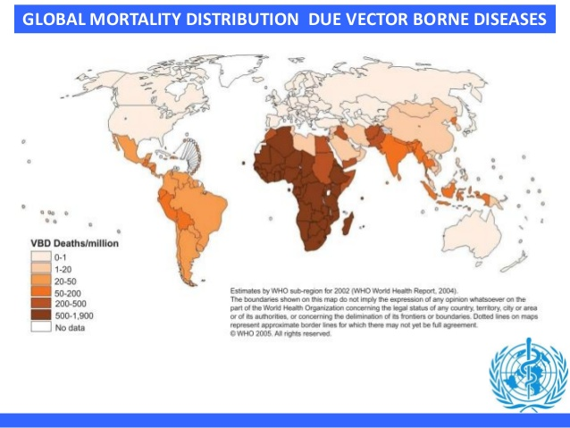
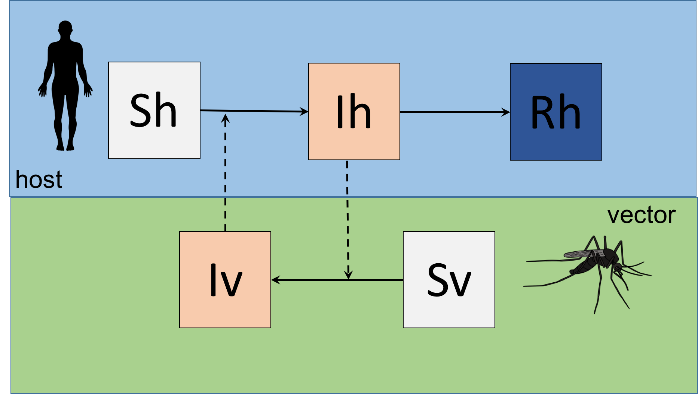
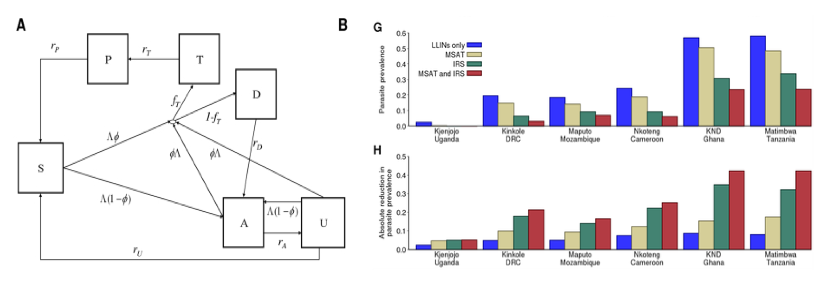
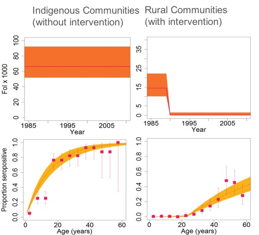
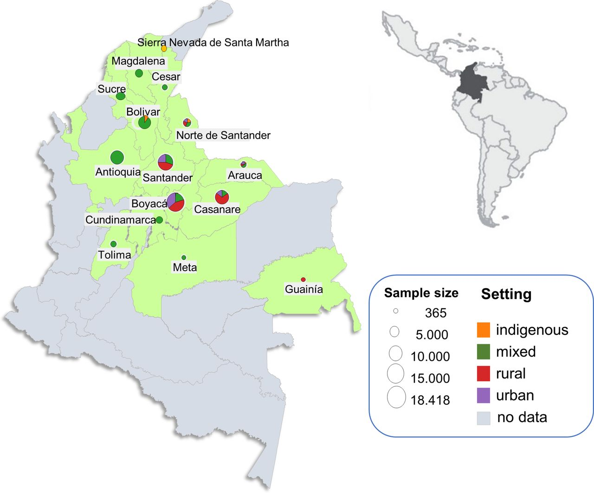
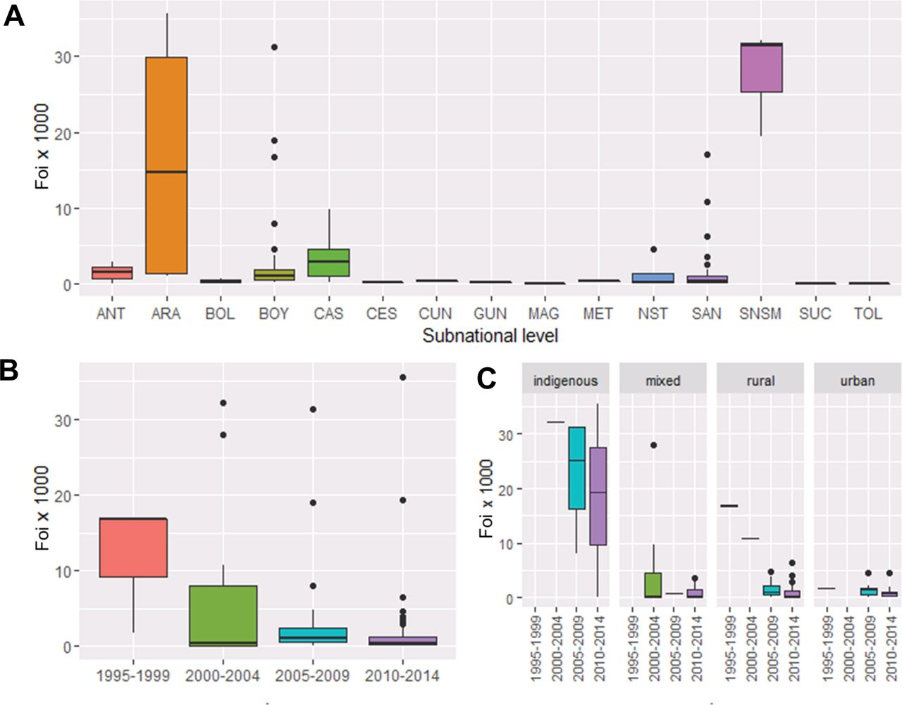
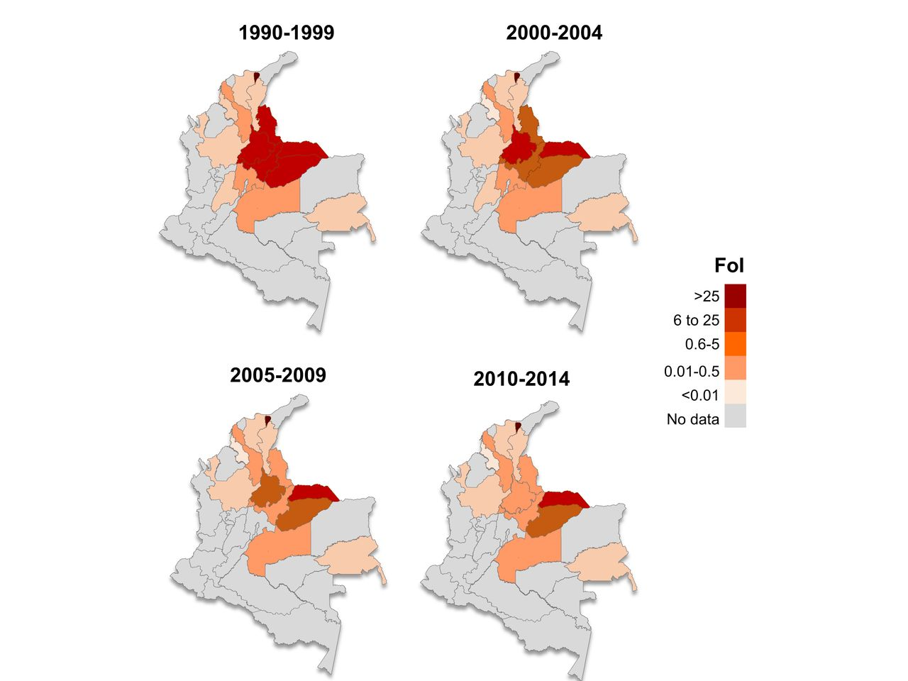
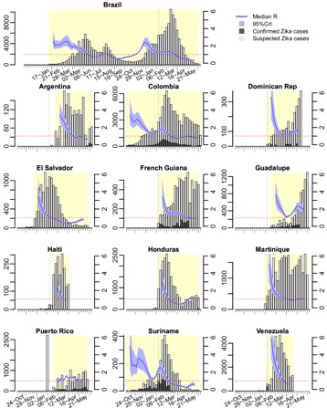
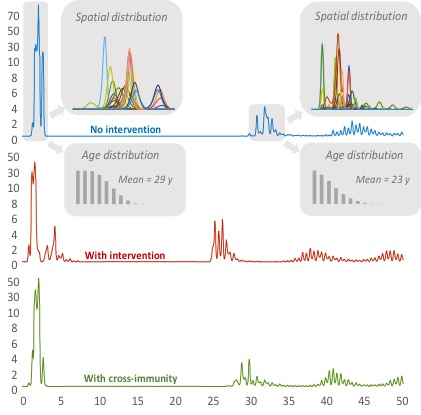

```{r setup, include=FALSE}
## This code defines the 'verbatim' option for chunks
## which will include the chunk with its header and the
## trailing "```".

require(knitr)
hook_source_def = knit_hooks$get('source')
knit_hooks$set(source = function(x, options){
  if (!is.null(options$verbatim) && options$verbatim){
    opts = gsub(",\\s*verbatim\\s*=\\s*TRUE\\s*.*$", "", options$params.src)
    bef = sprintf('\n\n    ```{r %s}\n', opts, "\n")
    stringr::str_c(bef, paste(knitr:::indent_block(x, "    "), collapse = '\n'), "\n    ```\n")
  } else {
     hook_source_def(x, options)
  }
})
```


# Introduction

## Core Concepts 

In this lecture we will develop these concepts:

- General understanding of VBD transmission
- The Ross-MacDonald Model and futher developments (Malaria)
- Force-of-Infection models (Chagas disease)
- A basic compartimental model for Zika

## VBD diseases

Vector-borne diseases are human illnesses caused by parasites, viruses and bacteria that are transmitted by:

- mosquitoes
- sandflies
- triatomine bugs
- blackflies
- ticks
- tsetse flies
- mites
- snails
- lice


## Why to study VBD
<center>


</center>
<br>


## Why to study VBD
It has been a major cause of disease burden for decades particularly Malaria, Dengue, Chagas disease. 

Since 2014, major outbreaks of dengue, malaria, chikungunya yellow fever and Zika have afflicted populations, claimed lives and overwhelmed health systems in many countries.

Global travel and trade, unplanned urbanization, climate change can impact on pathogen transmission, making transmission season longer or more intense or causing diseases to emerge in countries where they were previously unknown.


# Malaria

## The Ross - MacDonald Model

The first vbd model was the Malaria transmission model by Ross (1911) and MacDonald (1957). 

The Ross-Macdonald theory has since played a central role in infectious disease modelling and constitute the basis of much of the epidemiological understanding of insect-borne diseases. 

The Ross-Macdonald model then let to the *Global Malaria Eradication Programme* (GMEP, 1955–1969).


## The Simple Ross - MacDonald Model (flow diagram)

<center>


</center>
<br>


## The Ross - MacDonald Model (parameters)

- **N** =       Size of human population
- **M** =       Size of vector population
- *m*   =     N/M, number of mosquitos per human host
- *a*   =     bitting rate by a single mosquito
- *b*   =     probablity of transmission from mosquito to human
- *c*   =     probablity of transmission from human to mosquito
- *r*   =     recovery rate in humans
- *mu_v*  =   mortality of the mosquito


## The model (Equations)

$$\ \frac{dSh}{dt}  = - a b\frac {S_h I_v}{N_h} $$
$$\ \frac{dIh}{dt}  = a b\frac {S_h I_v}{N_h} - rI_h$$
$$\ \frac{dRh}{dt}  = rI_h$$

$$\ \frac{dSv}{dt}  = \mu_v N_v  - ac \frac{S_vI_h} {N_h} - \mu_v S_v$$
$$\ \frac{dI_v}{dt}  = ac \frac{S_vI_h} {N_h} - \mu_v I_v$$

## The Ross - MacDonald Model (R0)

$$\ R_0^2 =  \frac {ma^2bc}{r \mu_v}$$

For a more thorough revision on the evolution of Ross-MacDonald theory, you can check (Smith  et al., 2012) 

## An example of a more complex and updated malaria model


<center>


</center>
<br>
*Griffin et al. 2010*


# Chagas disease

## Force-of-Infection models (I)

In epidemiology, FOI ($\lambda$) is defined as the per capita rate at which
susceptible individuals become infectious.

These models also called catalytic models aim at fitting age-structured sero-prevalence data to estimate the FoI.

The basic model (Muench, 1934) 

$$\ p_a  =  1 - exp ^ {-\lambda a} $$
They allow us to estimate parameteres from previous exposure to infection.

Particularly used in VBD for arboviruses, malaria and Chagas disease.


## FoI models for Chagas disease

- Chagas is an infectious but chronic disease

- Undestanding exposure history is crutial to estimate disease burden

- Exposure is heterogeneous both over time and in space

- There is not age dependency in susceptibility to infection (assumption)

- There is no loss of antibodies over time (assumption)

## FoI models for Chagas disease 


- Constant FoI model
$$\ p_a  =  1 - exp ^ {-\lambda a} $$

- Interruption model
$$\ p_{a,\tau}  =  1 - exp {(- [\lambda_1 (a - (\tau - \epsilon_1)) + \lambda_2(\tau - \epsilon_2) ]} $$
 
- Temporarily changing FoI
$$\ p_a  =  1 -  \sum_{i=\tau - a +1}^{i = \tau} {\lambda_i} $$

*Cucunuba et at. BMJ Global Health 2017 *

## FoI models for Chagas disease in Colombia (I)

<center>

</center>
<br>

*Cucunuba et at. BMJ Global Health 2017 *


## FoI models for Chagas disease in Colombia (II)

<center>

</center>
<br>
*Cucunuba et at. BMJ Global Health 2017 *

## FoI models for Chagas disease in Colombia (III)

<center>

</center>
<br>
*Cucunuba et at. BMJ Global Health 2017 *

## FoI models for Chagas disease in Colombia (IV)

<center>

</center>
<br>
*Cucunuba et at. BMJ Global Health 2017 *


# Zika

## Zika in Latin America (R estimates)

<center>

</center>
<br>
*Ferguson et at. Science 2016*


## Zika in Latin America (Projections)

<center>

</center>
<br>

*Ferguson et at. Science 2016*


## 

<br>

<center>

</center>
