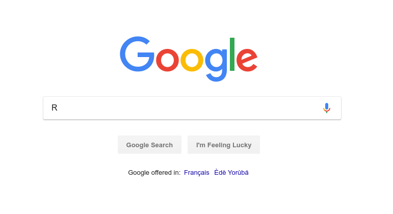
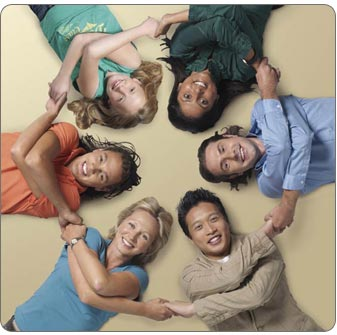
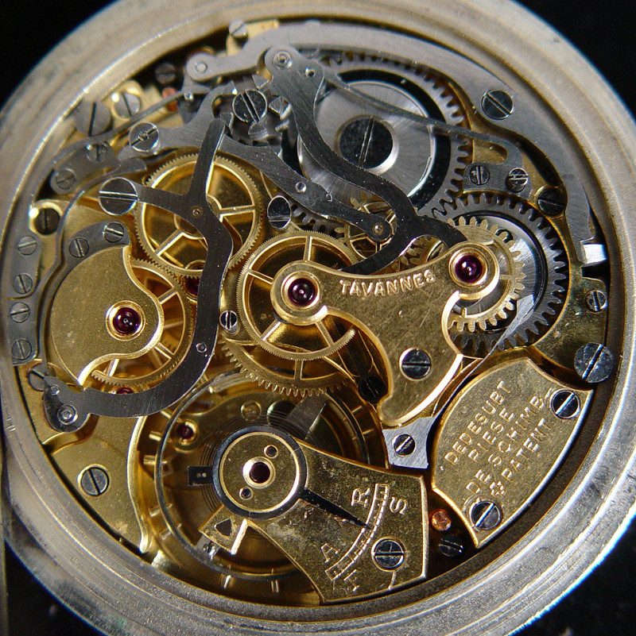
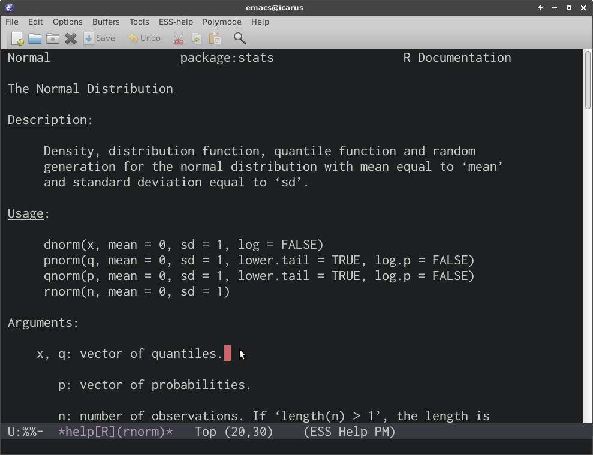

```{r setup, include = FALSE}
## This code defines the 'verbatim' option for chunks
## which will include the chunk with its header and the
## trailing "```".

require(knitr)
hook_source_def = knit_hooks$get('source')
knit_hooks$set(source = function(x, options){
  if (!is.null(options$verbatim) && options$verbatim){
    opts = gsub(",\\s*verbatim\\s*=\\s*TRUE\\s*.*$", "", options$params.src)
    bef = sprintf('\n\n    ```{r %s}\n', opts, "\n")
    stringr::str_c(bef, paste(knitr:::indent_block(x, "    "), collapse = '\n'), "\n    ```\n")
  } else {
    hook_source_def(x, options)
  }
})
```


# What is **R**?

## **R** in a nutshell

<center></center>

<br>

> - a <font color="#99004d">free software</font> for <font color="#99004d">data analysis</font>
> - an interpreted <font color="#99004d">programming language</font>, derived from `S-plus'
> - initially developed by <font color="#99004d">R.</font> Ihaka and <font color="#99004d">R.</font> Gentleman (1996)
> - currently developed by the <font color="#99004d">R Core Team</font> (20 people)
> - <font color="#99004d">largest collection</font> of tools for data analysis (1,000s of contributors)


## Where can you get it?

<center></center>

> - The **R** project: [www.r-project.org](www.r-project.org)
> - archiving / distribution network CRAN: <br>[cran.r-project.org/mirrors.html](cran.r-project.org/mirrors.html)
> - available on Windows, MacOSX, Linux


## What can you do with it?

<center></center>


> - <font color="#99004d">basic statistics</font>: statistical tests, linear modelling, multivariate analysis
> - <font color="#99004d">spatial statistics</font>: GIS, mapping, clustering
> - <font color="#99004d">graph theory</font>: social sciences, network analysis, graph algorithm
> - <font color="#99004d">genetics</font>: phylogenetic trees, genetic markers, genomics
> - <font color="#99004d">epidemiology!</font>
> - <font color="#99004d">much more</font>: see *task views* [cran.r-project.org/web/views/](cran.r-project.org/web/views/)


## What does "free" mean?

<center></center>

<br>

> - <font color="#99004d">Freedom</font> = *ability to make informed decisions*
> - you don't pay for it
> - the code is accessible by anyone
> - anyone can use, modify and share the code


## Getting started

<center></center>

<br>

> - get **R** for your system (download from CRAN)

> - get a Graphical User Interface (GUI): <font color="#99004d">RStudio</font>, emacs + ESS, Tinn-R

> - (or at least) get a text editor to write code: notepad++, emacs, vi, Tinn-R, ...


## And then...

<center></center>


## Getting help

<center></center>

<br>

> - `?foo` or `help("foo")`: access the help page of `foo`
> - `??bar` or `help.search("foo")`: look for `foo` in help pages
> - dedicated <font color="#99004d">mailing lists</font>: [stat.ethz.ch/mailman/listinfo](stat.ethz.ch/mailman/listinfo)
> - the <font color="#99004d">RECON forum</font>: [http://www.repidemicsconsortium.org/forum/](http://www.repidemicsconsortium.org/forum/)
> - <font color="#99004d">google</font>


# Storing data in **R**

## How does **R** store information?

<center></center>

> - <font color="#99004d">no files</font>, all in the <font color="#99004d">RAM</font> (i.e. temporary memory)
> - data, results, functions, etc. are all **R** <font color="#99004d">*objects*</font>
> - <font color="#99004d">one *object*</font> can be saved / loaded using `saveRDS`/`readRDS` (output: `.rds` files)
> - <font color="#99004d">several *objects*</font> can be saved / loaded using `save`/`load` (output: `.RData` files)
> - an <font color="#99004d">entire session</font> can be saved using `save.image`


## How to create objects? 

<center></center>

General syntax: `object_name <- content`:

```{r}
toto <- 1:8
toto # check content: 1, 2, 3, ...
toto <- "some text"
toto # content has changed
```


## <font color="#99004d">Round numbers</font>: `integer`

```{r}
a <- 1:10
a
class(a)
```


## <font color="#99004d">Decimal numbers</font>: `numeric`

```{r}
b <- c(-0.1, 10.123, pi)
b
class(b)
```


## <font color="#99004d">Text</font>: `character`

```{r}
a <- c("hello world", "this is fun", "even more fun coming")
a
class(a)
```


## <font color="#99004d">Categorical variables</font>: `factor`

```{r}
a <- factor(c("red", "blue", "green", "red", "green"))
a
class(a)
levels(a)
```


## <font color="#99004d">Booleans</font>: `logical`

The `logical` type can be `TRUE` or `FALSE`:

```{r}
a <- c(TRUE, FALSE, TRUE, TRUE)
a
class(a)
```


## Vectors

A `vector` stores several values of the <font color="#99004d">same type</font>
as a one-dimensional array:

```{r}
a <- c(1, 2, 10, -1, 1.123)
a
length(a)
```


## Matrices

A `matrix` stores several values of the <font color="#99004d">same type</font>
as a table:

```{r}
a <- matrix(sample(1:12), ncol = 4)
a
class(a)
dim(a)
```


## Data frames

A `data.frame` is a table where variables (columns) can have different types
(equivalent to a <font color="#99004d">spreadsheet</font>):

```{r, size = "tiny"}
a <- data.frame(age = c(10, 54, 3), sex = c("m", "f", "m"))
a
class(a)
dim(a)
```


## Lists

A `list` is a collection of objects of <font color="#99004d">any types and
sizes</font>, stored as different `slots`:

```{r size = "tiny"}
age <- c(10, 54, 3)
sex <- factor(c("m", "f", "m"))
swab  <- matrix(
  sample(c("+", "-"), replace = TRUE, 10), nrow = 2,
  dimnames = list(NULL, paste("t", 1:5, sep = "")))
x <- list(age = age, gender = sex, swab_results = swab)
```


## Lists (continued)

```{r size = "tiny"}
x
class(x)
length(x)
```


## Summary: basic object types`

- `integer`: integer numbers
- `numeric`: decimal numbers
- `character`: character strings
- `factor`: categorical variables
- `vector`: collection of values (1 dimensional array, same type)
- `matrix`: collection of values (table, same type)
- `data.frame`: columns can have different types, but same length (spreadsheet)
- `list`: collection of elements, no restriction of content
- `...`: classes for: DNA sequences, maps, networks, etc.


# Using functions


## What is a function?

<center></center>

A set of <font color="#99004d">operations</font> made on a given input.

Syntax: `function_name(argument1, argument2, ...)`

Example:

```{r}
rnorm(8, mean = 5, sd = 3)
```


## How to use a function?

Read the documentation by typing `?function_name`.

Example:

```{r}
?rnorm
```

<center></center>


## Functions results need storing

For example:

```{r}
rnorm(5, mean = 3, sd = 2) # this result is not stored
toto <- rnorm(5, mean = 3, sd = 2) # store output in toto
toto
```


## Functions can be nested

For example:

```{r}
hist(rnorm(1000, mean = 3, sd = 2), col = rainbow(15))
```


# Handling objects

## Subsetting objects

<center></center>

<br>

Objects can be <font color="#99004d">subsetted</font> by *index*, *name*, or *logical*, using:

> - `object_name[]` for a vector
> - `object_name[rows, columns]` for a `matrix` / `data.frame`
> - `object_name[[]]` for a `list`


## Subsetting a vector: by index

`x[foo]` where `foo` is an `integer` vector

- <font color="#99004d">positive integers</font>: position of retained entries
- <font color="#99004d">negative integers</font>: position of discarded entries


```{r}
x <- 10:1
x
x[c(1, 2, 5)]
letters[2:10]
letters[-(1:20)]
```


## Subsetting a vector: logicals

`x[foo]` where `foo` is a `logical` vector, returns the values of `x` where `foo`
is `TRUE`:

```{r}
x <- 1:10
x < 5
x[x < 5]
```


## Subsetting a vector: names

`x[foo]` where `x` is named and `foo` is a `character` vector of retained names:

```{r}
x <- sample(1:100, 10)
names(x) <- letters[1:10]
x
x[c("c", "d", "a", "i")]
```


## Subsetting and replacing values

`x[foo] <- new.value` where `x[foo]` are values to be replaced with `new.value`:

```{r}
x <- round(rnorm(14), 2)
x
x[x< 0] <- 0
x
```


## Subsetting matrices and data frames

Same principle, with `x[lines, columns]`:

```{r size = "tiny"}
x <- matrix(1:15, nrow = 3)
x
x[c(3,1), ]
x[2, 4:5]
```


## Subsetting lists

`x[foo]` to return a list, `x[[foo]]` for a single element:

```{r size = "tiny"}
x <- list(a = rnorm(4), hi = "Hello", stuff = letters[1:10]); x
x[c(1,3)]
x[[3]]
x$stuff
```


# Using logical operations

## Logical operations 1/4

```{r}
a <- c(TRUE, TRUE, FALSE, FALSE)
b <- c(TRUE, FALSE, TRUE, FALSE)
rbind(a,b)
a & b # logical 'AND'
a | b # logical 'OR'
```


## Logical operations 2/4
```{r}
!a # not A
any(a) # at least one TRUE
all(a) # all TRUE
which(a) # indices of the TRUEs
```


## Logical operations 3/4
`is.na` is useful to spot missing data (NAs)
```{r}
a <- c(3,NA,2,5,NA,10)
is.na(a)
a[!is.na(a)]
```


## Logical operations 4/4
Logicals are numbers: `TRUE = 1`, `FALSE = 0`

```{r}
a <- -10:5
sum(a > 0)
mean(a > 0)
a * (a > 0)
```


## 

<br>

<center>

</center>
