```{r setup, include=FALSE}
## This code defines the 'verbatim' option for chunks
## which will include the chunk with its header and the
## trailing "```".

require(knitr)
hook_source_def = knit_hooks$get('source')
knit_hooks$set(source = function(x, options){
  if (!is.null(options$verbatim) && options$verbatim){
    opts = gsub(",\\s*verbatim\\s*=\\s*TRUE\\s*.*$", "", options$params.src)
    bef = sprintf('\n\n    ```{r %s}\n', opts, "\n")
    stringr::str_c(bef, paste(knitr:::indent_block(x, "    "), collapse = '\n'), "\n    ```\n")
  } else {
     hook_source_def(x, options)
  }
})
```


# Introduction

## Early outbreak context 

<center>

</center>

- within a few days / weeks of index case
- limited data available
- no or limited intervention
- no depletion of susceptibles
- <font color="#99004d">urgent assessment needed to inform response</font>


## Data usually available

- dates of symptom <font color="#99004d">onset</font>

- contact data: <font color="#99004d">exposure</font> (*who infected you?*) and <font color="#99004d">contact tracing</font> (*who could you have infected?*)

- dates of <font color="#99004d">exposure / infection</font>

- dates of <font color="#99004d">outcome</font>: death / recovery

- <font color="#99004d">metadata on patients</font>: age, gender, location, occupation, etc.

- <font color="#99004d">data from past outbreaks</font>


## Key questions

<center>

</center>

Disease-dependent, but generally includes:

- How fast is it growing?
- What is driving the epidemic growth?
- What is the case fatality ratio?
- Who is most severely affected?
- How many cases should we expect in the next days / weeks?
- ...


# Estimating key delays

## The incubation period

**Definition:** time interval between the <font color="#99004d">date on
infection</font> and the date of <font color="#99004d">symptom onset</font>

<center>

</center>


## The serial interval

**Definition:** time interval between <font color="#99004d">onset of
symptoms</font> in primary and secondary cases.

<center>
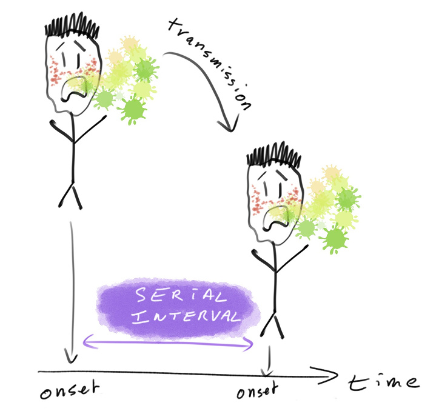
</center>


## The generation time

**Definition:** time interval between <font color="#99004d">date of
infections</font> in primary and secondary cases.

<center>
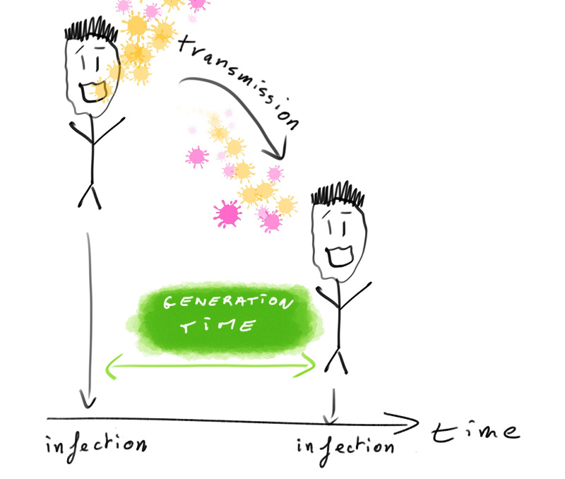
</center>


## Estimating the underlying distribution

From empirical distribution (data) to estimated distribution.

<center>
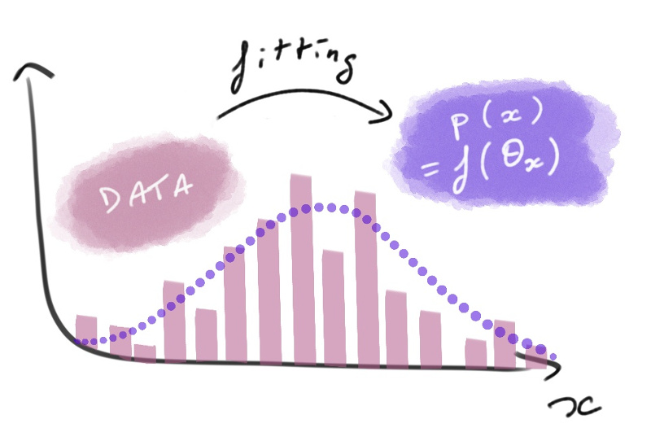
</center>

- choose type of distribution (e.g. normal, Poisson, Gamma)

- find $\theta_x$ which maximise $p(x)$, i.e. the <font color="#99004d">likelihood</font>

- visually: best fit between bars (data) and curve (distribution)


## Reminder: what is a likelihood?

<center>
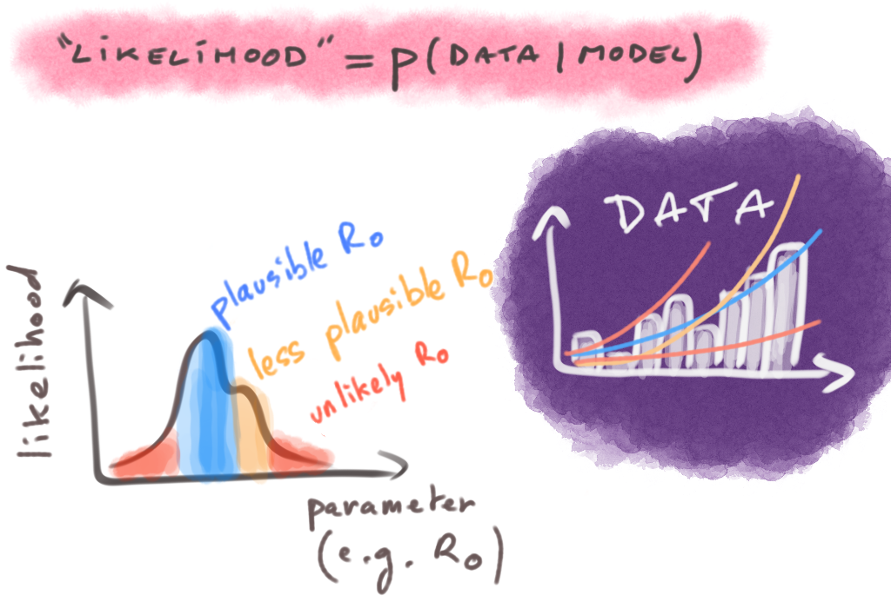

> A <font color="#99004d">relative measure</font> of <font color="#99004d">fit</font> between <font color="#99004d">data</font> and <font color="#99004d">model</font>

</center>


## Discretising continuous distributions

Using continuous distributions to model discrete variables:

<center>
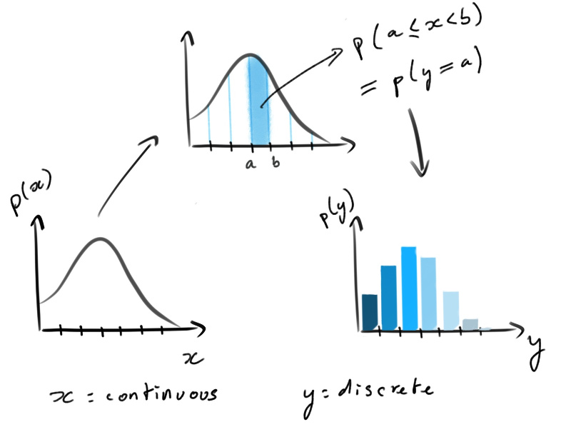
</center>


## Fitting discretised Gamma distributions for delays

- <font color="#99004d">flexible</font> distribution (many shapes possibles)

- 2 parameters: *shape*, *scale*

- alternatively: *mean*, *coefficient of variation*

- typical choice for <font color="#99004d">delay</font> distributions

- needs to be <font color="#99004d">discretised</font>


# Estimating mortality

## Case fatality ratio

**Definition:** the <font color="#99004d">proportion</font> of cases who die of
the infection.

<br>

<center>
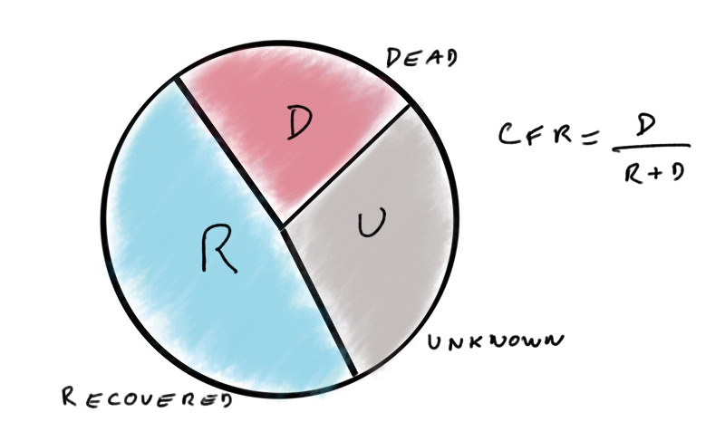
</center>


## Associated uncertainty {.small}

- CFR = <font color="#99004d">mean</font> number of death per case $\rightarrow$
  confidence interval is <font color="#99004d">Normally distributed</font>

<center>
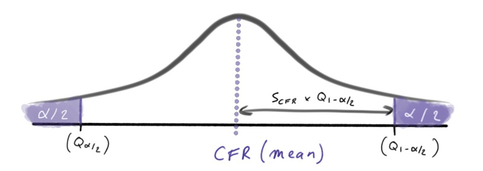
</center>

- standard error: $s_{CFR} = \sqrt{\frac{CFR (1 - CFR)}{D + R}}$
- <font color="#99004d">confidence interval</font> with $\alpha$ threshold:
$$
CI_{(1-\alpha)\%} = CFR \pm s_{CFR} \times Q_{1-\alpha/2} 
$$

where $Q$ is a Normal quantile (e.g. $1.96$ for $\alpha=0.05$)


## Example: confidence intervals of CFR

- CFR: 60%, <font color="#99004d">N = 10</font>:
$$
s_{CFR} = \sqrt{\frac{0.6 \times 0.4}{10}} = 0.155
$$

$$
CI_{95\%} = 0.6 \pm 1.96 \times 0.158 = [0.30 ; 0.90]
$$

- CFR: 60%, <font color="#99004d">N = 100</font>:
$$
s_{CFR} = \sqrt{\frac{0.6 \times 0.4}{100}} = 0.05
$$

$$
CI_{95\%} = 0.6 \pm 1.96 \times 0.05 = [0.50 ; 0.70]
$$


## Common caveats

- "*case fatality <font color="#99004d">rate</font>*": this is a proportion, not a rate

- computation using wrong <font color="#99004d">denominator</font>, i.e. including unknown outcome:

$$
\frac{D}{D + R + U}
$$

(leads to <font color="#99004d">underestimating</font> the CFR)

- not accounting for <font color="#99004d">uncertainty</font>, e.g. comparing CFR across groups without
  statistical tests


# Analysing incidence data

## What is incidence?

**Definition:** the <font color="#99004d">incidence</font> is the number of <font color="#99004d">new
cases</font> on a given time period. 

- relies on dates, typically of <font color="#99004d">onset of symptoms </font>

- only daily incidence is non-ambiguous

- other definitions (e.g. weekly) rely on a <font color="#99004d">starting date</font>

- prone to <font color="#99004d">reporting delays</font>


## Log-linear model of incidence

<center>
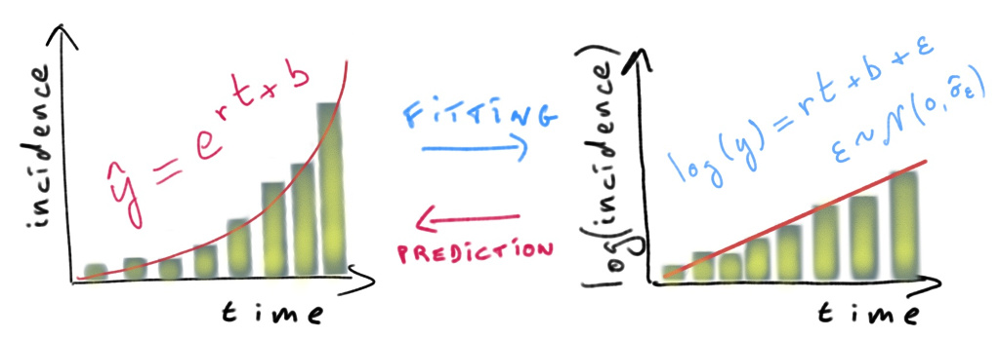
</center>

$log(y) = r \times t + b + \epsilon\:\:$ so that $\:\:\hat{y} = e^{r \times t + b}$

with:

- $r$: <font color="#99004d">growth rate</font>
- b: intercept
- $\epsilon \sim \mathcal{N}(0, \hat{\sigma_{\epsilon}})$


## Doubling time

Let $T$ be the time taken by the incidence to double, given a daily growth rate
$r$.

<center>
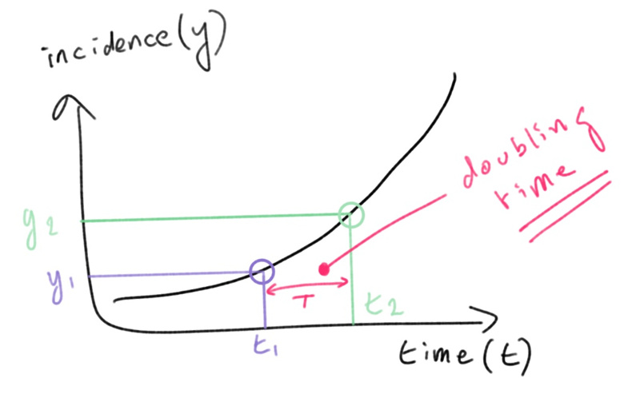
</center>

$$
y_2 / y_1 = 2 \:\: \Leftrightarrow  e^{rt_2 + b} / e^{rt_1 + b}  = 2
$$

$$
\Leftrightarrow  e^{r(t_2 - t_1)} = 2  \Leftrightarrow T = log(2) / r
$$


## Log-linear model: pros and cons

**Pros**:

- fast and simple
- predictions possible
- doubling / halving time readily available
- possible extensions to estimate $R_0$ from $r$

**Cons**:

- zero incidence problematic
- non mechanistic
- no inclusion of other information (e.g. serial interval)


## Individual infectiousness over time

**Serial interval:** time interval between <font color="#99004d">onset of
symptoms</font> of primary and secondary cases.

<center>
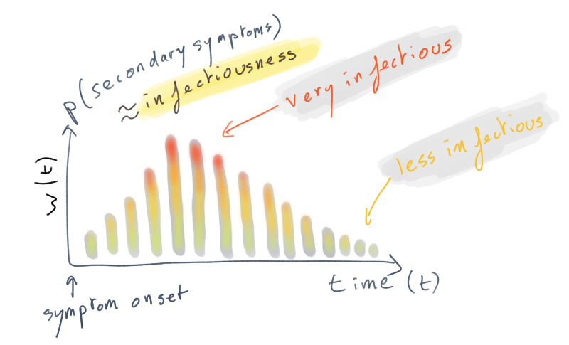
</center>


## Global infectiousness over time

<center>
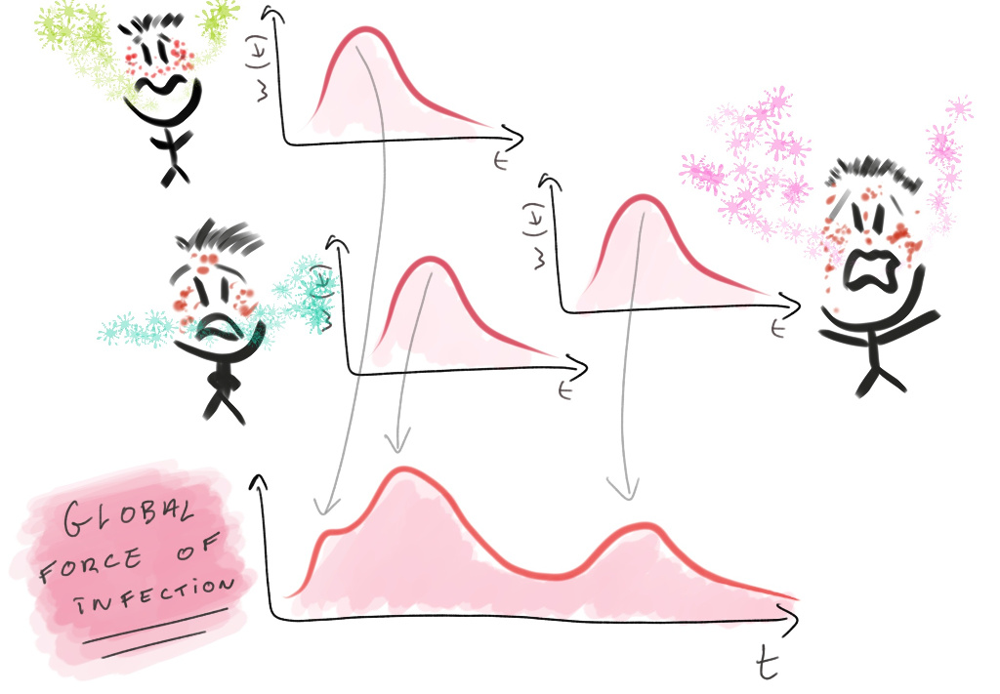
</center>

$$
\lambda_t = R_0 \times \sum_i w(t - t_i)
$$

with: $\lambda_t$: <font color="#99004d">global force of infection</font>; $w()$: serial interval
distribution; $t_i$: date of symptom onset


## A Poisson model of incidence

<center>

</center>
<br>

Treat incidence $y_t$ on day $t$ as a Poisson distribution of rate $\lambda_t$:

$$
p(y_t | R_0, y_1, ..., y_{t-1}) = e^{-\lambda_t} \frac{\lambda_t^{y_t}}{(!y_t)}
$$
with (slight rewriting):
$\lambda_t = R_0 \times \sum_{s = 1}^{t-1} y_s w(t - s)$


## Short-term forecasting {.small}

<center>
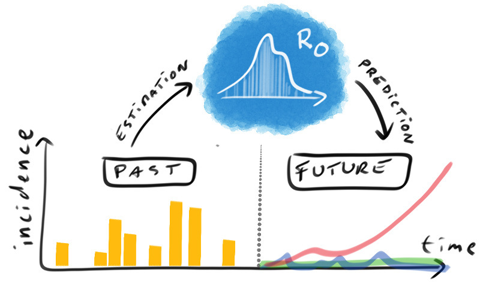
</center>
<br>

- draw $R_0$ from estimated distribution
- simulate $y_{t+1} \sim \mathcal{P}(\lambda_{t+1} | R_0, y_1, ..., y_t)$ for increasing $t$
- repeat many times with different values of $R_0$


## Poisson model: pros and cons

**Pros**:

- still fast, reasonably simple (1 parameter)
- accommodates zero incidence
- <font color="#99004d">predictions possible</font>: forward simulation (Poisson)
- integrates information on <font color="#99004d">serial interval</font>
- extension to <font color="#99004d">time-varying</font> $R$ (*EpiEstim*)


**Cons**:

- needs information on serial interval
- no spatial processes
- assumes constant reporting
- likelihood / Bayesian methods harder to communicate


## 

<br>

<center>

</center>

