```{r setup, include=FALSE}
## This code defines the 'verbatim' option for chunks
## which will include the chunk with its header and the
## trailing "```".

require(knitr)
hook_source_def = knit_hooks$get('source')
knit_hooks$set(source = function(x, options){
  if (!is.null(options$verbatim) && options$verbatim){
    opts = gsub(",\\s*verbatim\\s*=\\s*TRUE\\s*.*$", "", options$params.src)
    bef = sprintf('\n\n    ```{r %s}\n', opts, "\n")
    stringr::str_c(bef, paste(knitr:::indent_block(x, "    "), collapse = '\n'), "\n    ```\n")
  } else {
     hook_source_def(x, options)
  }
})
```


# Inferring who infected whom

## Transmission tree, transmission chain

<center> 
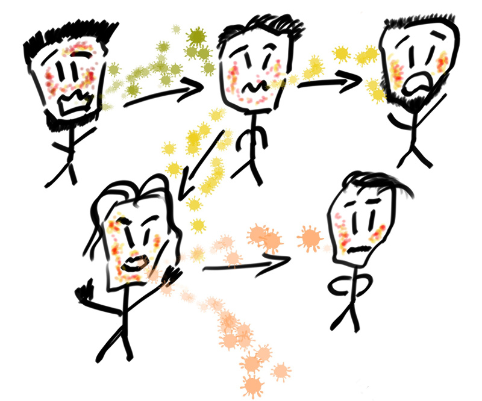
</center> 


> - <font color="#99004d">transmission tree</font>: directed acyclic graph
representing transmission events of an outbreak

> - <font color="#99004d">transmission chain</font>: path from a case to a
descending case


## Why does it matter?
 
<center> 
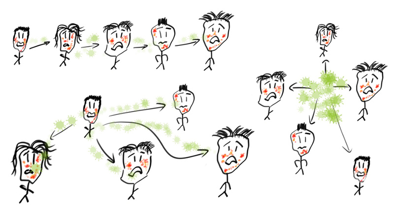
</center> 

Different <font color="#99004d">transmission contexts</font> need different
<font color="#99004d">responses</font>.
 


## A difficult problem

The number of possible transmission trees grows very fast:

```{r number-of-trees, echo = FALSE, out.width = "60%", fig.align="center"}
par(mar = c(4, 5, 1, 1))
plot(1:10, factorial(1:10), type = "b", xlab = "Number of cases",
     ylab = "Number of possible trees", pch = 20, lwd =2,
     cex = 1.5, cex.lab = 1.5)
	
```	

- for <font color="#99004d">10 cases</font> with unique onsets, <font
  color="#99004d">$\sim 3,500,000$ trees</font>

- for <font color="#99004d">60 cases</font> with unique onsets, <font
  color="#99004d">$\sim 8^{81}$ trees</font> (more or less the estimated number
  of atoms in the universe)


## Some data can be informative

<center> 
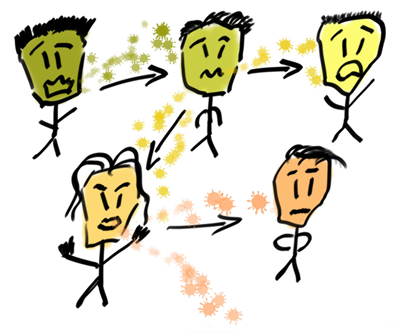
</center> 

- <font color="#99004d">mutations</font> accumulate in the pathogen genome along
  the transmission chains

- can be used to <font color="#99004d">reconstruct transmission trees</font>


## But even genomic data have limits

<center> 
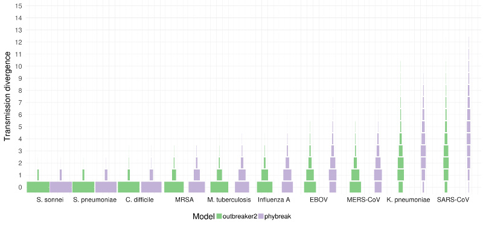
</center> 

<br>

For most diseases, <font color="#99004d">whole genome sequences</font> alone are <font color="#99004d">not sufficient</font> for reconstructing transmission trees.


## An evidence synthesis approach

<center> 
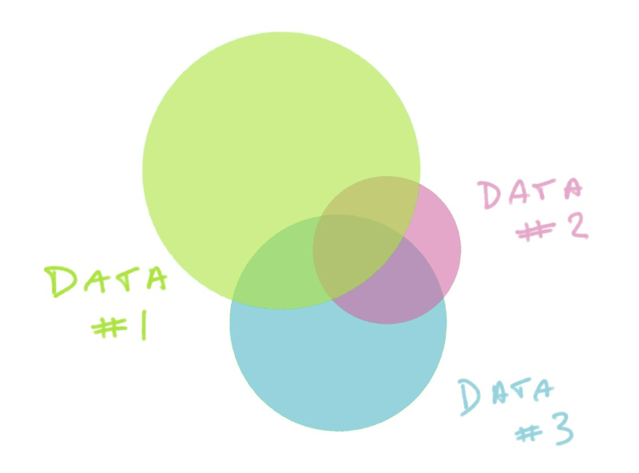
</center> 
<br>

- data (e.g. dates of symptom onset) <font color="#99004d">restrict possible
  trees</font>

- <font color="#99004d">combine different types of data</font> to identify a
  small set of <font color="#99004d">plausible trees</font>


# Outbreak reconstruction using *outbreaker2*

## Original idea of *outbreaker*

Original *outbreaker* model used <font color="#99004d">serial interval</font>
and <font color="#99004d">genetic data</font> to reconstruct transmission
events.

<center> 
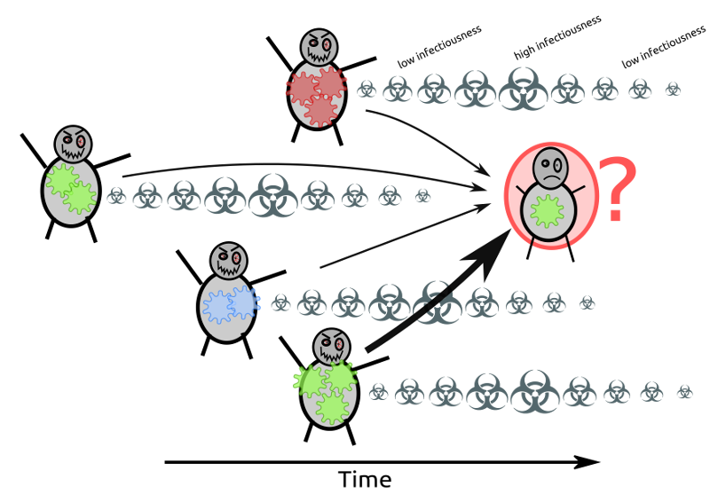
</center> 
<br>


## *outbreaker2*: a modular platform for outbreak reconstruction

<center>
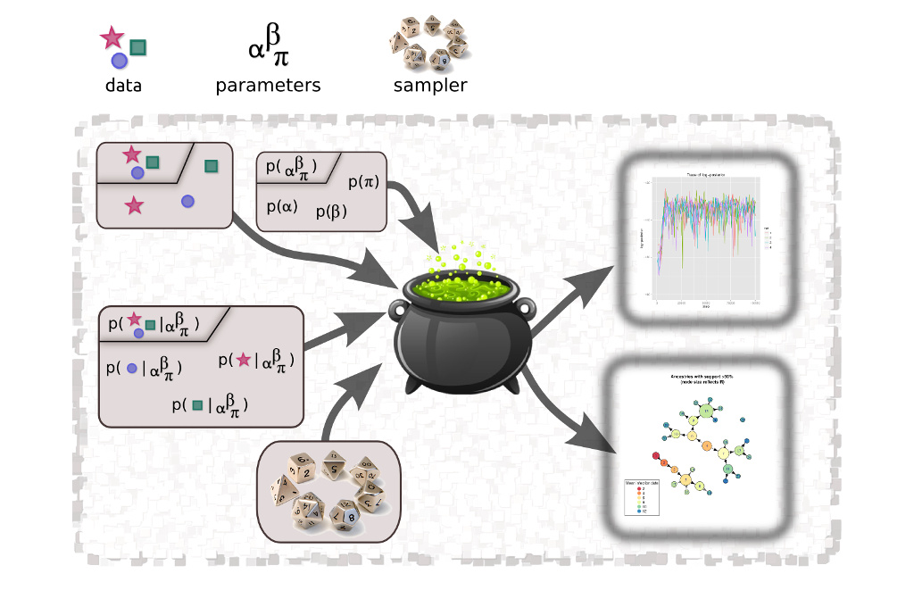
</center>
<br>


## Temporal likelihood

<center>
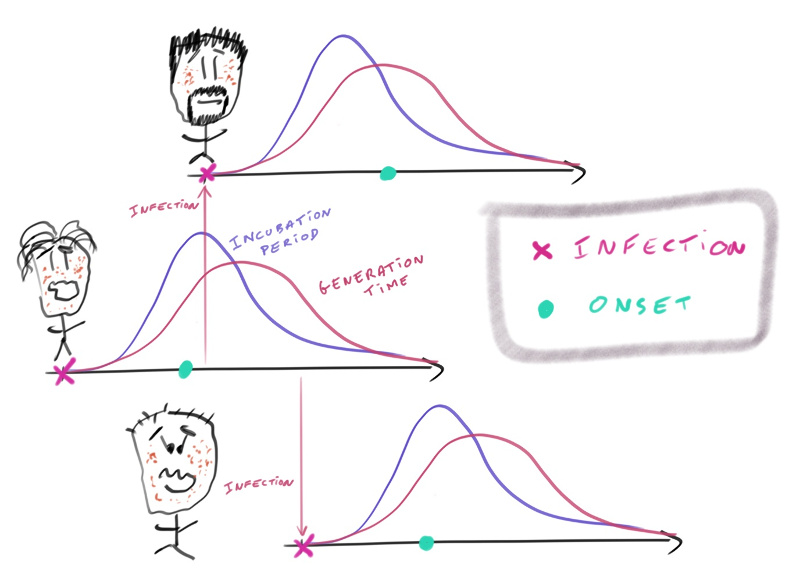
</center>

Combines <font color="#99004d">generation time</font>, <font
color="#99004d">incubation period</font>, and dates of <font
color="#99004d">onset</font>.


## Temporal likelihood

<center>

</center>

Dates of <font color="#99004d">symptom onset</font> ($t_i$),
<font color="#99004d">generation time</font> ($w()$), <font
color="#99004d">incubation period</font> ($f()$), number of generations
($\kappa_i$).

$$
p(t_i | T_i^{inf}) \times p(T_i^{inf} | T_{\alpha_i}^{inf}, \kappa_i)
 = f(t_i - T_i^{inf}) \times w^{(\kappa_i)}(T_i^{inf} - T_{\alpha_i}^{inf})
$$


## Reporting likelihood

<center>
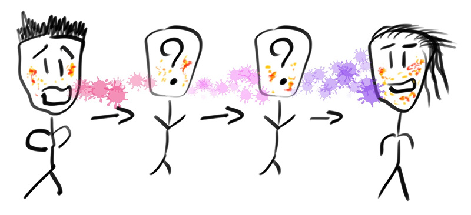
</center>

- $\kappa_i$: <font color="#99004d">number of generations</font> between case
  $i$ and its more recent sampled "ancestor"; $\pi$ case <font color="#99004d">reporting</font> probability

**Geometric distribution:**

$$
p(\kappa_i | \pi) = (1 - \pi^{})^{\kappa_i - 1} \times \pi 
$$


## Genetic likelihood

<center>
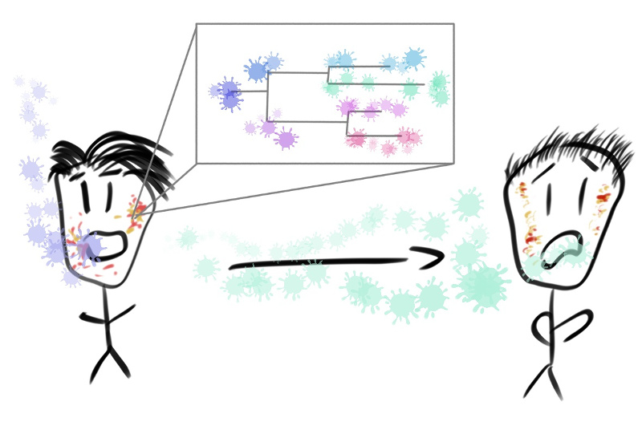
</center>

- $d()$: number of <font color="#99004d">mutations</font> between 2 sequences; $s_i$, $s_{\alpha_i}$: sequences of infectee their infector; $L$: genome length; $\mu$: <font color="#99004d">mutation rate</font> per generation of infection

$$
p(s_i | s_{\alpha_i} \mu) = \mu^{d(s_i, s_{\alpha_i})} \times 
(1 - \mu)^{(\kappa_i L - d(s_i, s_{\alpha_i}))}
$$


## Contact likelihood

**Relies on:** contact reporting probability ($\epsilon$) and probability of
contact between non-transmission pairs ($\lambda$).

<center>
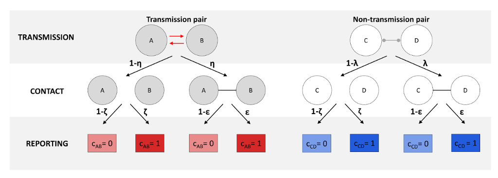
</center>

$\alpha_i = j$:  $p(c_{i,j} = 1 ) = \epsilon$ ; $p(c_{i,j} = 0) = 1 - \epsilon$

$\alpha_i \neq j$: $p(c_{i,j} = 1) = \lambda \epsilon$ ; $p(c_{i,j} = 0) = (1 - \lambda) + \lambda (1 - \epsilon)$


## 

<br>

<center>

</center>
