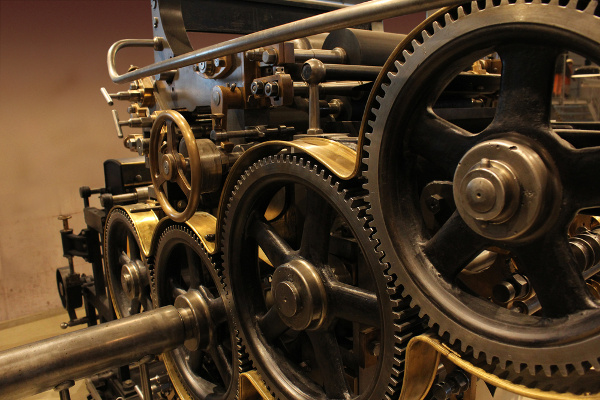
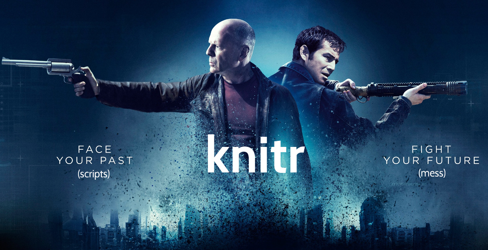
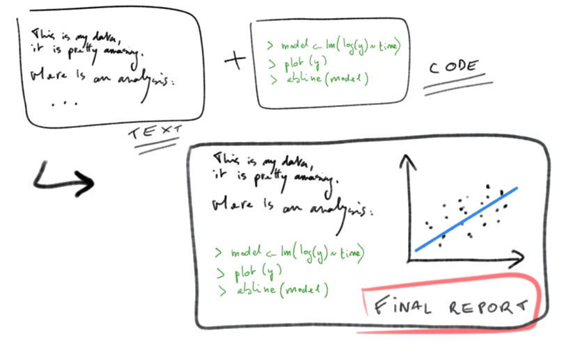
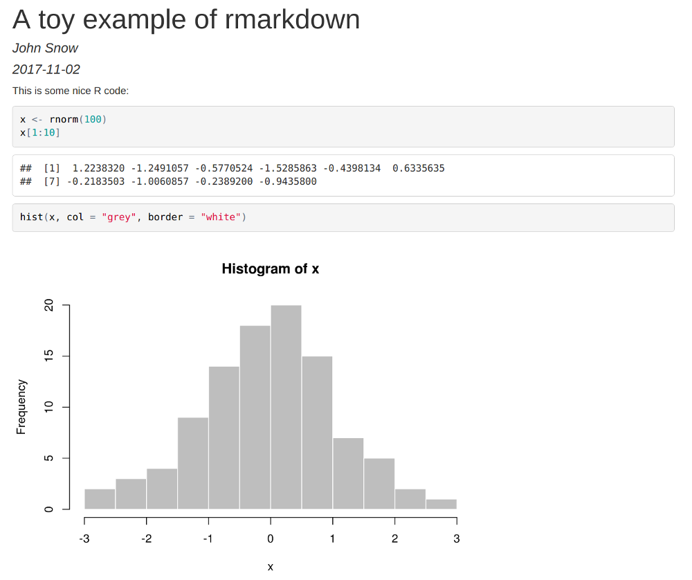
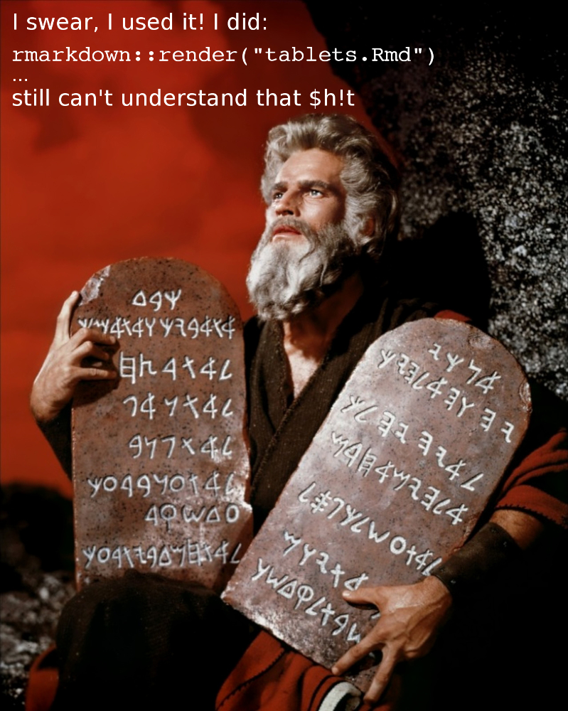
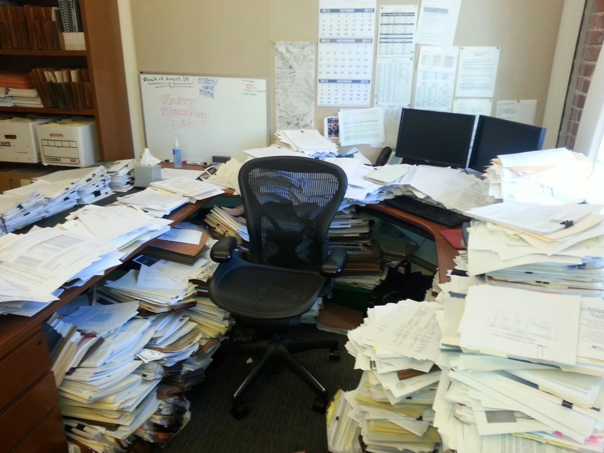
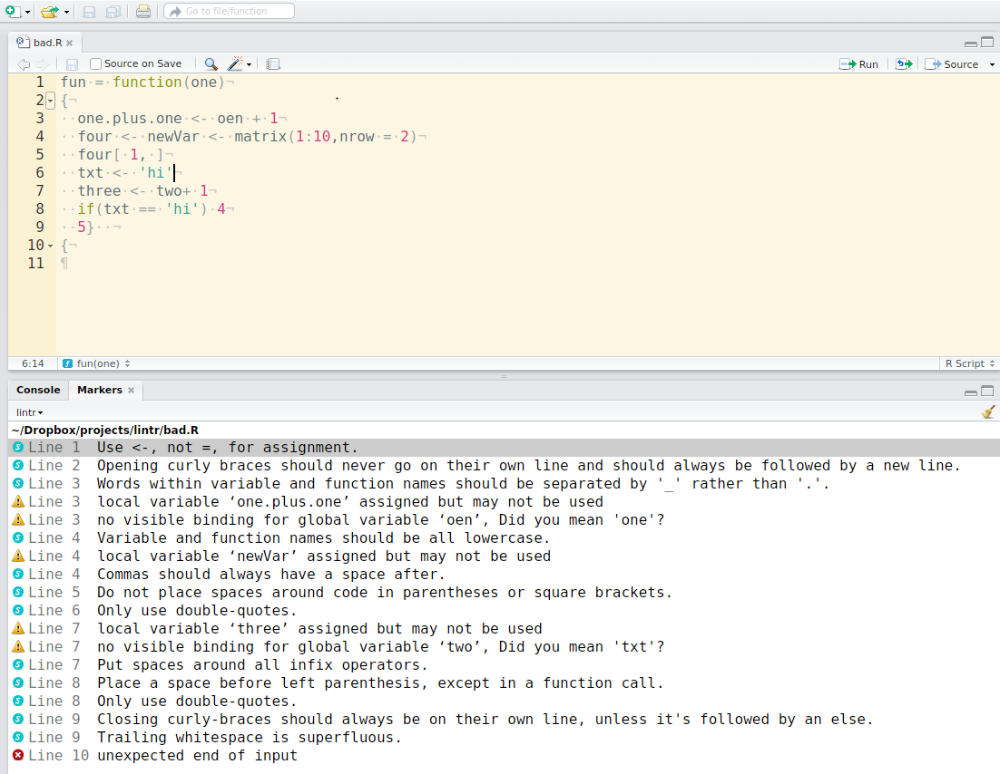
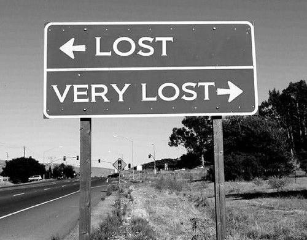

```{r setup, include=FALSE}
## This code defines the 'verbatim' option for chunks
## which will include the chunk with its header and the
## trailing "```".

require(knitr)
hook_source_def = knit_hooks$get('source')
knit_hooks$set(source = function(x, options){
  if (!is.null(options$verbatim) && options$verbatim){
    opts = gsub(",\\s*verbatim\\s*=\\s*TRUE\\s*.*$", "", options$params.src)
    bef = sprintf('\n\n    ```{r %s}\n', opts, "\n")
    stringr::str_c(bef, paste(knitr:::indent_block(x, "    "), collapse = '\n'), "\n    ```\n")
  } else {
     hook_source_def(x, options)
  }
})
```


# On reproducibility


## What is reproducibility in science?

<center>

</center>
<br>

> - ability to reproduce results by a peer
> - requires <font color="#99004d">data</font>, <font color="#99004d">methods</font>, and <font color="#99004d">procedures</font>
> - increasingly, science is supposed to be reproducible


## Why does it not happen, in practice?

  Some opinions on whether reproducibility is needed:
  
> - *Ideally, yes but we don't have time for this.*
> - *If it gets published, yes.*
> - *If it gets published, yes; unless it is in PLoS One...*
> - *No need: I work on my own.*
> - *For others to copy us? You crazy?!*
> - *No way! We rigged the data, the method does not work, and we ran the analyses in Excel.*


## Main obstacles to reproducibility {.columns-2}

<center></center>

> - lack of time: ultimately, reproducibility is faster
> - fear of plagiarism: low risks in practice
> - internal work, no need to share: almost never true
<br>
> - one good reason: <font color="#99004d">lack of tools to facilitate reproducibility</font>


## You never work alone

<center>

<br>

Be nice to your future selves!

</center>


## Two aspects of reproducibility using 


<center>

</center>

<br>

> - implementing methods as  packages
> - making <font color="#99004d">transparent</font> and <font color="#99004d">reproducible</font> analyses


# eproducibility in practice

## Literate programming

<center>

</center>

> *Let us change our traditional attitude to the construction of programs: instead
of imagining that our main task is to instruct a computer what to do, let us
concentrate rather on <font color="#99004d">explaining to humans what we want
the computer to do</font>.* </center> (Donald E. Knuth, Literate Programming,
1984)


## A data-centred approach to programming

<center>

</center>


## Literate programming in 

Current workflows use the following equation: 

**markdown** (`.md`)   +    = 
<font color="#99004d"> **Rmarkdown** </font> (`.Rmd`)

<br><br>Example:<br>
`knitr::knit2html("foo.Rmd")`  $\rightarrow$  `foo.html`<br>
`rmarkdown::render("foo.Rmd")`  $\rightarrow$  `foo.pdf`<br>
`rmarkdown::render("foo.Rmd")`  $\rightarrow$  `foo.doc`<br>
`...`


## **Rmarkdown**:  chunks in markdown {.smaller}

```{r chunk-title, ..., verbatim = TRUE, eval = FALSE}
a <- rnorm(1000)
hist(a, col = terrain.colors(15), border = "white", main = "Normal distribution")
```

results in:
```{r rmarkdown, out.width = "80%", fig.width = 12, echo = c(2,3)}
set.seed(1)
a <- rnorm(1000)
hist(a, col = terrain.colors(15), border = "white", main = "Normal distribution")
```


## Formatting outputs

```{r another-chunk-title, ..., verbatim = TRUE, eval = FALSE}
[some R code here]
```

where `...` are options for processing and formatting, e.g:

- `eval` (`TRUE`/`FALSE`): evaluate code?
- `echo` (`TRUE`/`FALSE`): show code input?
- `results` (`"markup"/"hide"/"asis"`): show/format code output
- `message/warning/error`: show messages, warnings, errors?
- `cache` (`TRUE`/`FALSE`): cache analyses?
<br>

See [http://yihui.name/knitr/options](http://yihui.name/knitr/options) for details on all options.


## One format, several outputs

**`rmarkdown`** can generate different types of documents:

- standardised reports (`html`, `pdf`) 
- journal articles. using the `rticles` package (`.pdf`)
- Tufte handouts (`.pdf`)
- word documents (`.doc`)
- slides for presentations (`html`, `pdf`)
- ...

See: [http://rmarkdown.rstudio.com/gallery.html](http://rmarkdown.rstudio.com/gallery.html).


## **`rmarkdown`**: toy example 1/2 {.smaller}

Let us consider the file \texttt{foo.Rmd}:
<pre><code>
---
title: "A toy example of rmarkdown"
author: "John Snow"
date: "`r Sys.Date()`"
output: html_document
---

This is some nice R code:
</pre></code>

```{r rnorm-example, verbatim = TRUE, eval = FALSE, echo = 2:4}
set.seed(1)
x <- rnorm(100)
x[1:6]
hist(x, col = "grey", border = "white")
```


## **`rmarkdown`**: toy example 1/2 {.smaller}

```{r toy-rmd, eval = FALSE}
rmarkdown::render("foo.Rmd")
```

<center>

</center>


# Good practices

## **`rmarkdown`** is just the beginning {.columns-2}

<center>

</center>

<br>

> - alter your original data

> - have a messy project

> - write non-portable code

> - write horrible code

> - lose work permanently


## How to treat your original data

<center>

</center>

> - **do not touch your original data**
> - save it as <font color="#99004d">read-only</font>
> - <font color="#99004d">make copies</font> - you can play with these
> - <font color="#99004d">track the changes</font> made to the original data


## How to avoid messy projects

<center>

</center>

> - **1 project = 1 folder**
> - subfolders for: data, analyses, figures, manuscripts, ...
> - document the project using a `README` file
> - use the Rstudio projects (if you use Rstudio)


## How to write portable code?

<center>

</center>

> - avoid absolute paths e.g.:<br>
`my_file <- "C:\project1\data\data.csv"`<br>
> - use the package <font color="#99004d">`here`</font> for portable paths e.g.:<br>
`my_file <- here("data/data.csv")`
> - avoid special characters and spaces in all names e.g.:<br> `éèçêäÏ*%~!?&`
> - assume case sensitivity: <br>`FooBar` $\neq$ `foobar` $\neq$ `FOOBAR`


## How to write better code?

<center>

</center>

> - name things explicitly
    
> - settle for one <font color="#99004d">naming convention</font>; `snake_case` is currently recommended for  packages
   
> - document your code using <font color="#99004d">comments</font> (`##`)
    
> - write <font color="#99004d">simple code</font>, in short sections
   
> - use current coding standards -- see the <font color="#99004d">`lintr`</font> package


## Example of `lintr`

<center>
<br>
<small>source: [https://github.com/jimhester/lintr](https://github.com/jimhester/lintr)</small>
</center>


## Do not lose your work!

Because you never know what can happen..

<center>

</center>


## How to avoid losing work?

<center>

</center>

<br>

> - **never rely on a single computer** to store your work
> - <font color="#99004d">backups</font> are good, <font color="#99004d">syncing</font> with a server is better (e.g. Dropbox)
> - use <font color="#99004d">version numbers</font> to track progress
> - use <font color="#99004d">version control systems</font> (e.g. GIT) for serious
    coding projects


## 

<br>

<center>

</center>
