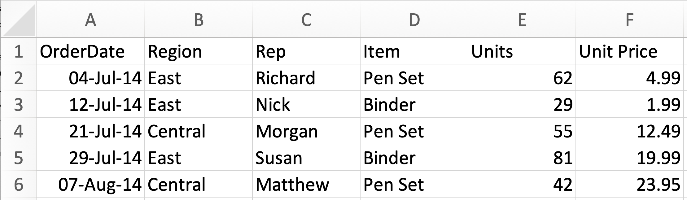
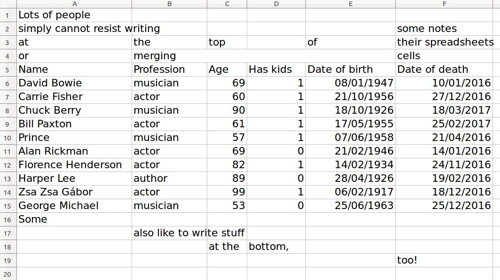
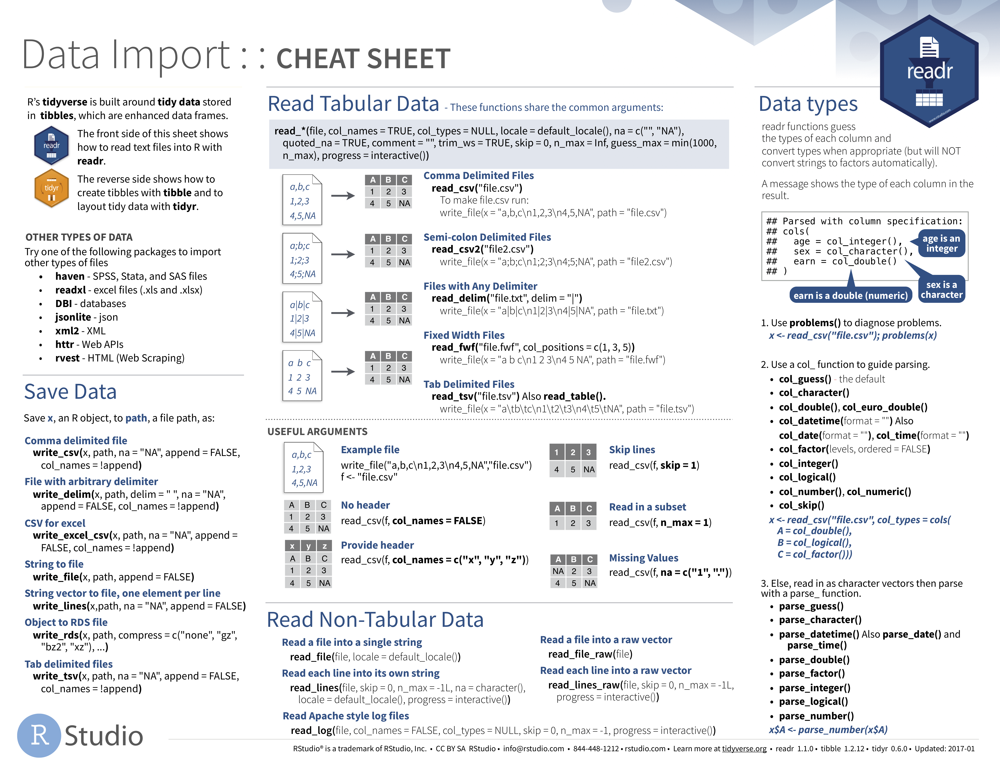

layout: true
class: inverse

<style type="text/css">
@import url(https://fonts.googleapis.com/css?family=Roboto+Condensed);
h1, h2, h3 { font-family: 'Roboto Condensed'; }
body { font-family: 'Roboto Condensed'; serif: 'Roboto Slab'; font-size: 1em; }
p { font-size: 1em }
li { font-size: 1em; }
.quote{ color: #dca3a3 }
code.r{ font-size: 18px; }
.remark-inline-code{
  <!-- color: #dca3a3; -->
  color: #7f9f7f;
}
.title-slide {
  <!-- background-image: url(http://www.repidemicsconsortium.org/img/logo.png); -->
  background-image: url("logo_recon.png");
  background-size: 80%;
  background-position: top center;
}
.title-slide .remark-slide-number { display: none; }
.title-slide h1:nth-of-type(1) { 
    font-size: 48px;
    color: #dca3a3; 
}
.title-slide h3:nth-of-type(1) { 
    font-size: 32px;
    color: #7f9f7f; 
}
.title-slide h3:nth-of-type(2) { 
    font-size: 32px;
    color: gray; 
}
.title-slide p:nth-of-type(1) {
    font-size: 32px;
    color: #7f9f7f;
}
.inverse {
  font-size: 24px;
}
.hex-col-l{
  width: 24%;
  float: left;
}
.hex-col-r{
  width: 74%;
  float: right;
}

<!-- @page { -->
<!--   size: 908px 681px; -->
<!--   margin: 0; -->
<!-- } -->
<!-- @media print { -->
<!--   .remark-slide-scaler { -->
<!--     width: 100% !important; -->
<!--     height: 100% !important; -->
<!--     transform: scale(1) !important; -->
<!--     top: 0 !important; -->
<!--     left: 0 !important; -->
<!--   } -->
<!-- } -->
</style>

---

```{r setup, include=FALSE, cache=F}
knitr::opts_chunk$set(echo = TRUE, message = FALSE, collapse = TRUE, warning = FALSE, fig.align = 'center', fig.height = 4, dpi = 300, cache = TRUE)
# knitr::opts_knit$set(root.dir = normalizePath(".."))
pacman::p_load(tidyverse, readxl, fontawesome)
options(dplyr.print_min = 5, dplyr.print_max = 5)
```

## Data import

### Learning objectives

- Use `readxl` to import your data into `r fontawesome::fa("r-project", fill = "steelblue")`

- Be aware of various other `r emo::ji("package")` used for importing a multitude of data formats into `r fontawesome::fa("r-project", fill = "steelblue")`

--

### Prerequisites

- Load `readxl`

```{r}
library(readxl)
```

---

## Data import

- Almost always the first step of your work

--

- R can handle multiple data types

--

  - Flat files (`.csv`, `.tsv`, ...)
  
--

  - Excel files (`.xls`, `.xlsx`)
  
--

  - Foreign statistical formats 
      - `.sas` (SAS)
      - `.sav` (SPSS)
      - `.dta` (Stata)
      - `.rec` (EpiInfo)...
      
--

  - Databases (SQL, SQLite, ...)
  
--

  - Ill-advised formats (`.pdf`, `.docx`, ...) `r emo::ji("cry")` `r fa("thumbs-down", fill = "steelblue")`

---
class: center middle

## Importing MS Excel files with `readxl`

.pull-left[
```{r echo=FALSE, out.width='50%'}
knitr::include_graphics("readxl_hi-res.png")
```
]

.pull-right[
```{r echo=FALSE, out.width='50%'}

```
]

---

## What data look like in Excel vs. `r fontawesome::fa("r-project", fill = "steelblue")`

```{r echo=FALSE, out.width='70%'}

```

```{r}
read_excel('office_supplies.xlsx')
```

---

## `readxl` functions

.hex-col-l[
```{r echo=FALSE, out.width='100%'}
knitr::include_graphics("readxl_hi-res.png")
```
]

.hex-col-r[
- `excel_sheets()`: lists all sheets in Excel file

- `read_excel()`: imports `.xls` and `.xlsx` files
]

---

## `readxl` functions

- Explore sheet names with `excel_sheets()`

```{r}
excel_sheets(path = 'sales_data.xlsx')
```

--

- Import data with `read_excel()` (default sheet to read is 1st)

--

```{r}
read_excel(path = 'sales_data.xlsx')
```

---

## `readxl` functions

- Override default page by specifying **name** or **position**

--

```{r}
excel_sheets(path = 'sales_data.xlsx')
```

--

.pull-left[
```{r}
read_excel(
  path = 'sales_data.xlsx',
  sheet = 'Returns'
)
```
]
--
.pull-right[
```{r}
read_excel(
  path = 'sales_data.xlsx',
  sheet = 2
)
```
]
---

## Messy datasets

.pull-left[

- What are some of the problems with this dataset?

```{r echo=FALSE, out.width='100%'}

```

]

--

.pull-right[

- Specify range to import when working with untidy datasets

```{r}
read_excel(
  'deaths.xlsx', 
  sheet = 1, range = "A5:F15"
)
```

]

---

## Recap

.footnote[Material adapted from [__R for Data Science__](http://r4ds.had.co.nz/) by Garrett Grolemund & Hadley Wickham]

Today, you learned to:

--

- Use `readxl` to __import__ data into `r fontawesome::fa("r-project", fill = "steelblue")`

--

- Import selected data of interest from __untidy__ excel files

--

<!-- - use `readr` and `readxl` to *export* data from _R_  -->

<!-- -- -->

- Be aware of a range of other `r emo::ji("package")` to import data of different formats

---

## Further reading:

.footnote[Material adapted from [__R for Data Science__](http://r4ds.had.co.nz/) by Garrett Grolemund & Hadley Wickham]

.pull-left[
```{r echo=FALSE}

```
]

.pull-right[
__N.B.__ [__StackOverflow.com__](https://stackoverflow.com) is your best friend while learning how to programme

  - Most questions you can possibly imagine have already been asked and answered here

  - And, if not, ask them yourself!
]

---
class: middle center

## Questions?
