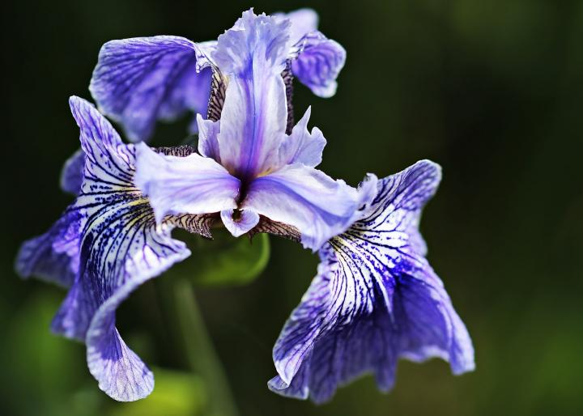

<style>
img {
    border-radius: 8px;
	box-shadow: 5px 5px 5px #999;
}
</style>


```{r setup, include = FALSE}
knitr::opts_chunk$set(collapse = TRUE, out.width = "60%",
                      warning = FALSE, message = FALSE,
                      tidy = FALSE, fig.align = "center")
```


## A simple example: Fisher's Iris

<center>
</a>
</center>

<br>

```{r fisher}
head(iris)
```


## The basic graphics system

Functions create graphics, example with Fisher's Iris:

```{r basic-plot}
hist(iris$Petal.Length, col = "grey", border = "white",
     main = "Example of a histogram", xlab = "Fisher's Iris: petal length")
```


## *ggplot2*: treating graphics as objects

Functions create a graphical object:

```{r ggplot2-plot, echo = -1}
library(ggplot2)
my_plot <- ggplot(iris) + geom_histogram(aes(Petal.Length)) +
  labs(title = "Example of a histogram",
       x = "Fisher's Iris: petal length")
my_plot
```


## A grammar for graphics

*ggplot2* builds graphics one component at a time. The grammar includes:

- `ggplot()`: to provide the data
- `geom_...`: to define the type of graph
- `aes()`: to map features of data into *aesthetic* properties (e.g. shapes, colors)


```{r eval = FALSE}
my_plot <- ggplot(iris) + # use 'iris' data.frame
  geom_histogram(aes(Petal.Length)) + # hist using petal length
  labs(title = "Example of a histogram", # add title
       x = "Fisher's Iris: petal length") # add x label
```


## Making customisation easy

For instance, to color histograms by species:

```{r iris_colors}
my_plot + aes(fill = Species)
```


## Making customisation easy: scatterplot


```{r iris_scatterplot}
my_plot <- ggplot(iris, aes(x = Petal.Length, y = Sepal.Length)) +
  geom_point(aes(color = Species, shape = Species),
             size = 5, alpha = .75) +
  geom_smooth() +
  labs(title = "Example of a scatterplot")
my_plot
```


## Going further

<center>
</a>
</center>

<br>

Learn more about *ggplot2*:

- check the package's [website](https://ggplot2.tidyverse.org/)
- a list of [all available `geoms_`](https://ggplot2.tidyverse.org/reference/index.html#section-layer-geoms) (types of plot)
- a list of [`aes()` specifications](https://ggplot2.tidyverse.org/articles/ggplot2-specs.html) (colors / shapes / etc.)
- a [gallery of extensions](http://www.ggplot2-exts.org/gallery/) to *ggplot2*


## Useful tips: specifying your colors

- select your favourite colors, e.g. using a [color picker](https://www.w3schools.com/colors/colors_picker.asp)
- make a named vector storing these colors as `character`
- specify your colors using e.g.:

```{r custom_colors}
col <- c(setosa = "#666699", versicolor = "#99cc00", virginica = "#b30059")
my_plot + scale_color_manual(values = col)
```

Note that you will need to use `scale_fill_manual` for colors specified through `fill = ...`. 


## Useful tips: using panels

You can use `facet_grid(rows ~ columns)` to specify panels:
```{r ggplot2_panels}
new_plot <- ggplot(iris) +
  geom_histogram(aes(x = Petal.Length, fill = Species)) +
  scale_fill_manual(values = col) + facet_grid(Species ~  .)
new_plot
```


## Useful tips: moving the legend

Use `theme(legend.position = c(x_coord, y_coord))` to move the legend:

```{r ggplot2_legend_position}
new_plot + theme(legend.position = c(.9, .8))
```


## Useful tips: changing the theme

Other *themes* are available and can be customised:

```{r ggplot2_themes}
new_plot + theme_light(base_family = "Times", base_size = 20)
```
