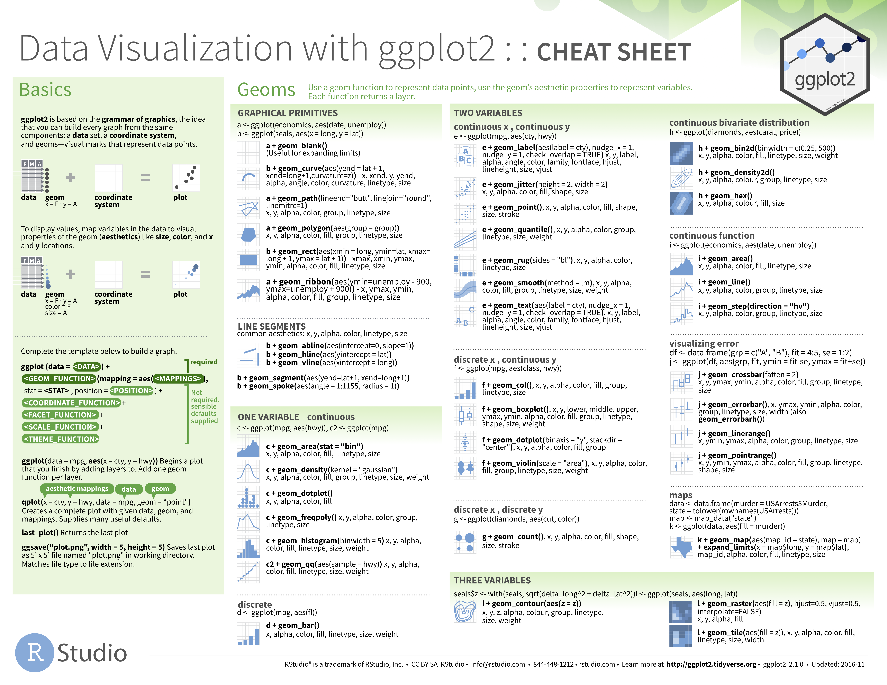

layout: true
class: inverse

<style type="text/css">
@import url(https://fonts.googleapis.com/css?family=Roboto+Condensed);
h1, h2, h3 { font-family: 'Roboto Condensed'; }
body { font-family: 'Roboto Condensed'; serif: 'Roboto Slab'; font-size: 1em; }
p { font-size: 1em }
li { font-size: 1em; }
.quote{ color: #dca3a3 }
code.r{ font-size: 16px; }
.remark-inline-code{
  <!-- color: #dca3a3; -->
  color: #7f9f7f;
}
.title-slide {
  <!-- background-image: url(http://www.repidemicsconsortium.org/img/logo.png); -->
  background-image: url("logo_recon.png");
  background-size: 80%;
  background-position: top center;
}

.title-slide .remark-slide-number { display: none; }
.title-slide h1:nth-of-type(1) { 
    font-size: 48px;
    color: #dca3a3; 
}
.title-slide h3:nth-of-type(1) { 
    font-size: 32px;
    color: #7f9f7f; 
}
.title-slide h3:nth-of-type(2) { 
    font-size: 32px;
    color: gray; 
}
.title-slide p:nth-of-type(1) {
    font-size: 32px;
    color: #7f9f7f;
}
.inverse {
  font-size: 24px;
}
<!-- @page { -->
<!--   size: 908px 681px; -->
<!--   margin: 0; -->
<!-- } -->
<!-- @media print { -->
<!--   .remark-slide-scaler { -->
<!--     width: 100% !important; -->
<!--     height: 100% !important; -->
<!--     transform: scale(1) !important; -->
<!--     top: 0 !important; -->
<!--     left: 0 !important; -->
<!--   } -->
<!-- } -->
</style>

---

```{r setup, include=FALSE}
knitr::opts_chunk$set(echo = TRUE, message = FALSE, collapse = TRUE, warning = FALSE, fig.align = 'center', fig.height = 4, dpi = 300, cache = TRUE)
pacman::p_load(tidyverse, readxl)
options(dplyr.print_min = 5, dplyr.print_max = 5)

# theme_set(hrbrthemes::theme_ipsum_rc())
# theme_set(
#   hrbrthemes::theme_modern_rc() +
#     theme(
#       panel.background = element_rect(fill = '#272822', colour = '#272822'),
#       plot.background = element_rect(fill = '#272822', colour = '#272822')
#     )
# )
```

## Data visualisation

- R has several systems for making graphs, but __ggplot2__ is one of the most elegant and most versatile

- This session will teach how to visualise data `r fontawesome::fa("chart-area", fill = "steelblue")` using __ggplot2__

--

### Prerequisites

- Load `ggplot2`

```{r}
library(ggplot2)
```

---

## Building a plot layer by layer

.pull-left[

Create a blank canvas

```{r}
ggplot(iris)
```

]

--

.pull-right[

Map global aesthetics

```{r}
ggplot(iris, aes(x = Petal.Length))
```

]

---

## Building a plot layer by layer

.pull-left[

Add geometry layer

```{r}
ggplot(iris, aes(x = Petal.Length)) +
  geom_bar()
```

]

--

.pull-right[

Facet the plot

```{r}
ggplot(iris, aes(x = Petal.Length)) +
  geom_bar() +
  facet_wrap(~ Species)
```

]

---

## Geometric objects

__Question:__ How are these two plots similar?

.pull-left[

```{r echo=FALSE}
ggplot(mpg) +
  geom_point(aes(x = displ, y = hwy))
```

]

.pull-right[

```{r echo=FALSE}
ggplot(mpg) +
  geom_smooth(aes(x = displ, y = hwy))
```

]
--

- Both plots contain same x variable, same y variable, & both describe same data
--

- However, plots are not identical
--
  
  - Each plot uses different visual object to represent data
--
  
  - In __ggplot2__ syntax, we say they use different __geoms__

---

## Geometric objects

.pull-left[

```{r}
ggplot(mpg) +
  geom_point(aes(x = displ, y = hwy))
```

]

.pull-right[

```{r}
ggplot(mpg) +
  geom_smooth(aes(x = displ, y = hwy))
```

]

Left plot uses point geom, right plot uses smooth geom (smooth line fitted to data)

---

## Examples of various geometric objects

--

.pull-left[

#### `geom_point()` + `geom_smooth()`

```{r echo=FALSE}
# ggplot(mpg, aes(x = displ, y = hwy)) +
ggplot(mpg, aes(x = hwy, y = displ)) +
  geom_point() +
  geom_smooth()
```

]

--

.pull-right[

#### `geom_density()`

```{r echo=FALSE}
ggplot(mpg, aes(hwy)) +
  geom_density()
```

]

---

## Examples of various geometric objects

.pull-left[

#### `geom_histogram(..., binwidth = 1)`

```{r echo=FALSE}
ggplot(mpg) +
  geom_histogram(aes(hwy), binwidth = 1)
```

]

--

.pull-right[

#### `geom_histogram(..., binwidth = 5)`

```{r echo=FALSE}
ggplot(mpg) +
  geom_histogram(aes(hwy), binwidth = 5)
```

]

---

## Examples of various geometric objects

.pull-left[

#### `geom_boxplot()`

```{r echo=FALSE}
ggplot(mpg, aes(class, hwy)) + 
  geom_boxplot()
```

]

--

.pull-right[

#### `geom_violin()`

```{r echo=FALSE}
ggplot(mpg, aes(class, hwy)) + 
  geom_violin()
```

]

---

## Examples of various geometric objects

.pull-left[

#### `geom_line()` + `geom_ribbon()`

```{r echo=FALSE}
huron <- data.frame(year = 1875:1972, level = as.vector(LakeHuron))

ggplot(huron, aes(year)) +
  geom_ribbon(aes(ymin = level - 1, ymax = level + 1), fill = "grey70") +
  geom_line(aes(y = level))
```

]

--

.pull-right[

#### `geom_hex()`

```{r echo=FALSE}
ggplot(diamonds, aes(carat, price)) +
  geom_hex(aes(fill = clarity))
```

]

---

## Examples of various geometric objects

.pull-left[

#### `geom_contour()`

```{r echo=FALSE}
ggplot(faithfuld) + 
  geom_contour(aes(x = waiting, y = eruptions, z = density))
```

]

--

.pull-right[

#### `geom_map()`

```{r echo=FALSE}
states_map <- map_data("state")

data.frame(state = tolower(rownames(USArrests)), USArrests) %>% 
  ggplot() +
  geom_map(aes(map_id = state, fill = Assault), map = states_map) +
  expand_limits(x = states_map$long, y = states_map$lat) +
  scale_fill_viridis_c()
```

]

---

## Examples of various geometric objects

.pull-left[

#### `geom_contour()`+`plotly::ggplotly()`

```{r echo=FALSE}
(ggplot(faithfuld) + 
  geom_contour(aes(x = waiting, y = eruptions, z = density))) %>% 
  plotly::ggplotly(width = 500, height = 280)
```

]

.pull-right[

#### `geom_map()` + `plotly::ggplotly()`

```{r echo=FALSE}
states_map <- map_data("state")

(data.frame(state = tolower(rownames(USArrests)), USArrests) %>% 
  ggplot() +
  geom_map(aes(map_id = state, fill = Assault), map = states_map) +
  expand_limits(x = states_map$long, y = states_map$lat) +
  scale_fill_viridis_c()) %>% 
  plotly::ggplotly(width = 500, height = 280)
```

]


- __N.B.__ `r fontawesome::fa("r-project", fill = "steelblue")` makes it trivially easy to turn your plots into interactive visualisations!

---

## Aesthetic mappings

- __Question__: How can we explore additional properties in this 2D scatterplot?

```{r out.width="40%"}
ggplot(data = mpg) +
  geom_point(mapping = aes(x = displ, y = hwy))
```

--

- __Answer__: We can add 3rd variable, e.g. `class`, by mapping it to an __aesthetic__

---

## Aesthetic mappings

- Visual properties of objects
    
    - Size, shape, colour, etc...

--

- Can convey info by mapping aesthetics in plot to variables in data
    
    - e.g. map colours of points to `class` variable

--

- We associate name of aesthetic to name of variable inside `aes()`.
  
  - __ggplot2__ will assign unique level of aesthetic (in this case, colour) to each unique value of variable
  
  - __ggplot2__ will also add legend that explains which levels correspond to which values

---

## Aesthetic mappings

.pull-left[

`aes(..., colour = class)`

```{r out.width="90%"}
ggplot(data = mpg) +
  geom_point(
      aes(x = displ, y = hwy, colour = class)
  )
```

- We mapped `class` to colour aesthetic, but could map to _size_ aesthetic in same way

]

--

.pull-left[

`aes(..., size = class)`

```{r out.width="90%"}
ggplot(data = mpg) +
  geom_point(
    aes(x = displ, y = hwy, size = class)
  )
```

- In this case, size of each point reveals class
]

---

## Facets

- We can also add variables by splitting the plot into __facets__ (small multiples)
--


  - Subplots that each display one subset of data
--


  - Particularly useful for small number of categorical variables

---

## Facets

.pull-left[

- To facet plot on a single variables, use `facet_grid()`

  - First argument of `facet_grid()` is a formula

  - Formula should contain the name of the variable to facet by followed by `~ .`
  
]

--

.pull-right[

```{r}
ggplot(mpg) +
  geom_point(aes(x = displ, y = hwy)) +
  facet_grid(drv ~ .)
```

]

---

## Facets

.pull-left[

- You can also facet plot on combination of two variables

  - Formula should contain two variable names separated by `~`
  
]

--

.pull-right[

```{r}
ggplot(mpg) +
  geom_point(aes(x = displ, y = hwy)) +
  facet_grid(drv ~ cyl)
```

]

---

# `RECON::Recap()`

Today, you learned to:

--

- Appreciate the layered _grammar of graphics_ approach implemeted in __ggplot2__

--

- Use `ggplot2` to __visualise__ data in `r fontawesome::fa("r-project", fill = "steelblue")`

--

- Know how to use __ggplot2__ to begin to create any type of plot you can think of!


---

## Further reading:

.footnote[Material adapted from [__R for Data Science__](http://r4ds.had.co.nz/) by Garrett Grolemund & Hadley Wickham]

.pull-left[
```{r echo=FALSE}

```
]

.pull-right[
__N.B.__ [__StackOverflow.com__](https://stackoverflow.com) is your best friend while learning how to programme

  - Most questions you can possibly imagine have already been asked and answered here

  - And, if not, ask them yourself!
]

---
class: middle center

# Questions?
