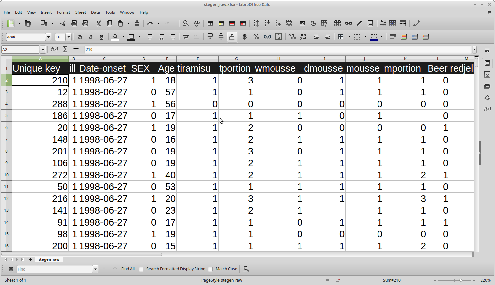
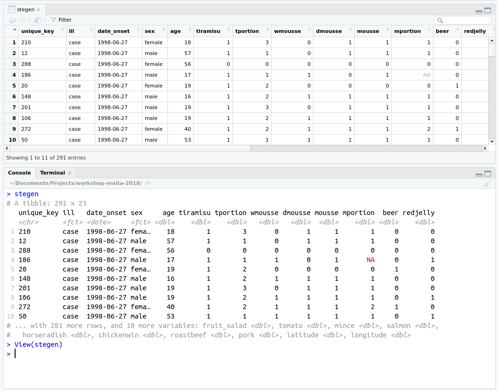

## What data usually look like

 

 

 
Typical spreadsheet:

- rows: observations (typically individuals)
- columns: variables

## What data look like in R
 

 

 

 
A `data.frame` is the R equivalent of a
spreadsheet.
 

## How does the magic happen

 

 

> Basic R:

- `read.table("some_data.txt")` for general text files
- `read.csv("some_data.csv")` for csv files

> In packages:

- `readr::read_csv("some_data.csv")` for csv files
- `readxl::read_xlsx("some_data.xlsx")` for Excel format
- `haven::read_dta("some_data.dta")` for Stata 
- ...

